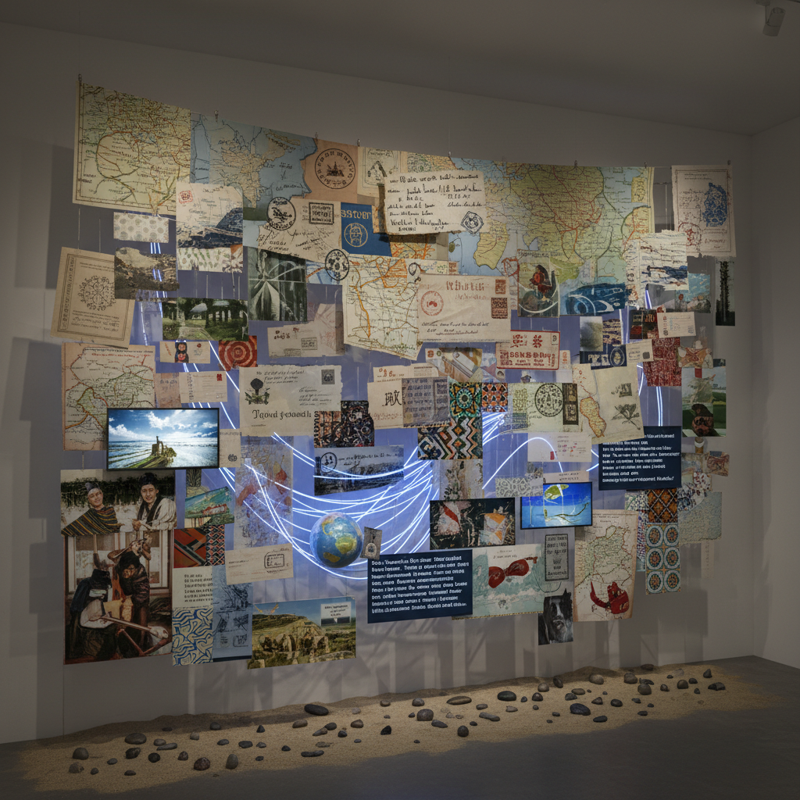

# Altermodern 替代现代主义

> **时期：** 2009–至今  
> **关键词：** 全球游牧、文化翻译、超文本叙事、后身份、创造力群岛

## 概述

Altermodern 由策展人尼古拉·布里奥（Nicolas Bourriaud）在2009年泰特三年展中提出，作为对后现代主义的回应。它描述了全球化时代的艺术家如何像"文化游牧者"一样穿越不同的时间、空间和文化——不再被单一身份（国籍、种族、性别）所定义，而是在全球文化的"群岛"之间自由航行，创造新的叙事路径。

## 风格特征

- **文化游牧**：跨越地理和文化边界的创作
- **超文本结构**：非线性的叙事和引用网络
- **翻译与转化**：在不同文化符号之间进行"翻译"
- **时间旅行**：自由混合不同历史时期的元素
- **后身份**：超越固定的文化身份标签

## 代表人物与作品

- 2009年泰特三年展参展艺术家
- Subodh Gupta 印度日常器物雕塑
- Marcus Coates 萨满主义表演
- Spartacus Chetwynd 历史混搭表演

## 概念图

