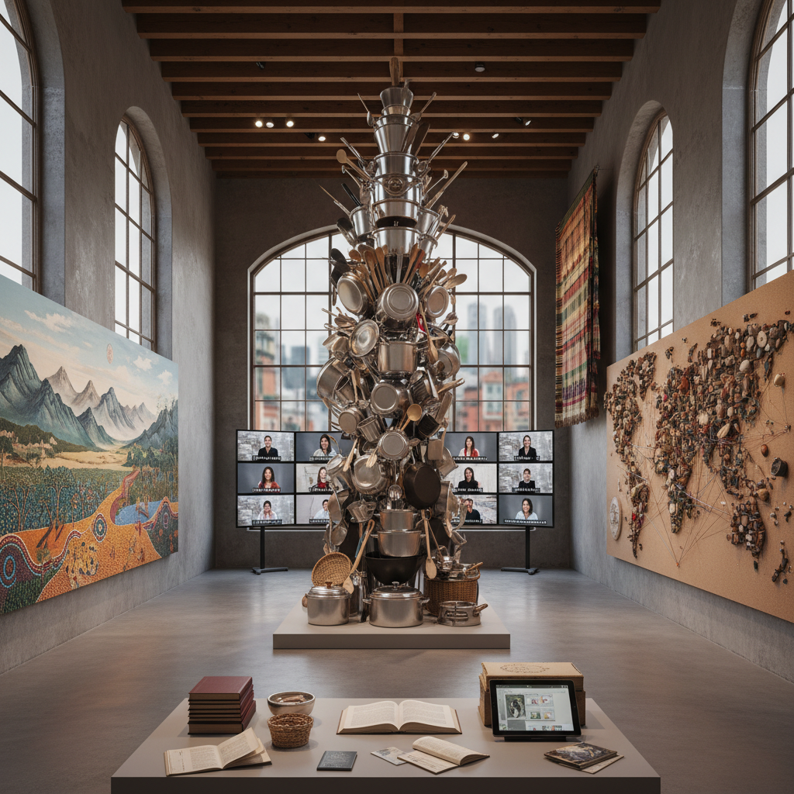

# Altermodernism Art 替代现代主义艺术

> "Altermodernism is not postmodernism's sequel but its escape route — a way of being modern again without repeating modernism's mistakes, of embracing universality without imperialism, of traveling without colonizing, of mixing without homogenizing, a cultural condition defined by translation, nomadism, and creolization rather than by origin, identity, or tradition, where the artist is a semionaut navigating between signs and cultures, where the artwork is a journey rather than a destination, and where modernity is reimagined as an archipelago of singularities rather than a single Western narrative imposed on the world." — Nicolas Bourriaud

## 概述

替代现代主义（Altermodernism / Altermodern）是法国策展人和批评家尼古拉·布里奥（Nicolas Bourriaud）在2009年提出的概念，作为对后现代主义的超越。布里奥认为后现代主义已经耗尽了其批判能量，当代文化需要一种新的框架——不是回到现代主义的普遍主义，而是发展一种"替代的"现代性，基于翻译、游牧和克里奥尔化（creolization）。

替代现代主义的核心概念是"符号航行者"（semionaut）——艺术家在不同的文化符号系统之间航行，创造新的意义路径。布里奥在2009年伦敦泰特三年展"Altermodern"中展示了这一概念，参展艺术家包括Subodh Gupta、Peter Doig、Spartacus Chetwynd等。替代现代主义强调：全球化不必意味着同质化，旅行和翻译可以产生新的文化形式，当代艺术可以既是普遍的又是特殊的。

## 核心特征

| 特征 | 描述 |
|------|------|
| 翻译 | 文化间的翻译 |
| 游牧 | 游牧式的创作 |
| 克里奥尔 | 文化的克里奥尔化 |
| 航行 | 符号间的航行 |
| 群岛 | 群岛式的多元 |
| 旅程 | 艺术作为旅程 |

## 视觉特征

- **混合**：文化元素的混合
- **旅行**：旅行和位移的痕迹
- **翻译**：翻译和转化的过程
- **网络**：全球网络的可视化
- **档案**：档案和收集
- **叙事**：非线性的叙事

## 代表作品

| 作品 | 艺术家 | 年代 | 意义 |
|------|--------|------|------|
| *Altermodern Tate Triennial* | Various | 2009 | 布里奥策划的泰特三年展 |
| *Very Hungry God* | Subodh Gupta | 2006 | 古普塔的厨具雕塑 |
| *Radicant* | Nicolas Bourriaud | 2009 | 布里奥的理论著作 |
| *Creolization works* | Various | 2000年代 | 克里奥尔化的艺术 |
| *Translation projects* | Various | 2010年代 | 翻译作为艺术实践 |

## 历史时间线

| 时期 | 事件 |
|------|------|
| 1998 | 布里奥的《关系美学》 |
| 2002 | 布里奥的《后制作》 |
| 2009 | "Altermodern"泰特三年展 |
| 2009 | 《Radicant》出版 |
| 当代 | 替代现代主义的讨论 |

## 中国语境

替代现代主义对中国当代艺术有重要的理论参照意义。中国艺术家长期面临"如何现代"的问题——如何在不简单模仿西方现代主义的前提下发展自己的当代性？替代现代主义提供了一种可能的框架：现代性不是单一的西方叙事，而是多元的"群岛"；中国可以发展自己的现代性路径，既参与全球对话又保持文化特殊性。中国的一些当代艺术家在实践中体现了替代现代主义的精神——在中国传统和全球当代之间航行，创造新的文化混合形式。中国的快速全球化也为"翻译"和"克里奥尔化"提供了丰富的现实素材。

## AI生成概念图

## 与其他风格的关系

- **Relational Aesthetics** → 关系美学
- **Post-Internet Art** → 后网络艺术
- **Globalization Art** → 全球化艺术
- **Postmodernism** → 后现代主义
- **Postcolonial Art** → 后殖民艺术
- **Contemporary Art** → 当代艺术

---

*浮光艺志 | Chronicle of Artistry*
