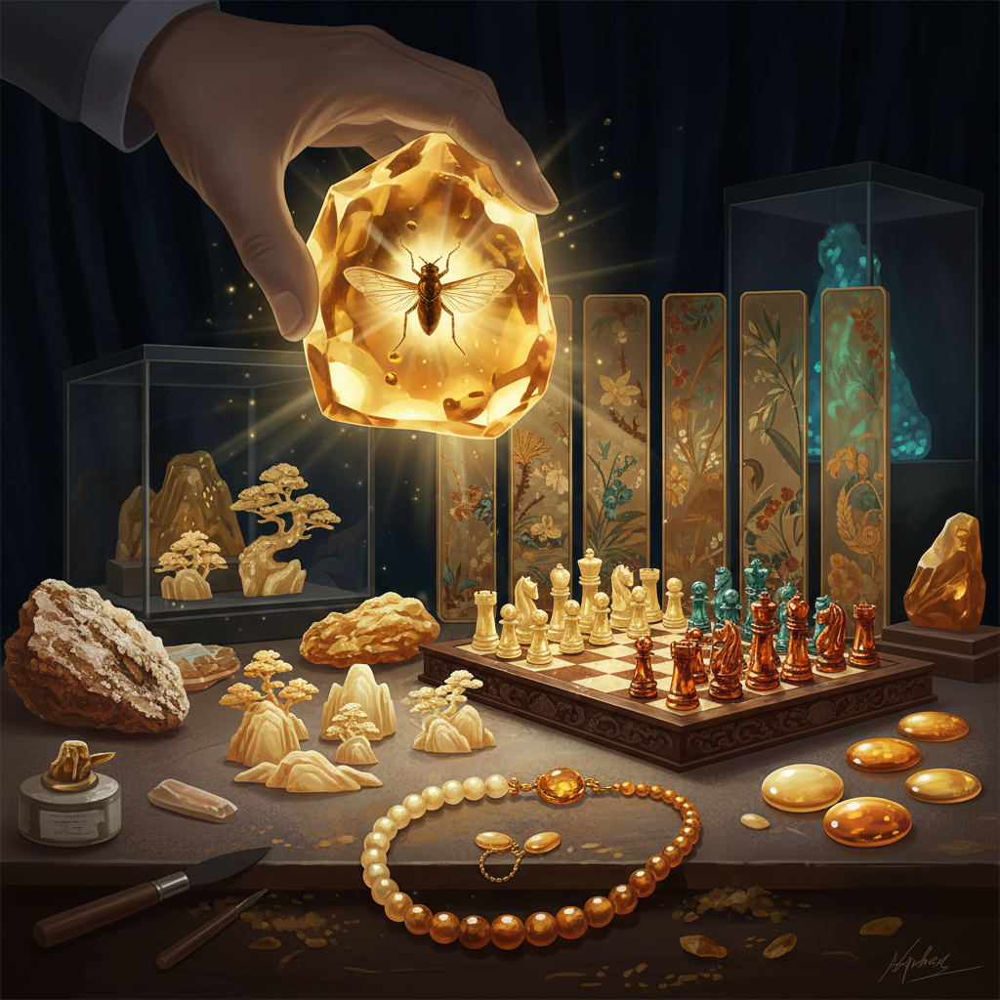

# Amber Art 琥珀艺术

> "Amber is time made visible — each piece a window into a world that existed millions of years ago, preserving in golden transparency the insects, plants, and air bubbles of ancient forests. When an artist carves amber, they are shaping solidified sunlight, working with a material that was liquid when dinosaurs walked the earth and has been waiting patiently ever since for human hands to give it new form." — Unknown

## 概述

琥珀艺术（Amber Art）是以琥珀（树脂化石）为材料进行艺术创作的实践——利用琥珀的天然透明度、温暖色泽、内含物和数千万年的地质历史创造艺术品。琥珀是世界上最古老的装饰材料之一，自石器时代就被人类用作首饰和护身符。

琥珀艺术的实践包括：1）琥珀雕刻——在琥珀上进行精细雕刻；2）琥珀首饰——用琥珀制作的项链、戒指、胸针等；3）琥珀镶嵌——将琥珀镶嵌在金属或木材中；4）琥珀画——用不同颜色的琥珀碎片拼贴成画面；5）琥珀室——用琥珀装饰整个房间（如俄罗斯琥珀宫）；6）琥珀标本——展示内含昆虫或植物的琥珀；7）当代琥珀设计——将琥珀与现代设计结合。

## 核心特征

| 特征 | 描述 |
|------|------|
| 古老 | 数千万年的历史 |
| 透明 | 温暖的透明感 |
| 内含 | 可能含有古生物 |
| 温暖 | 温暖的金色调 |
| 轻盈 | 比石头轻得多 |
| 电性 | 摩擦生电（电的词源） |

## 视觉特征

- **金色**：温暖的蜂蜜金色
- **透明**：清澈的透明感
- **内含**：内部的气泡和包裹体
- **光泽**：打磨后的温润光泽
- **渐变**：从浅黄到深红的色彩
- **温暖**：视觉上的温暖感

## 代表作品

| 作品 | 艺术家 | 年代 | 意义 |
|------|--------|------|------|
| *Amber Room* | 普鲁士/俄罗斯 | 1701-1770 | 琥珀宫（世界第八奇迹） |
| *Baltic amber jewelry* | 波罗的海传统 | 古代至今 | 波罗的海琥珀首饰 |
| *Amber carvings* | 但泽/格但斯克 | 17-18世纪 | 琥珀雕刻 |
| *Chinese amber art* | 中国传统 | 古代至今 | 中国琥珀艺术 |
| *Contemporary amber design* | Various | 当代 | 当代琥珀设计 |

## 历史时间线

| 时期 | 事件 |
|------|------|
| 石器时代 | 最早的琥珀装饰品 |
| 古罗马 | 琥珀贸易路线 |
| 17-18世纪 | 琥珀雕刻的黄金时代 |
| 1701 | 琥珀宫的建造 |
| 当代 | 琥珀作为当代设计材料 |

## 中国语境

琥珀艺术在中国有悠久的历史和独特的文化意义。中国古代称琥珀为"虎魄"，认为它是老虎的灵魂化石。中国是世界重要的琥珀产地之一——辽宁抚顺琥珀以其独特的品质著称。中国传统的琥珀雕刻以精细著称，能在小块琥珀上雕出人物、花鸟等复杂图案。中国的缅甸琥珀（产自缅甸北部，约1亿年历史）因含有恐龙时代的昆虫和植物而在古生物学上极为重要。中国当代的琥珀艺术家将传统雕刻技法与现代设计结合，创作出融合东方美学与当代审美的琥珀艺术品。中国也是世界最大的琥珀消费市场之一。

## AI生成概念图

## 与其他风格的关系

- **Jewelry Art** → 首饰艺术
- **Resin Art** → 树脂艺术
- **Carving Art** → 雕刻艺术
- **Fossil Art** → 化石艺术
- **Gemstone Art** → 宝石艺术
- **Light Art** → 光艺术

---

*浮光艺志 | Chronicle of Artistry*
