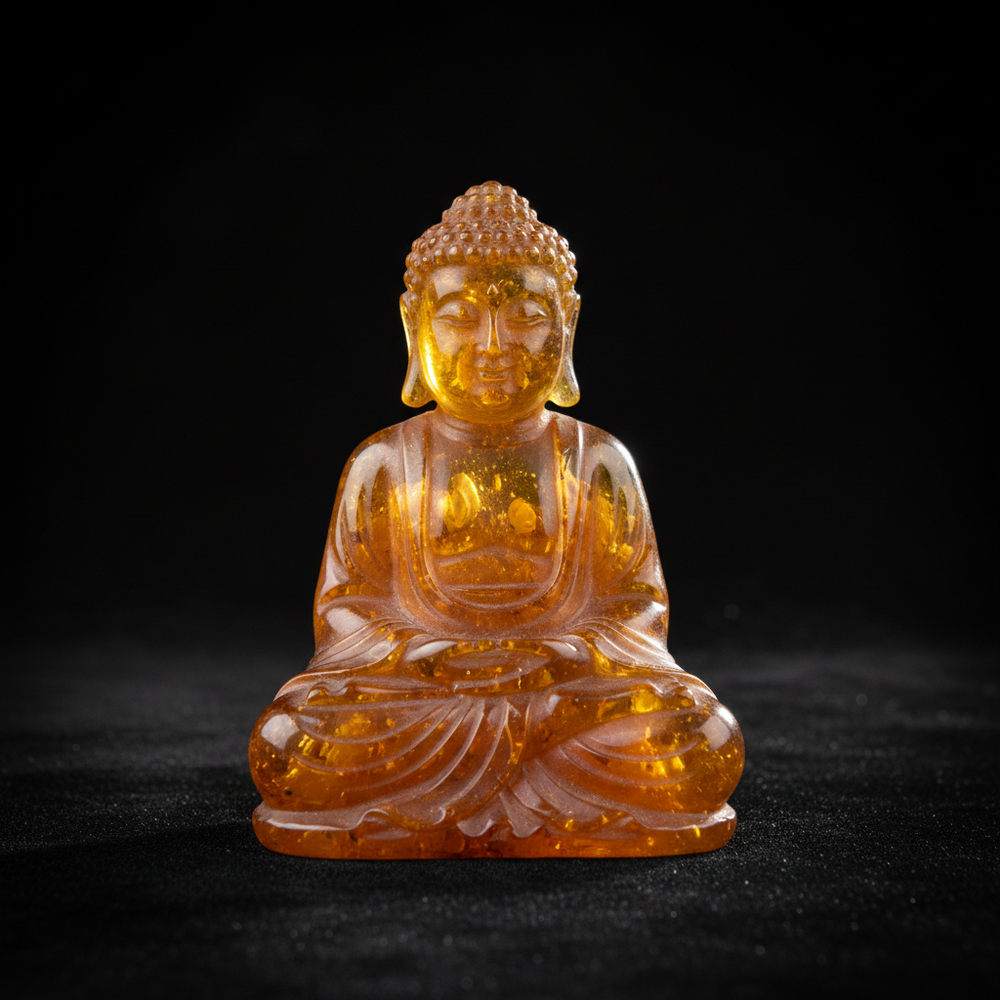

# Amber Carving Art 琥珀雕刻艺术

> "Amber carving is sculpting frozen time — each piece of amber is a capsule of prehistoric forest, millions of years of tree resin transformed into golden stone that holds ancient insects, seeds, and bubbles of Cretaceous air. The carver works with this material of extraordinary warmth and translucency, shaping it into jewelry, figurines, and ornamental objects that glow with an inner light, as if the sun of a vanished world were still trapped within." — Unknown

## 概述

琥珀雕刻艺术（Amber Carving Art）是使用天然琥珀（远古树脂的化石化产物）进行雕刻、塑形和装饰的传统工艺——利用琥珀的温暖色泽、半透明性和独特的内含物创造各种装饰品和艺术品。琥珀雕刻在波罗的海地区、中国和缅甸有悠久的传统。

琥珀雕刻艺术的实践包括：1）圆雕——完全立体的琥珀雕刻；2）浮雕——在琥珀表面雕刻浮雕图案；3）镂空雕——在琥珀中雕出镂空效果；4）巧雕——利用琥珀的天然色彩和形状进行创作；5）镶嵌——将琥珀镶嵌在金属或其他材料中；6）抛光——将琥珀打磨至光滑透明；7）当代琥珀艺术——将传统技法与现代设计结合的创作。

## 核心特征

| 特征 | 描述 |
|------|------|
| 温暖 | 温暖的金色光泽 |
| 透明 | 半透明的光学效果 |
| 古老 | 数千万年的材料 |
| 内含 | 可能含有古生物 |
| 轻盈 | 比石头轻盈 |
| 珍贵 | 珍贵的有机宝石 |

## 视觉特征

- **金色**：温暖的金色到蜜色
- **透明**：半透明的光学效果
- **光泽**：抛光后的温润光泽
- **内含**：可见的内含物
- **温暖**：温暖的材质感
- **深邃**：透明中的深邃感

## 代表作品

| 作品 | 艺术家/文化 | 年代 | 意义 |
|------|-------------|------|------|
| *Amber Room* | 俄罗斯/德国 | 18世纪 | 琥珀宫 |
| *Baltic amber jewelry* | 波罗的海 | 史前至今 | 波罗的海琥珀首饰 |
| *Chinese amber carvings* | 中国 | 明清至今 | 中国琥珀雕刻 |
| *Burmese amber art* | 缅甸 | 传统 | 缅甸琥珀艺术 |
| *Contemporary amber art* | 当代 | 当代 | 当代琥珀艺术 |

## 历史时间线

| 时期 | 事件 |
|------|------|
| 史前 | 琥珀作为装饰品的使用 |
| 古代 | 琥珀贸易路线的建立 |
| 中世纪 | 波罗的海琥珀行会 |
| 18世纪 | 琥珀宫的建造 |
| 当代 | 琥珀雕刻的艺术化发展 |

## 中国语境

琥珀雕刻艺术在中国有悠久的传统和蓬勃的当代发展。中国自古就珍视琥珀——古代称之为"虎魄"，认为是虎的精魄所化。中国辽宁抚顺是重要的琥珀产地——抚顺琥珀以其独特的色彩和品质著称。中国当代的琥珀雕刻以福建和广东为主要产地——大量缅甸琥珀在中国加工。中国的琥珀市场近年来快速增长——琥珀雕刻作品作为收藏品和佩饰受到广泛欢迎。中国的琥珀雕刻师将传统玉雕技法应用于琥珀——创造出具有中国特色的琥珀雕刻作品。中国的琥珀文化中，含有古生物的琥珀（虫珀）特别受到珍视——既有科学价值又有审美价值。

## AI生成概念图

## 与其他风格的关系

- **Horn Carving** → 角雕
- **Jade Carving** → 玉雕
- **Gem Cutting** → 宝石切割
- **Jewelry** → 珠宝艺术
- **Sculpture** → 雕塑
- **Organic Art** → 有机材料艺术

---

*浮光艺志 | Chronicle of Artistry*
