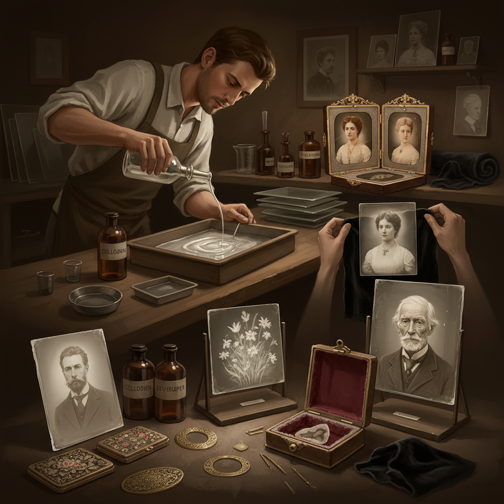

# Ambrotype 安布罗版摄影

> "An ambrotype is a photograph trapped in glass — a collodion negative so thin and underexposed that when backed with black velvet or dark varnish, it transforms into a luminous positive image, each one a unique jewel housed in a hinged case like a precious miniature painting." — Unknown

## 概述

安布罗版摄影（Ambrotype）是一种在玻璃板上制作的直接正像摄影工艺，流行于1850年代至1860年代。安布罗版本质上是一张故意曝光不足的火棉胶玻璃负片——当这张薄弱的负片放在黑色背景（黑色天鹅绒、黑色纸张或黑色漆）前面时，负像中的透明区域变暗，银色区域变亮，视觉上转变为正像。

安布罗版由James Ambrose Cutting在1854年获得美国专利（虽然技术本身由Frederick Scott Archer更早发明）。安布罗版通常装在精美的铰链式保护盒中——与达盖尔版（daguerreotype）的展示方式相同。安布罗版比达盖尔版便宜、制作更快，但比后来的锡版（tintype）更精致。安布罗版是摄影史上从达盖尔版到锡版和蛋白印刷的重要过渡工艺。

## 核心特征

| 特征 | 描述 |
|------|------|
| 玻璃 | 玻璃板作为载体 |
| 正像 | 负片转正像的视觉效果 |
| 黑色背景 | 需要黑色背景 |
| 独一无二 | 每张都是原版 |
| 保护盒 | 装在精美保护盒中 |
| 火棉胶 | 使用火棉胶工艺 |

## 视觉特征

- **玻璃质感**：玻璃的透明质感
- **精致**：精致的细节
- **立体**：微妙的立体感
- **银色**：银色的高光
- **深邃**：深邃的暗部
- **珍贵**：珍贵的物件感

## 代表作品

| 作品 | 艺术家 | 年代 | 意义 |
|------|--------|------|------|
| *Ambrotype portraits* | Various | 1850-60s | 维多利亚时代肖像 |
| *Civil War ambrotypes* | Various | 1860s | 美国内战安布罗版 |
| *Contemporary ambrotypes* | Various | 当代 | 当代安布罗版 |
| *Large format ambrotypes* | Various | 当代 | 大画幅安布罗版 |

## 历史时间线

| 时期 | 事件 |
|------|------|
| 1851年 | Frederick Scott Archer发明火棉胶工艺 |
| 1854年 | James Ambrose Cutting获得专利 |
| 1855-65年 | 安布罗版的流行期 |
| 1860年代后 | 被锡版和蛋白印刷取代 |
| 当代 | 安布罗版的艺术复兴 |

## 中国语境

安布罗版在中国的历史记录较少——19世纪中期进入中国的早期摄影中可能包含安布罗版作品，但保存下来的极少。当代中国的湿版摄影（wet plate collodion）复兴中，安布罗版作为湿版工艺的一种形式受到关注。中国的一些湿版摄影师制作安布罗版肖像——将玻璃板上的影像装在精美的框架中，作为独一无二的艺术品。中国的摄影收藏市场中，历史安布罗版具有较高的收藏价值。

## AI生成概念图

## 与其他风格的关系

- **Tintype** → 锡版摄影
- **Daguerreotype** → 达盖尔版
- **Wet Plate Collodion** → 湿版火棉胶
- **Alternative Photography** → 替代摄影
- **Portrait Photography** → 肖像摄影
- **Historical Photography** → 历史摄影

---

*浮光艺志 | Chronicle of Artistry*
