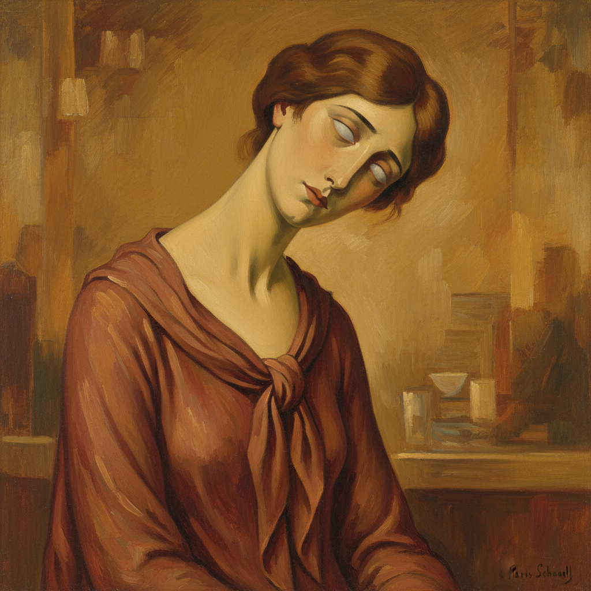

# Amedeo Modigliani 阿梅代奥·莫迪利亚尼

> **流派**: 表现主义 · 巴黎画派  
> **时期**: 1884–1920 意大利/法国  
> **关键词**: 拉长面孔、杏仁眼、优雅变形、裸体肖像

## 概述

莫迪利亚尼以其标志性的拉长面孔和颈部、杏仁形空洞眼睛闻名于世。他融合了意大利文艺复兴的优雅与非洲雕塑的简洁，创造出一种独特的肖像风格——既现代又古典，既简化又深情。

## 视觉特征

- **拉长比例**: 颈部、面部被优雅地拉长，形成独特的垂直韵律
- **杏仁形眼睛**: 常常无瞳孔，呈现冥想般的空灵感
- **暖色调**: 赭石、肉色、深红构成温暖的色彩基调
- **简洁轮廓**: 用流畅的曲线概括形体，去除多余细节
- **倾斜头部**: 人物常微微侧首，带有忧郁的诗意

## 代表作品

- 《斜躺的裸女》(1917)
- 《珍妮·赫布特尼肖像》(1918)
- 《头像》雕塑系列 (1911–1913)
- 《戴帽子的女人》(1917)

## 历史影响

莫迪利亚尼证明了变形不必是暴力的——它可以是温柔的、诗意的。他的风格影响了后来的肖像画传统，从巴尔蒂斯到当代时尚插画都能看到他的影子。

## 相关风格

- [Egon Schiele 埃贡·席勒](egon-schiele.md)
- [Gustav Klimt 古斯塔夫·克里姆特](klimt.md)
- [Henri Matisse 亨利·马蒂斯](matisse.md)
