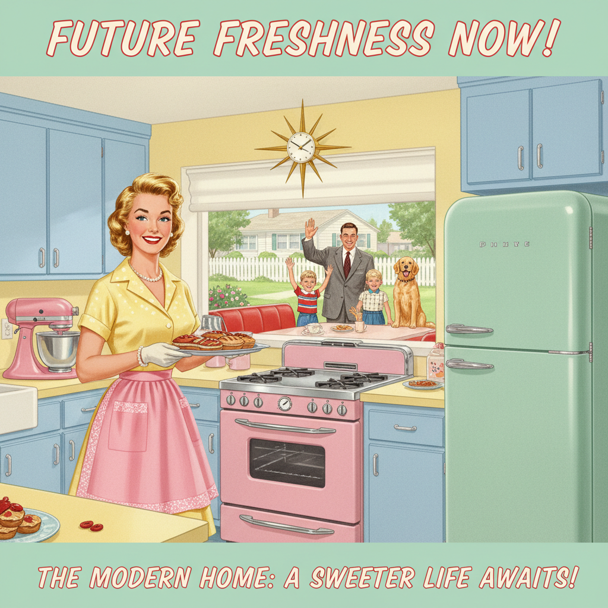

# American Kitsch 美国媚俗



> **"理想化的家庭主妇、太空时代曲线、讽刺的乐观——战后美国梦的视觉糖衣。"**

## 概述

| 维度 | 描述 |
|------|------|
| 时期 | 1940s–1960s/影响至今 |
| 别名 | American Kitsch, Retro Americana, Atomic Kitsch |
| 核心色彩 | 粉色、薄荷绿、奶油黄、珊瑚红、天蓝 |
| 关键元素 | 理想化插画、太空时代造型、戏剧化姿态、未来派曲线 |
| 代表人物 | Norman Rockwell (边缘), Gil Elvgren, 广告插画师群体 |
| 关联风格 | Atomic Age, Googie, Mid-Century Modern, Pin-up, Tiki |

---

## 历史脉络

| 年份 | 事件 |
|------|------|
| 1940s | 战后乐观主义——消费文化爆发 |
| 1950s | 全盛期——电视广告、杂志插画、产品设计 |
| 1955 | 迪士尼乐园开业——Kitsch 的物理化 |
| 1960s | Pop Art 对 Kitsch 的讽刺性引用 |
| 1990s | "Retro" 复兴——Kitsch 被重新发现 |
| 2020s | 作为"Americana"美学的核心元素 |

### 核心哲学

American Kitsch 的精神是**"一切都会好的——只要你买了这个产品"**：
- 乐观 = 商业（"微笑的家庭主妇 = 产品好用"）
- 理想化 = 销售（"完美的生活 = 你也可以拥有"）
- 未来 = 希望（"太空时代 = 一切皆有可能"）
- 讽刺 = 后来的解读（"当时是真诚的——现在看是讽刺的"）
- "Kitsch 是美国梦最诚实的视觉表达——因为它毫不掩饰地在卖东西"

---

## 视觉语法

### 色彩系统

```
主色：
  粉色 (#FFB6C1) — 女性、甜美
  薄荷绿 (#98FF98) — 清新、现代
  奶油黄 (#FFFDD0) — 温暖、家庭
  珊瑚红 (#FF6B6B) — 活力、热情

辅色：
  天蓝 (#87CEEB) — 乐观
  金色 (#FFD700) — 奢华
  白色 (#FFFFFF) — 纯净

规则：
  - 明亮、饱和
  - 糖果色调
  - 高对比
  - "太干净"的感觉

质感：
  光滑 — 理想化
  光泽 — 产品感
  柔焦 — 梦幻
  印刷 — 杂志广告
```

### 标志性元素

| 类别 | 元素 |
|------|------|
| 人物 | 微笑家庭主妇、英俊丈夫、完美儿童 |
| 物品 | 家电、汽车、食品、清洁产品 |
| 造型 | 太空时代曲线、流线型、未来派 |
| 场所 | 完美厨房、郊区草坪、餐厅、公路 |
| 字体 | 手写体、装饰体、戏剧化 |
| 态度 | 乐观、理想化、消费主义、"美国梦" |

---

## 与千禧怀旧的关系

### "Retro Americana" 的持续魅力
- American Kitsch = 2000s-2020s "复古"设计的核心素材
- Fallout 游戏系列——Kitsch 美学的当代演绎
- "50s Diner" 美学在全球的流行
- "我们怀念的不是50年代——是50年代想象中的未来"

### 讽刺与真诚之间
- 当时: 真诚的商业乐观
- 现在: 讽刺的怀旧引用
- "Kitsch 的魅力在于——你不确定它是在开玩笑还是认真的"

---

## 中国语境

- 与中国50-60年代宣传画的平行（不同意识形态，相似视觉策略）
- "美式复古"在中国餐饮/零售的流行
- 中国设计师对 Americana 元素的借鉴
- 作为"消费主义视觉史"的研究对象

---

## 设计应用

| 场景 | 应用方式 |
|------|----------|
| 餐饮 | 50s Diner+复古菜单+霓虹+糖果色 |
| 品牌 | 复古+乐观+美式+怀旧+讽刺 |
| 游戏 | Fallout风格+复古未来+讽刺乐观 |
| 包装 | 复古插画+手写字+糖果色+理想化 |

---

## 相关风格

← [Atomic Age 原子时代](atomic-age.md) | [Mid-Century Illustration 世纪中叶插画](mid-century-illustration.md) →

↑ [返回千禧怀旧目录](README.md) | [返回总目录](../README.md)
