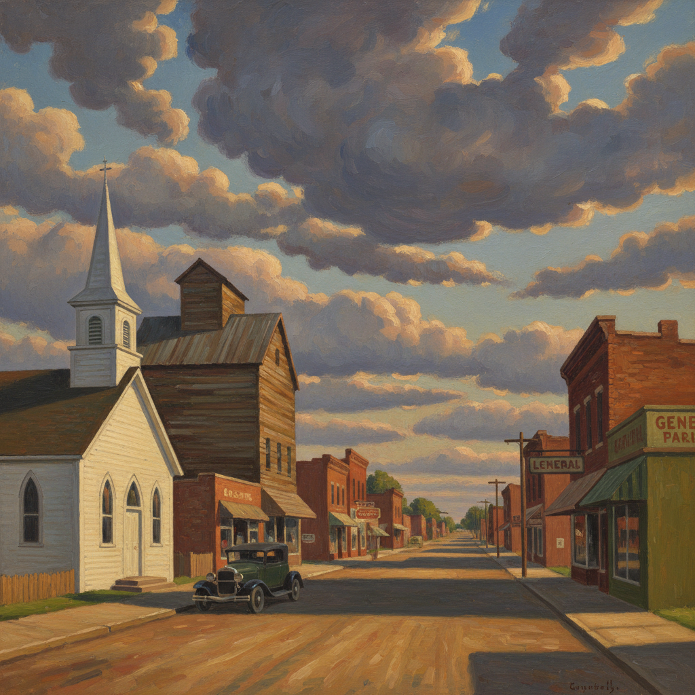

# American Scene Painting 美国场景画

> **时期：** 1920年代–1950年代  
> **关键词：** 美国日常、乡村小镇、城市生活、民族主义、大萧条

## 概述

American Scene Painting（美国场景画）是1920–1950年代美国画家描绘本土日常生活的广泛运动——拒绝欧洲现代主义的抽象实验，转向美国自身的风景、小镇、农场和城市街道。从格兰特·伍德的爱荷华农场到爱德华·霍珀的孤独城市，这些画作定义了美国人对自身形象的视觉认知。

## 风格特征

- **本土题材**：美国风景、小镇、日常生活
- **写实手法**：清晰可辨的叙事场景
- **民族意识**：强调美国独特的视觉文化
- **情感氛围**：从乐观到忧郁的多元情绪
- **反抽象**：拒绝欧洲前卫艺术的影响

## 代表人物与作品

- 格兰特·伍德《美国哥特式》
- 爱德华·霍珀《夜鹰》
- 托马斯·哈特·本顿 美国壁画
- 查尔斯·伯奇菲尔德 小镇风景

## 概念图

