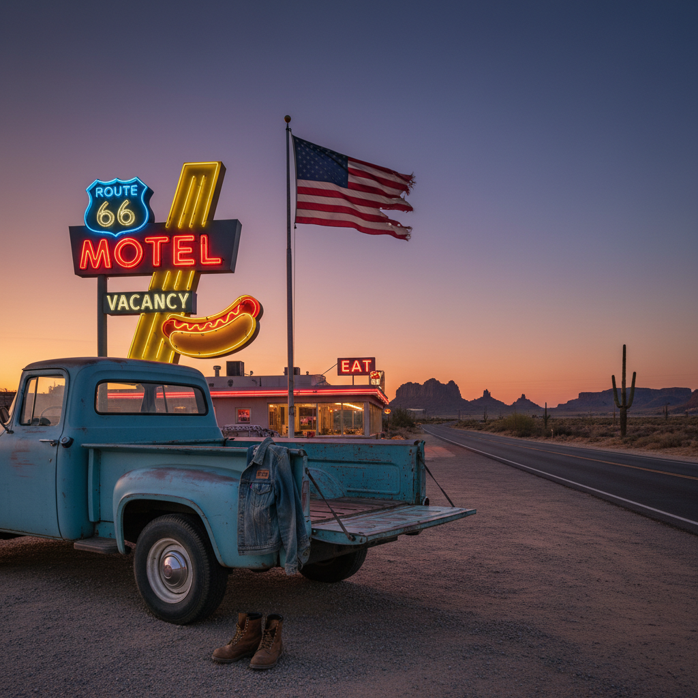

# Americana 美式复古



> **"66号公路、霓虹汽车旅馆、牛仔靴——永远在路上的美国梦。"**

## 概述

| 维度 | 描述 |
|------|------|
| 时期 | 1920s–1960s 原版 / 2010s 复兴 |
| 别名 | Americana, American Heritage, Workwear |
| 核心色彩 | 靛蓝、红色、白色、棕色、卡其 |
| 关键元素 | 牛仔布、工装、皮靴、复古招牌 |
| 代表人物 | Levi's、Red Wing、Filson、Pendleton |
| 关联风格 | Vintage Americana, Workwear, Western, Preppy |

---

## 历史脉络

### 从工人阶级到全球时尚

| 年份 | 事件 |
|------|------|
| 1853 | Levi Strauss 创立——牛仔裤诞生 |
| 1905 | Red Wing Shoes 创立 |
| 1920s | 美国工装文化成型 |
| 1950s | James Dean 让牛仔裤成为叛逆符号 |
| 1960s | 美国公路文化黄金时代 |
| 2010s | "Heritage" 品牌复兴运动 |
| 2020s | Americana 与可持续时尚融合 |

### 核心哲学

Americana 的精神是**"用双手建造——穿一辈子"**：
- 耐用 > 时尚（"买一次，穿一辈子"）
- 工作 = 尊严
- 美国制造 = 品质保证
- "这条牛仔裤的磨损是我的故事"
- 真实、朴素、持久

---

## 视觉语法

### 色彩系统

```
主色：
  靛蓝 (#1A237E) — 牛仔布
  红色 (#B71C1C) — 法兰绒、谷仓
  白色 (#FFFFFF) — T恤、帆布
  棕色 (#5D4037) — 皮革、木材
  卡其 (#C3B091) — 工装裤

辅色：
  绿色 (#2E7D32) — 军装、户外
  黑色 (#212121) — 皮靴
  金色 (#F9A825) — 黄铜、五金

质感：
  牛仔布 — 靛蓝、磨损
  帆布 — 厚实、耐用
  皮革 — 植鞣、老化
  法兰绒 — 格纹、温暖
  铜/黄铜 — 五金件
```

### 标志性元素

| 类别 | 元素 |
|------|------|
| 服装 | 牛仔裤、工装夹克、法兰绒衬衫、白T |
| 鞋 | 工装靴、牛仔靴、帆布鞋 |
| 配饰 | 皮带、怀表、bandana、工具 |
| 场景 | 公路、加油站、谷仓、工厂、小镇 |
| 品牌 | Levi's、Red Wing、Carhartt、Filson |
| 符号 | 星条旗、鹰、66号公路、霓虹招牌 |

---

## 与千禧怀旧的关系

### Heritage 品牌复兴
- 2010s "Heritage" 运动 = 对快时尚的反抗
- "买好的，穿一辈子" vs "每季换新"
- Red Wing、Filson 从工人品牌到时尚品牌
- 日本对 Americana 的痴迷（日本牛仔布）

### 公路文化的浪漫
- 66号公路 = 美国梦的象征
- 公路旅行 = 自由的隐喻
- 复古汽车旅馆、霓虹招牌 = 怀旧
- "那个时代的美国更简单"

---

## 中国语境

- "美式复古"/"工装风"在中国的流行
- 中国工装品牌的兴起
- 与中国"国潮"的对比
- 日本 Americana 对中国的影响
- 牛仔文化在中国的本土化

---

## 设计应用

| 场景 | 应用方式 |
|------|----------|
| 品牌 | 复古字体+靛蓝+皮革+手工+传承 |
| 空间 | 红砖+木材+皮革+复古招牌+工业 |
| 时尚 | 牛仔+工装+皮靴+耐用+磨损美 |
| 包装 | 牛皮纸+印章+手写+复古标签 |

---

## 相关风格

← [Vintage Americana 复古美国风](vintage-americana.md) | [Gorpcore 户外核](gorpcore.md) →

↑ [返回千禧怀旧目录](README.md) | [返回总目录](../README.md)
