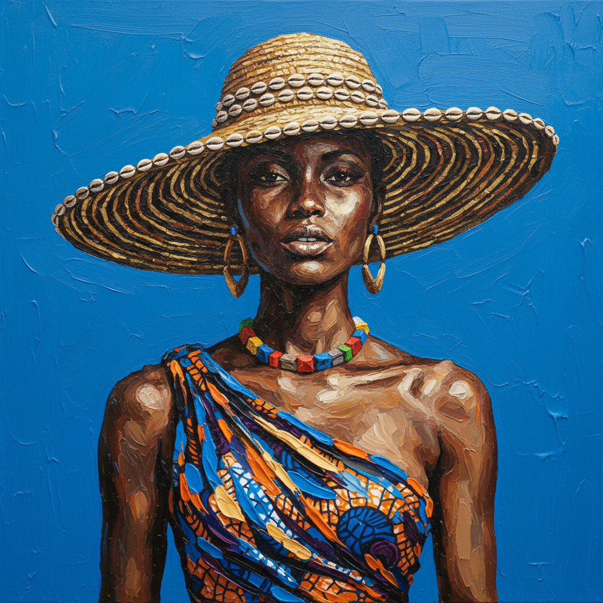

# Amoako Boafo 阿莫阿科·博阿福

> **时期：** 1984–至今  
> **关键词：** 手指绘画、黑人肖像、加纳当代、时尚与身份

## 概述

Amoako Boafo 是加纳当代画家，以用手指直接在画布上涂抹颜料的独特技法描绘黑人肖像而闻名。他的作品将时尚摄影的姿态与表现主义的笔触结合，赋予非洲散居群体一种兼具尊严与活力的视觉存在。

## 风格特征

- **手指绘画**：皮肤部分以手指直接涂抹，留下独特的指纹纹理和肌理
- **平涂背景**：人物背景通常为单一明亮色彩——钴蓝、翠绿、柠檬黄
- **时尚姿态**：人物常以时尚杂志式的姿态出现，穿着当代设计师服装
- **面部细节**：面部以手指精心塑造，五官清晰而富有个性
- **身体与图案**：服装图案以画笔精细描绘，与手指涂抹的皮肤形成对比

## 代表作品

- *Black Diaspora*（2018，系列）
- *Dethroning the Seated Queen*（2020）
- *Green Beret*（2020）
- *Hands Up*（2019）

## 历史意义

Boafo 代表了非洲当代艺术在全球市场的爆发式崛起，他的手指绘画技法将触觉和亲密感重新带入肖像画，同时挑战了西方艺术市场对非洲艺术家的刻板期待。

## 概念图

