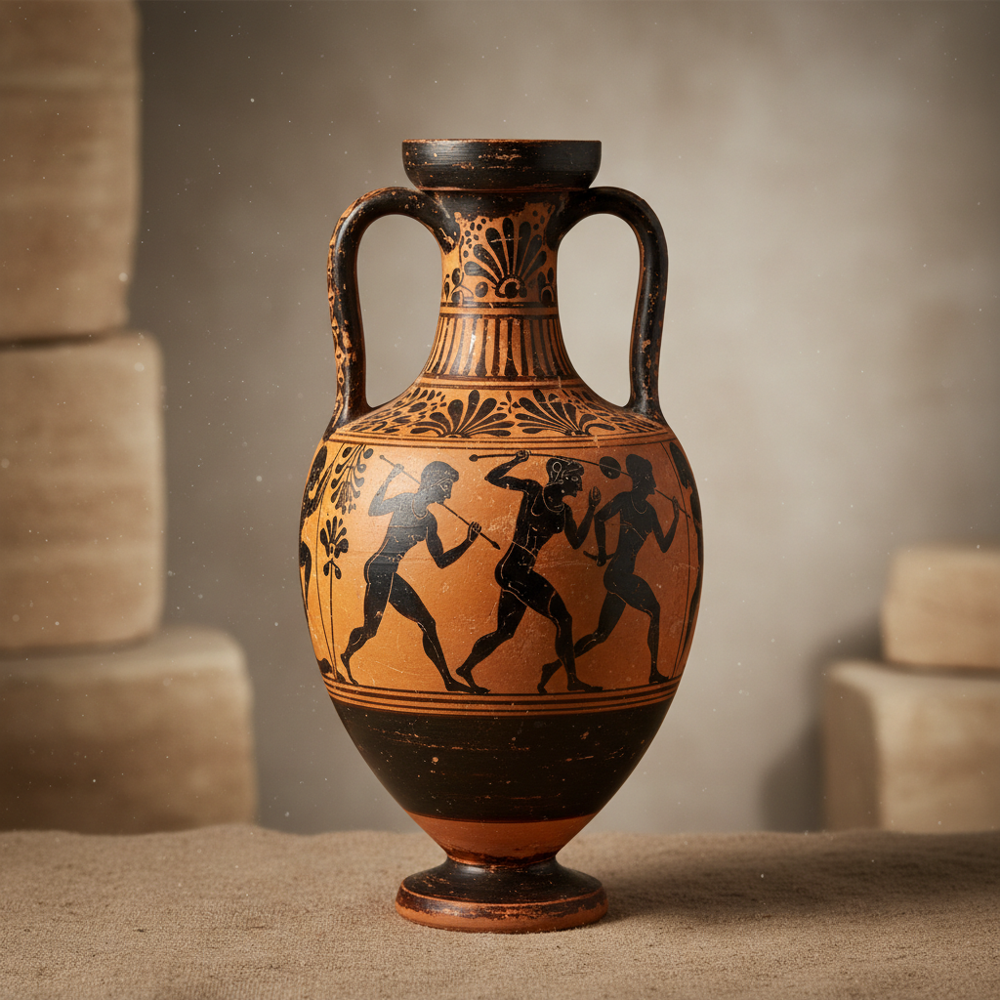

# Amphora Art 双耳瓶艺术

> "The amphora is the vessel that carried civilization — two handles flanking a narrow neck above a swelling body tapering to a point, designed to be stacked in the holds of ships and the cellars of merchants, each one a container for wine, oil, or grain that also became a canvas for some of the finest painting the ancient world produced, function and art inseparable in fired clay." — Unknown

## 概述

双耳瓶艺术（Amphora Art）是以古希腊罗马时期的双耳陶瓶为代表的陶瓷器形艺术。Amphora（安福拉）是古代地中海世界最重要的陶瓷容器——其标志性的双耳设计便于搬运和堆叠，尖底设计便于插入沙地或船舱固定。双耳瓶不仅是实用的储运容器，更是古希腊绘画艺术的重要载体——黑绘和红绘风格的双耳瓶是古希腊艺术最辉煌的成就之一。

双耳瓶艺术的核心要素包括：1）双耳造型——标志性的双耳设计；2）储运功能——储存和运输液体；3）绘画载体——瓶身绘画的艺术；4）古典美学——古希腊的美学理想；5）叙事功能——描绘神话和日常；6）贸易见证——古代贸易的物证；7）器形之美——优雅的器形比例。

## 核心特征

| 特征 | 描述 |
|------|------|
| 双耳造型 | 标志性双耳设计 |
| 储运功能 | 储存运输液体 |
| 绘画载体 | 瓶身绘画艺术 |
| 古典美学 | 古希腊美学理想 |
| 叙事功能 | 描绘神话日常 |
| 器形优美 | 优雅的比例 |

## 视觉特征

- **双耳对称**：两侧对称的把手
- **窄颈宽腹**：窄口颈宽腹部的造型
- **尖底设计**：便于固定的尖底
- **黑绘红绘**：黑色或红色的人物绘画
- **叙事场景**：神话和生活场景
- **几何装饰**：几何纹样的边饰

## 代表作品

| 作品 | 艺术家/文化 | 年代 | 意义 |
|------|-------------|------|------|
| *Exekias双耳瓶* | 古希腊 | 前6世纪 | 黑绘风格巅峰 |
| *Panathenaic双耳瓶* | 古希腊 | 前6-4世纪 | 运动会奖品瓶 |
| *红绘双耳瓶* | 古希腊 | 前5世纪 | 红绘风格经典 |
| *罗马运输双耳瓶* | 罗马 | 各时期 | 贸易用途 |
| *当代双耳瓶* | 各地陶艺家 | 当代 | 当代诠释 |

## 历史时间线

| 时期 | 事件 |
|------|------|
| 前15世纪 | 迈锡尼文明的早期双耳瓶 |
| 前8-6世纪 | 几何和黑绘风格的发展 |
| 前5世纪 | 红绘风格的巅峰 |
| 罗马时期 | 大规模贸易用双耳瓶 |
| 当代 | 双耳瓶造型的当代复兴 |

## 中国语境

虽然双耳瓶是地中海文明的标志性器形，但中国陶瓷中也有丰富的双耳器传统。中国新石器时代的双耳罐是最早的双耳容器之一——马家窑文化的彩陶双耳罐以其精美的彩绘著称。中国历代都有双耳瓶的制作——从汉代的双耳壶到宋代的双耳瓶，再到清代的各种双耳尊。中国的双耳设计更多是装饰性的，而非像地中海双耳瓶那样以运输功能为主。丝绸之路的贸易使得地中海的双耳瓶和中国的陶瓷器物在中亚地区交汇——考古发现证明了这种东西方陶瓷文化的交流。

## AI生成概念图

## 与其他风格的关系

- **Greek Pottery** → 古希腊陶器
- **Black Figure** → 黑绘风格
- **Red Figure** → 红绘风格
- **Classical Art** → 古典艺术
- **Vessel Form** → 器形艺术
- **Narrative Art** → 叙事艺术

---

*浮光艺志 | Chronicle of Artistry*
