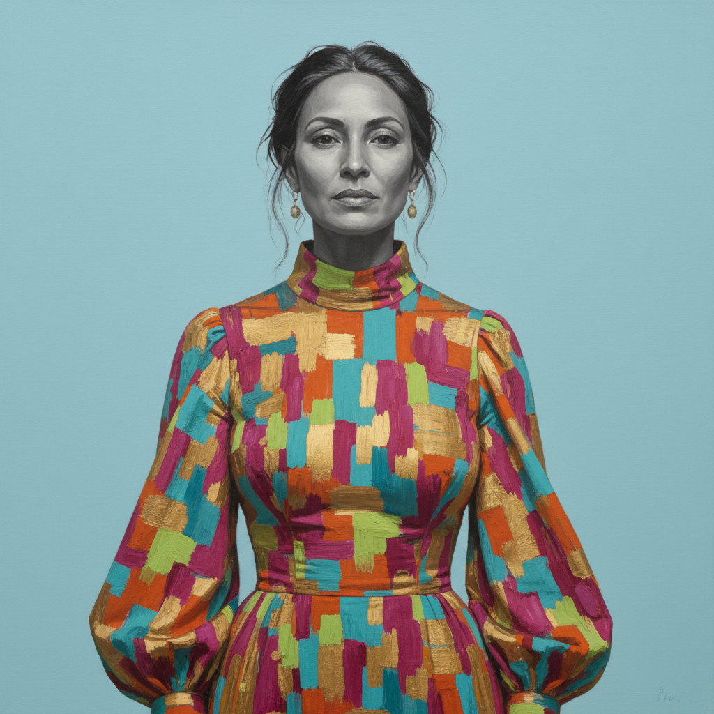

# Amy Sherald 艾米·谢拉尔德

> **流派**: 当代肖像画  
> **时期**: 1973–至今 美国  
> **关键词**: 灰色肤色、平面背景、日常黑人生活、静谧尊严

## 概述

艾米·谢拉尔德以独特的灰色调(grisaille)肤色处理闻名——她将黑人人物的皮肤画成灰色，从而将肤色从种族标签中解放出来，让观众关注人物本身而非其种族身份。她的人物通常穿着色彩鲜明的服装，站在纯色背景前，呈现出一种安静而有尊严的日常存在。

## 视觉特征

- **灰色肤色**: 人物皮肤统一为灰色调
- **纯色背景**: 单一柔和色彩的平面背景
- **鲜明服饰**: 人物服装色彩饱和、图案丰富
- **正面或四分之三侧面**: 经典肖像姿态
- **静谧氛围**: 人物表情平静、目光坚定

## 代表作品

- 米歇尔·奥巴马官方肖像 (2018)
- 《大大师》(The Grand Dame Queenie, 2012)
- 《无辜者》(Innocent You, Innocent Me, 2016)
- 《如果她们能看到我现在的样子》系列

## 历史影响

谢拉尔德为黑人肖像画创造了全新的视觉语言——既不是抗议也不是庆祝，而是一种平静的存在宣言。她的灰色肤色策略巧妙地绕过了种族凝视，让黑人形象获得了一种超越种族的普遍人性。

## 相关风格

- [Kehinde Wiley 凯欣德·威利](kehinde-wiley.md)
- [Portrait Painting 肖像画](portrait-painting.md)
- [Contemporary Figurative Art 当代具象艺术](contemporary-figurative-art.md)
