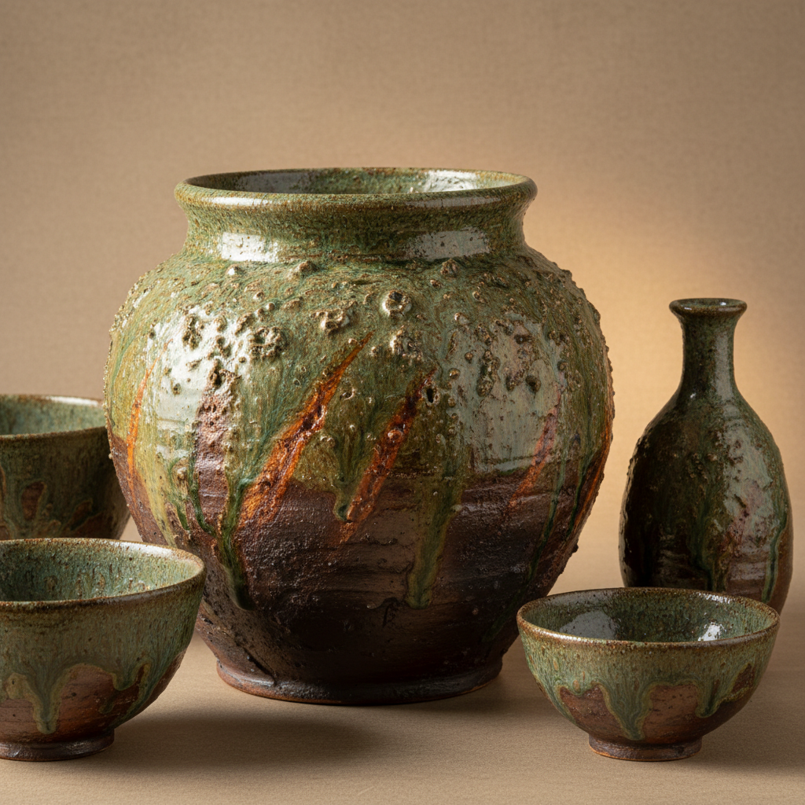

# Anagama Art 穴窑艺术

> "Anagama is pottery shaped by fire itself — a single-chamber climbing kiln is stoked continuously for days or even weeks, the wood ash carried by the draft settling on the pots and melting into natural glazes of green, gold, and amber, while the flames leave their own marks in flashing orange and deep charcoal, so that each piece emerges as a unique collaboration between the potter, the kiln, and the fire." — Unknown

## 概述

穴窑艺术（Anagama Art）是一种使用传统单室穴窑（anagama）进行长时间柴烧的陶瓷艺术——穴窑源自古代东亚，通过连续数天甚至数周的柴烧，木灰自然落在器物表面形成天然灰釉，火焰的流动在器物上留下独特的火痕和色彩变化，每件作品都是陶艺家与火焰合作的独一无二的结果。

穴窑艺术的实践包括：1）窑炉建造——建造传统的单室穴窑；2）装窑——精心安排器物在窑内的位置；3）长时间烧制——连续数天的柴烧；4）灰釉——木灰自然形成的天然釉面；5）火痕——火焰流动留下的痕迹；6）窑变——不可预测的窑内变化；7）当代穴窑——将传统柴烧与现代陶艺结合的创作。

## 核心特征

| 特征 | 描述 |
|------|------|
| 柴烧 | 使用木柴作为燃料 |
| 长时间 | 连续数天的烧制 |
| 灰釉 | 木灰形成天然釉面 |
| 火痕 | 火焰留下的痕迹 |
| 窑变 | 不可预测的变化 |
| 自然 | 自然力量的参与 |

## 视觉特征

- **灰釉**：绿色、金色、琥珀色的天然灰釉
- **火痕**：橙色和炭色的火焰痕迹
- **质朴**：质朴自然的表面
- **变化**：丰富的色彩和质感变化
- **独特**：每件作品独一无二
- **粗犷**：粗犷有力的质感

## 代表作品

| 作品 | 艺术家/文化 | 年代 | 意义 |
|------|-------------|------|------|
| *Shigaraki ware* | 日本 | 13世纪起 | 信乐烧 |
| *Bizen ware* | 日本 | 12世纪起 | 备前烧 |
| *Korean onggi* | 韩国 | 传统 | 韩国瓮器 |
| *Peter Voulkos anagama* | 美国 | 20世纪 | 彼得·沃尔科斯穴窑作品 |
| *Contemporary anagama* | 国际 | 当代 | 当代穴窑陶艺 |

## 历史时间线

| 时期 | 事件 |
|------|------|
| 5世纪 | 穴窑从朝鲜半岛传入日本 |
| 12-13世纪 | 日本六古窑的发展 |
| 16世纪 | 茶道文化推动穴窑美学 |
| 20世纪 | 穴窑在西方的传播 |
| 当代 | 全球穴窑陶艺运动 |

## 中国语境

穴窑与中国的传统柴烧陶瓷有深厚的渊源。中国是穴窑的发源地——早在商周时期就有穴窑的使用。中国的龙窑——是穴窑的一种发展形式，在南方地区广泛使用。中国的传统柴烧陶瓷——如建窑、吉州窑等都使用类似的柴烧技法。中国当代的柴烧陶艺运动——在景德镇、宜兴等地蓬勃发展。中国的陶艺家——越来越多地建造穴窑进行创作。中国的陶瓷教育中，穴窑烧制作为传统技法——在各大陶瓷院校中教授。中国的柴烧陶艺节——在各地举办，推动柴烧文化的交流。

## AI生成概念图

## 与其他风格的关系

- **Raku** → 乐烧
- **Wood-fired Ceramics** → 柴烧陶瓷
- **Wabi-sabi** → 侘寂美学
- **Bizen Ware** → 备前烧
- **Shigaraki Ware** → 信乐烧
- **Studio Pottery** → 工作室陶艺

---

*浮光艺志 | Chronicle of Artistry*
