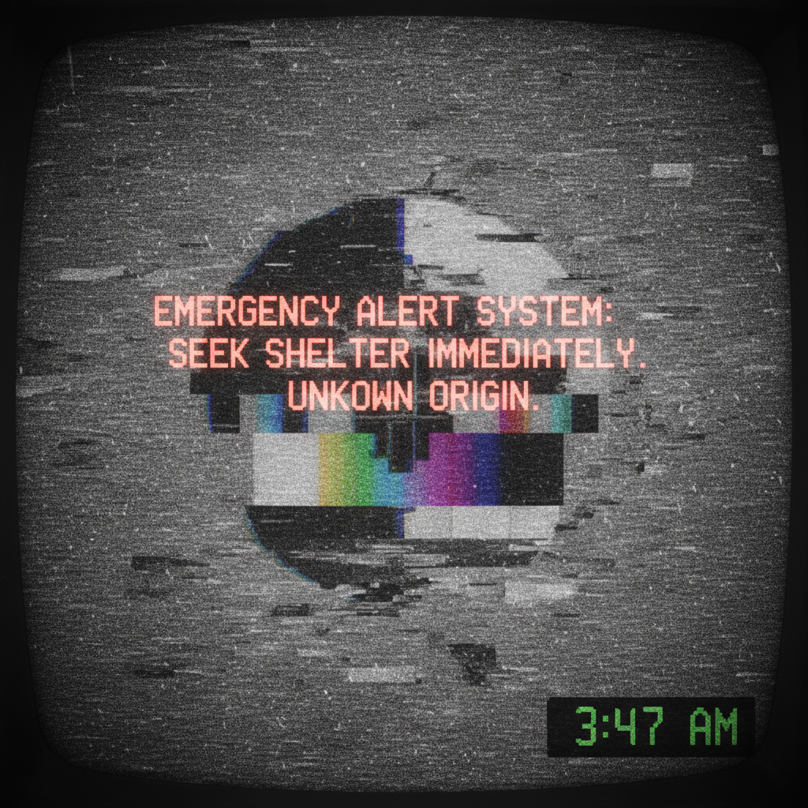

# Analog Horror Art 模拟恐怖艺术

> **时期：** 2019–至今  
> **关键词：** VHS质感、公共广播恐怖、复古媒体、信号干扰、怀旧恐惧

## 概述

模拟恐怖（Analog Horror）是一种通过模仿旧媒体格式——VHS录像带、公共电视广播、教育节目、监控录像——来制造恐怖的创作形式。它利用人们对这些"可信"媒体格式的信任，在看似正常的节目中植入越来越不对劲的元素，将怀旧感转化为深层不安。

## 风格特征

- **VHS质感**：扫描线、色彩偏移、磁带损坏
- **公共广播**：模仿紧急广播系统、教育节目
- **信号干扰**：静电噪音、画面撕裂、频率异常
- **文字叠加**：紧急警告、字幕、时间码
- **日常媒体**：监控录像、家庭录像、新闻播报

## 代表作品与平台

- Local 58《Weather Service》
- The Mandela Catalogue
- Gemini Home Entertainment
- The Walten Files

## 概念图

