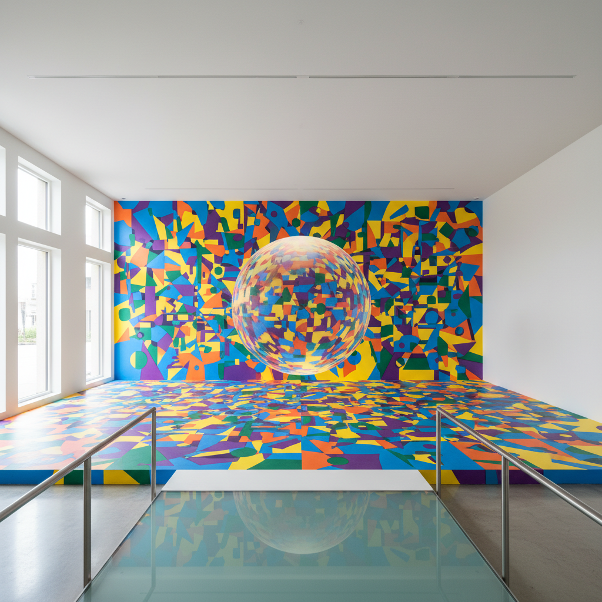

# Anamorphic Art 变形艺术

> "Anamorphosis reveals that seeing is not believing — it is a matter of perspective." — Felice Varini

## 概述

变形艺术（Anamorphic Art / Anamorphosis）是利用透视扭曲创造的图像——从特定角度或通过特定工具（如圆柱镜）观看时才能看到正确的图像，从其他角度看则是扭曲的、不可辨认的形状。变形艺术是视觉欺骗和透视科学的极致运用。

变形艺术的哲学意义在于它揭示了"看"的主观性——同一个物理表面，从不同角度看到完全不同的东西。真相取决于你站在哪里。

## 核心特征

| 特征 | 描述 |
|------|------|
| 透视扭曲 | 利用极端透视创造图像 |
| 视角依赖 | 只从特定角度才能看到正确图像 |
| 数学性 | 基于精确的几何计算 |
| 惊奇感 | 创造视觉惊奇和发现 |
| 空间性 | 与观看空间紧密相关 |
| 互动性 | 需要观众移动寻找正确视角 |

## 视觉特征

- **扭曲**：从"错误"角度看到的极端扭曲
- **还原**：从正确角度看到的清晰图像
- **3D幻觉**：在平面上创造立体幻觉
- **空间**：图像与建筑空间的融合
- **尺度**：从小型到城市级别的变形
- **发现**：观众发现正确视角的惊喜

## 代表作品

| 作品 | 艺术家 | 年代 | 意义 |
|------|--------|------|------|
| *The Ambassadors* | Hans Holbein | 1533 | 最著名的变形骷髅 |
| *Geometric installations* | Felice Varini | 1979-至今 | 建筑空间中的变形几何 |
| *3D street art* | Julian Beever | 1990s+ | 街头3D粉笔画 |
| *3D street art* | Edgar Müller | 2000s+ | 大型街头变形画 |
| *Perspective installations* | Georges Rousse | 1981-至今 | 废弃空间中的变形绘画 |
| *Anamorphic sculptures* | Jonty Hurwitz | 2010s | 需要圆柱镜才能看到的雕塑 |

## 历史时间线

| 时期 | 事件 |
|------|------|
| 15世纪 | Leonardo da Vinci的变形实验 |
| 1533 | Holbein的《大使们》——变形骷髅 |
| 17世纪 | 变形艺术在欧洲的流行 |
| 18-19世纪 | 圆柱镜变形画的流行 |
| 1979 | Felice Varini开始建筑变形创作 |
| 1990s-至今 | 3D街头艺术的兴起 |
| 2010s | 社交媒体推动变形艺术的传播 |

## 中国语境

变形艺术在中国主要通过3D街头绘画和商业互动装置为人所知。中国的商业空间和旅游景点大量使用3D变形画作为互动拍照点。一些中国当代艺术家也在探索变形艺术的更深层可能——将其与中国传统的"移步换景"园林美学进行对话。

## AI生成概念图

## 与其他风格的关系

- **Op Art** → 欧普艺术的视觉欺骗与变形相通
- **Trompe-l'oeil** → 错视画是变形艺术的近亲
- **Street Art** → 3D街头画是变形艺术的大众形式
- **Installation Art** → 空间变形装置
- **Interactive Art** → 观众需要移动寻找正确视角
- **Mathematics Art** → 变形基于精确的数学计算

---

*浮光艺志 | Chronicle of Artistry*
