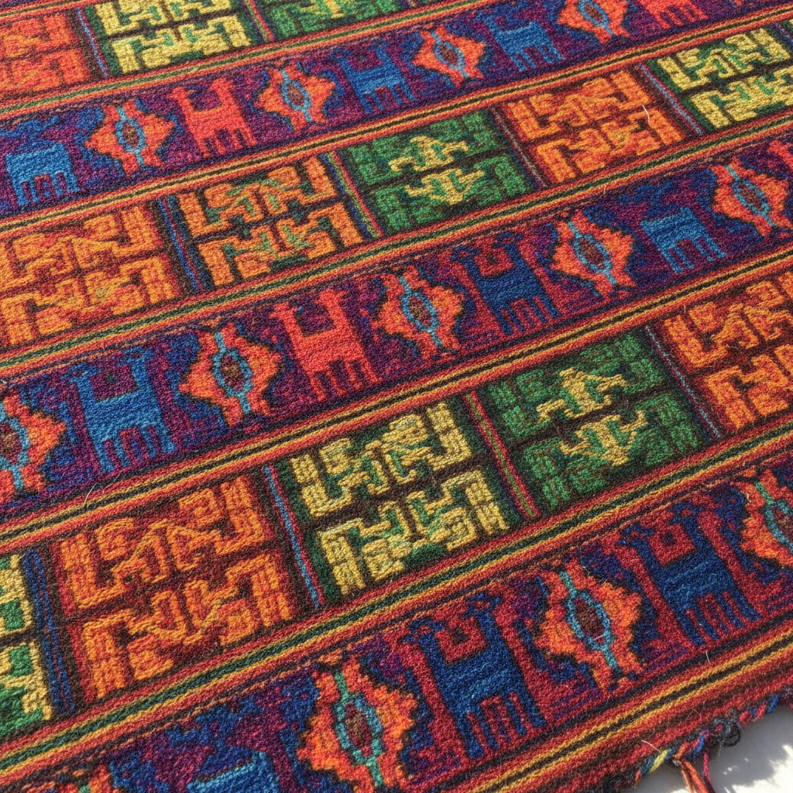

# Andean Textile Art 安第斯纺织艺术

> **"没有文字的文明用线记录一切——每一个结都是一段历史。"**

## 概述

安第斯纺织艺术（Arte Textil Andino / Andean Textile Art）是南美洲安第斯文明（包括印加帝国及其前身文化）最重要的艺术表达形式，历史可追溯至公元前3000年。在没有书写系统的安第斯世界，纺织品承担了记录、交流和身份标识的功能——从印加的奇普结绳记事（Quipu）到帕拉卡斯的精美刺绣斗篷，纺织品比黄金更珍贵，是权力、宗教和宇宙观的核心载体。

## 主要文化时期

| 文化 | 时期 | 纺织特征 |
|------|------|----------|
| 帕拉卡斯 Paracas | 800 BCE–100 CE | 极精细的刺绣斗篷，200+色 |
| 纳斯卡 Nazca | 100–800 CE | 鲜艳多色，神话生物 |
| 瓦里 Wari | 600–1000 CE | 几何抽象，帝国标准化 |
| 蒂瓦纳库 Tiwanaku | 300–1000 CE | 太阳门图案的纺织转化 |
| 奇穆 Chimú | 1000–1470 CE | 大规模生产，精细织造 |
| 印加 Inca | 1438–1533 CE | Tocapu几何符号系统 |

## 核心特征

- **Quipu 奇普**：结绳记事系统，用于记录数据和叙事
- **Tocapu**：印加几何符号方格，可能是一种书写系统
- **Cumbi**：印加皇室专用的极精细织物
- **骆驼科纤维**：羊驼毛（Alpaca）和骆马毛（Vicuña）
- **天然染料**：胭脂虫红、靛蓝、各种植物染料
- **背带织机**：便携式织机，至今仍在使用

## 视觉特征

- 极其精细的织造密度（每厘米200+根线）
- 鲜艳饱和的天然染料色彩
- 几何化的动物和人物图案
- 对称重复的模块化设计
- 阶梯形（Chakana十字）等核心几何母题
- 正反面均可使用的双面织造

## 象征图案

| 图案 | 含义 |
|------|------|
| Chakana（安第斯十字） | 宇宙四方、三界（天/地/冥） |
| 蛇 Amaru | 地下世界、水、智慧 |
| 美洲驼 | 大地、劳动、丰饶 |
| 秃鹰 Condor | 天空世界、精神 |
| 阶梯纹 | 通往天界的阶梯 |
| 菱形 | 湖泊、女性、生育 |

## 与其他风格的关系

| 风格 | 关系 |
|------|------|
| 中美洲纺织 | 共享美洲原住民纺织传统 |
| 非洲Kente | 共享窄条织布和身份标识功能 |
| 伊斯兰几何 | 共享几何抽象和模块化设计 |
| 极简主义 | 安第斯几何的纯粹性 |
| 当代秘鲁设计 | 传统图案的现代时装转化 |

## 概念图

---

*浮光艺志 | Chronicle of Artistry*
