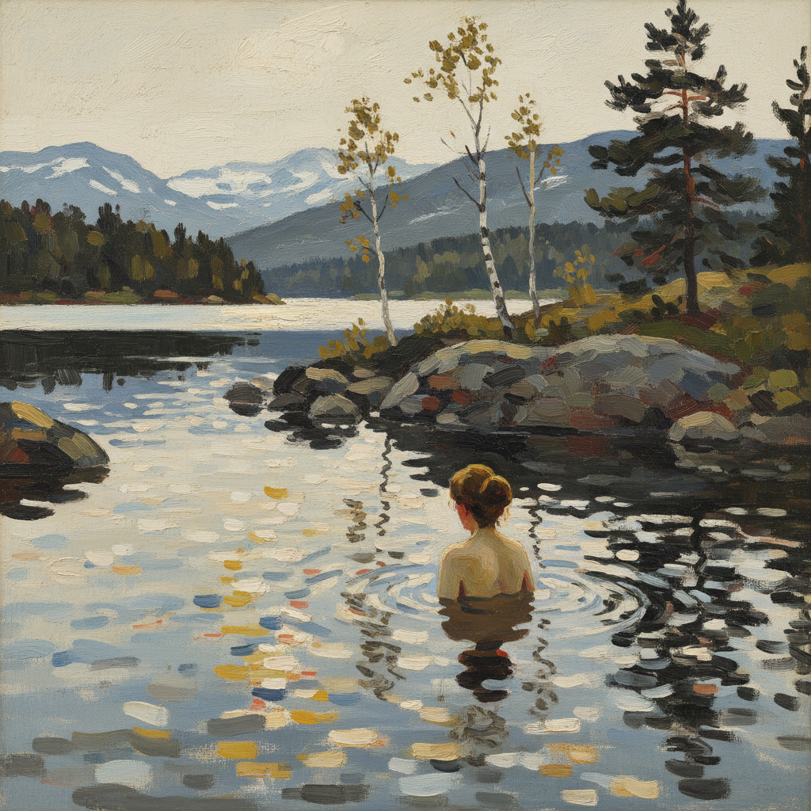

# Anders Zorn 安德斯·佐恩

> "I paint what I see." — Anders Zorn

## 概述

安德斯·佐恩（Anders Zorn，1860–1920）是瑞典画家、版画家和雕塑家，以精湛的水彩和油画技巧闻名于世。他以描绘裸体浴女、瑞典乡村生活和国际名流肖像闻名——用极其有限的调色板（据说只用四种颜色）和自信的笔触创造出充满光线和生命力的画面。

## 核心特征

| 特征 | 描述 |
|------|------|
| 有限调色板 | 仅用四色创造丰富色彩 |
| 水面光线 | 湖水中的反射和折射 |
| 自信笔触 | 一笔到位的精准 |
| 裸体浴女 | 北欧阳光下的自然之美 |
| 肖像大师 | 三位美国总统的肖像 |
| 版画技艺 | 铜版画的最高水平 |

## 代表作品

| 作品 | 年代 | 意义 |
|------|------|------|
| *Midsummer Dance* | 1897 | 瑞典民俗的经典 |
| *Girls from Dalarna Having a Bath* | 1906 | 光与水的极致 |
| *Self-Portrait with Model* | 1896 | 画室中的坦诚 |
| *President Grover Cleveland* | 1899 | 总统肖像的典范 |

## AI生成概念图

## 与其他风格的关系

- **Impressionism** → 瑞典印象主义的代表
- **Sargent** → 同代肖像画大师
- **Sorolla** → 共享阳光和水的追求
- **Rembrandt** → 版画技艺的继承者
