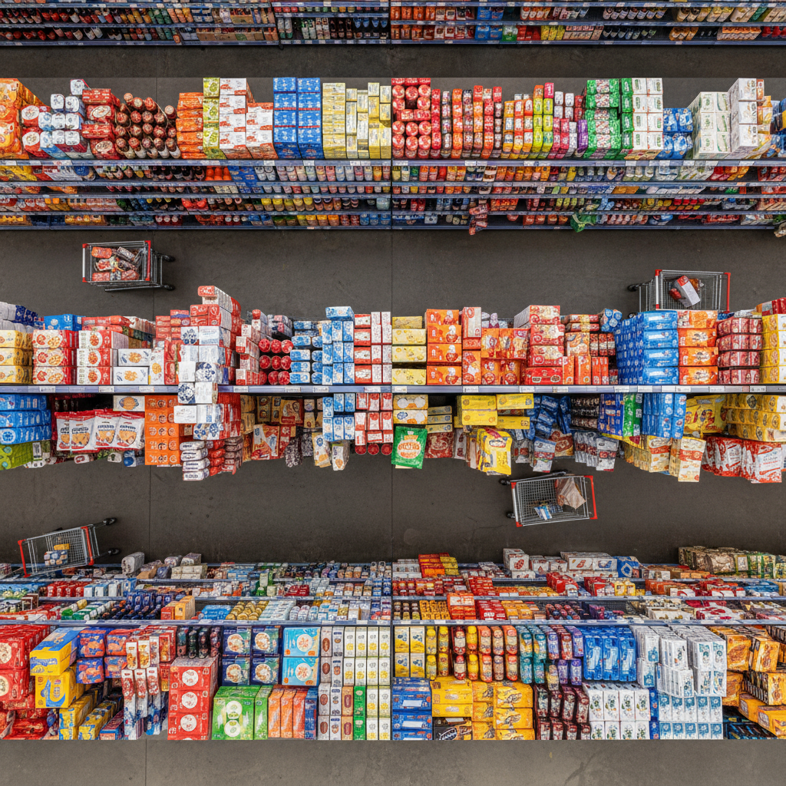

# Andreas Gursky 安德烈亚斯·古尔斯基

> **流派**: 当代摄影 · 杜塞尔多夫学派  
> **时期**: 1955–至今 德国  
> **关键词**: 巨幅摄影、全球化景观、数字后期、上帝视角

## 概述

安德烈亚斯·古尔斯基是当代最具影响力的摄影艺术家之一。他的作品以巨大的尺幅（常超过2×3米）和"上帝视角"的俯瞰构图著称，拍摄对象包括证券交易所、超市货架、工厂车间、音乐节人群和亚马逊河流域。他用数字后期将多张照片合成为一个"超真实"的整体，创造出一种关于全球化时代的视觉史诗。

## 视觉特征

- **巨幅尺寸**: 作品常超过2米宽，需要在美术馆中观看
- **俯瞰视角**: 从高处或远处拍摄，人变成图案的一部分
- **重复模式**: 大量相似元素（人、商品、建筑）形成视觉节奏
- **数字合成**: 多张照片无缝拼合为一个完美画面
- **色彩饱和**: 经过精心调色的鲜明色彩

## 代表作品

- 《莱茵河II》(Rhein II, 1999) — 曾为最贵照片
- 《99美分》(99 Cent, 1999)
- 《芝加哥商品交易所》(Chicago Board of Trade, 1997)
- 《平壤》系列 (2007)
- 《亚马逊》(Amazon, 2016)

## 历史影响

古尔斯基将摄影从记录工具提升为与绘画平等的艺术媒介。他的巨幅作品改变了人们对摄影尺寸和展示方式的期待，也为理解全球化、消费主义和集体行为提供了独特的视觉框架。

## 相关风格

- [Thomas Ruff 托马斯·鲁夫](thomas-ruff.md)
- [Düsseldorf School 杜塞尔多夫学派](dusseldorf-school.md)
- [Contemporary Photography 当代摄影](contemporary-photography.md)
