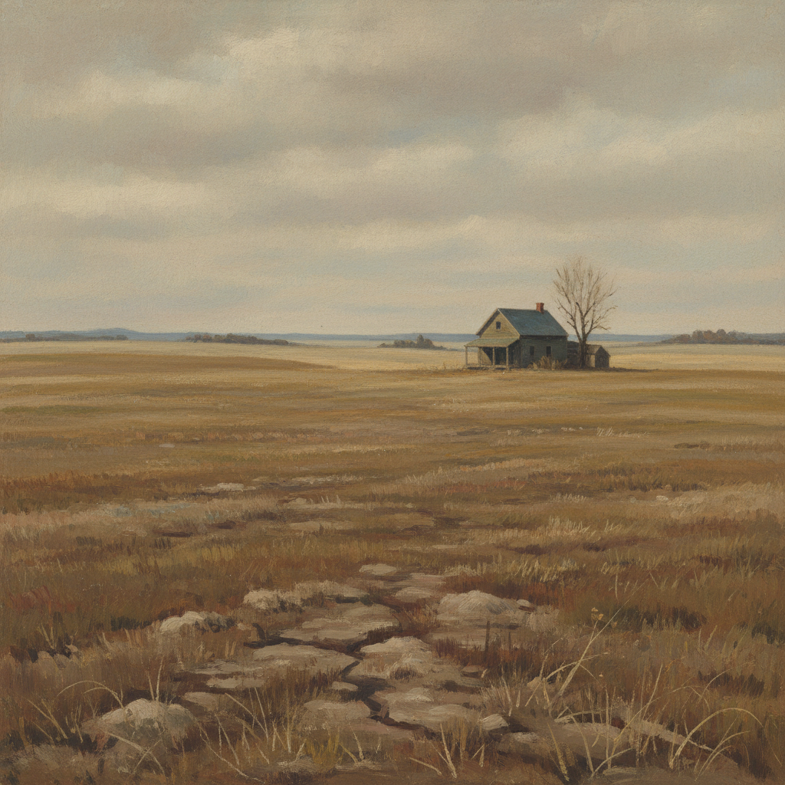

# Andrew Wyeth 安德鲁·怀斯

> **流派**: 美国现实主义 · 地方主义  
> **时期**: 1917–2009 美国  
> **关键词**: 蛋彩画、枯草色调、美国乡村、孤寂诗意

## 概述

安德鲁·怀斯是20世纪美国最受欢迎也最具争议的画家之一。他以极度精细的蛋彩画和水彩画描绘宾夕法尼亚和缅因州的乡村风景与人物，作品充满一种荒凉而深沉的美国式忧郁。

## 视觉特征

- **蛋彩技法**: 用蛋彩画的干笔法创造极度精细的肌理
- **枯草色调**: 褐色、灰色、枯黄色构成主色调
- **荒凉风景**: 冬日的田野、空旷的房屋、干枯的草地
- **精密细节**: 每一根草、每一块木板都被精确描绘
- **隐含叙事**: 画面暗示着不在场的人物和未说出的故事

## 代表作品

- 《克里斯蒂娜的世界》(1948)
- 《海风》(1947)
- 《赫尔加》系列 (1971–1985)
- 《远方的雷声》(1961)

## 历史影响

怀斯证明了写实绘画在现代主义时代仍有深刻的表达力。他的作品影响了美国摄影、电影和当代超写实主义，也引发了关于"通俗"与"前卫"之间界限的持续讨论。

## 相关风格

- [Edward Hopper 爱德华·霍珀](edward-hopper.md)
- [Norman Rockwell 诺曼·洛克威尔](norman-rockwell.md)
- [Grant Wood 格兰特·伍德](grant-wood.md)
