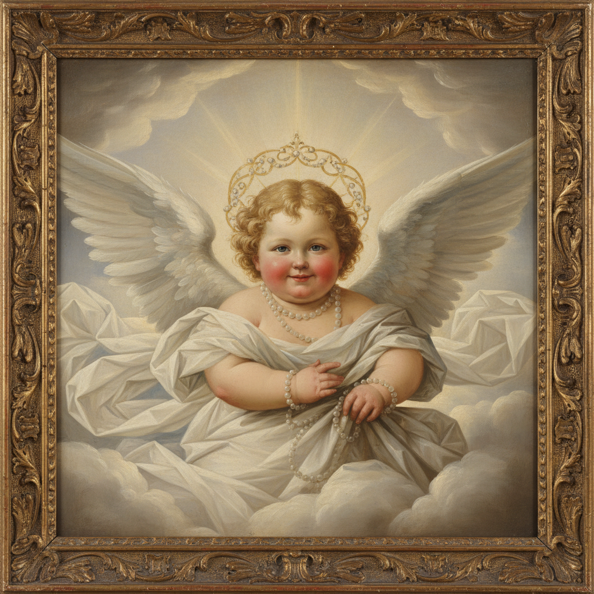

# Angelcore 天使核



> **"白色羽翼、金色光环、文艺复兴天顶画——成为天使不需要死去。"**

## 概述

| 维度 | 描述 |
|------|------|
| 时期 | 2020–至今 |
| 别名 | Angelcore, Cherubcore, Heavenly Aesthetic, Divine Feminine |
| 核心色彩 | 纯白、金色、淡粉、天蓝、珍珠色 |
| 关键元素 | 天使翅膀、光环、云朵、珍珠、文艺复兴天使画 |
| 代表人物 | Botticelli、Fra Angelico、Lana Del Rey (部分) |
| 关联风格 | Royalcore, Light Academia, Fairycore, Coquette |

---

## 历史脉络

### 2020：Tumblr/Pinterest 的神圣美学

Angelcore 在 2020 年作为一种视觉美学标签出现，将**基督教艺术中的天使意象**转化为世俗时尚和生活方式：

- 文艺复兴天顶画中的小天使(Cherub/Putti)
- 巴洛克教堂的金色装饰
- 维多利亚时代的天使墓碑雕塑
- 这些宗教意象被"去宗教化"，变成纯粹的美学符号

### 文化基因

| 来源 | 贡献 |
|------|------|
| 文艺复兴绘画 | Botticelli、Raphael 的天使形象 |
| 巴洛克建筑 | 金色、云朵、光线的戏剧性 |
| 维多利亚墓园 | 天使雕塑的忧郁美 |
| 90s 天使热潮 | 天使别针、天使主题装饰 |
| Dolce & Gabbana | 巴洛克+宗教元素的时尚化 |

### 核心哲学

Angelcore 的吸引力在于它提供了一种**世俗的神圣感**：
- 不需要信仰就能感受"神圣"
- 将自己想象为天使 = 纯洁、美丽、超越凡俗
- 一种对"完美"和"纯净"的渴望
- 在混乱的世界中创造一个"天堂"空间

---

## 视觉语法

### 色彩系统

```
主色：
  纯白 (#FFFFFF) — 纯洁、云朵、羽翼
  金色 (#FFD700) — 光环、圣光、装饰
  淡粉 (#FFE4E1) — 小天使的肌肤
  天蓝 (#87CEEB) — 天堂的天空
  珍珠色 (#F0EAD6) — 珍珠、丝绸

辅色：
  象牙白 (#FFFFF0) — 大理石
  淡紫 (#E6E6FA) — 薰衣草、神秘
  银色 (#C0C0C0) — 星光

质感：
  羽毛 — 天使翅膀
  丝绸/缎面 — 天使长袍
  大理石 — 雕塑
  金箔 — 装饰
  珍珠 — 配饰
  云朵/烟雾 — 氛围
```

### 标志性元素

| 类别 | 元素 |
|------|------|
| 符号 | 天使翅膀、光环、十字架、百合花 |
| 艺术 | 文艺复兴天使画、巴洛克天顶画、天使雕塑 |
| 服装 | 白色丝绸裙、珍珠配饰、羽毛装饰 |
| 空间 | 白色+金色装饰、蜡烛、鲜花、镜子 |
| 音乐 | 唱诗班、竖琴、空灵女声 |
| 妆容 | 发光肌肤、珍珠高光、淡粉唇色 |

---

## 与千禧怀旧的关系

### 90s 的天使热潮
- 1990s 美国有一波"天使热"——天使别针、天使装饰品
- 电视剧《Touched by an Angel》(1994–2003)
- Victoria's Secret 的"Angel"品牌形象
- Angelcore 是对这波 90s 天使文化的怀旧回归

---

## 中国语境

- "天使风"/"仙气"穿搭
- 婚纱摄影中的天使元素
- 与"白月光"审美的交叉
- 小红书上的"神颜"/"天使脸"标签
- 敦煌飞天与西方天使的视觉对话

---

## 设计应用

| 场景 | 应用方式 |
|------|----------|
| 品牌 | 白色+金色+衬线字体+天使插画 |
| 包装 | 珍珠色+金箔+浮雕+丝带 |
| 空间 | 白色+金色+蜡烛+鲜花+镜面 |
| 摄影 | 柔光+白纱+羽毛+逆光 |

---

## 相关风格

← [Royalcore 皇室核](royalcore.md) | [Fairycore 仙女核](fairycore.md) →

↑ [返回千禧怀旧目录](README.md) | [返回总目录](../README.md)
