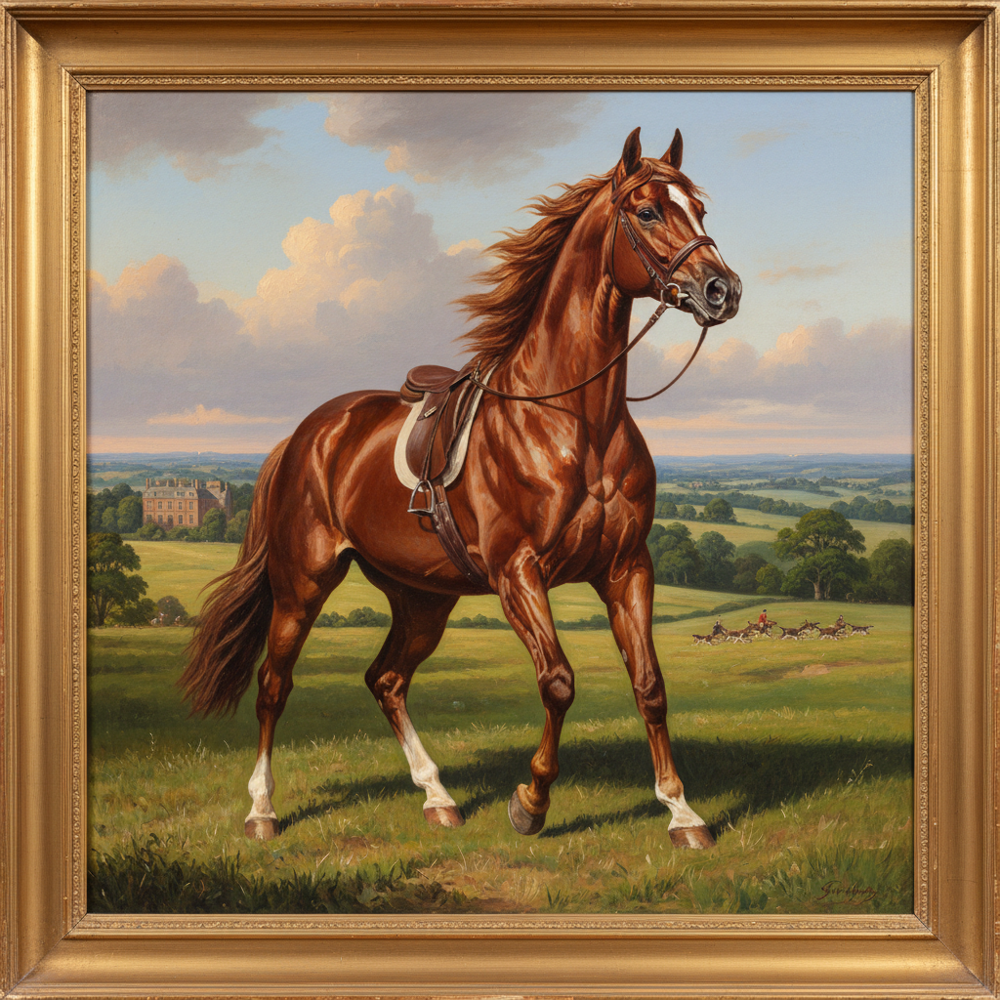

# Animal Painting 动物画

> **时期：** 史前–至今  
> **关键词：** 动物肖像、自然史记录、狩猎场景、马术画、野生动物

## 概述

Animal Painting（动物画）是以动物为主要题材的绘画类型，从拉斯科洞窟的野牛到斯塔布斯的骏马解剖学研究，人类对动物的描绘贯穿整个艺术史。17世纪荷兰和18世纪英国将动物画发展为独立画种——画家需要同时具备解剖学知识、运动观察力和对动物性格的敏感捕捉。

## 风格特征

- **解剖精确**：对骨骼肌肉结构的科学理解
- **运动捕捉**：奔跑、飞翔等动态瞬间
- **性格表现**：赋予动物个体性和情感
- **环境融合**：动物与其栖息地的关系
- **毛发质感**：皮毛、羽毛的精细描绘

## 代表人物与作品

- 乔治·斯塔布斯《惠斯尔杰克》
- 埃德温·兰西尔《鹿之君主》
- 罗莎·博纳尔《马市》
- 奥杜邦《美国鸟类》

## 概念图

