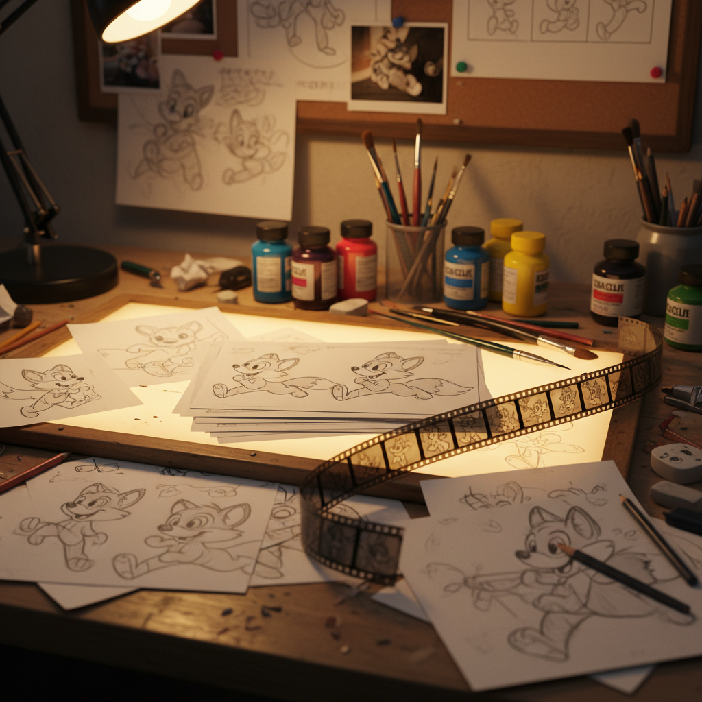

# Animation Art 动画艺术

> "Animation offers a medium of storytelling and visual entertainment which can bring pleasure and information to people of all ages everywhere in the world." — Walt Disney

## 概述

动画艺术（Animation Art）是通过逐帧创建图像并连续播放来产生运动幻觉的艺术形式。从早期的手绘赛璐珞动画到当代的3D计算机动画、定格动画和实验动画，动画艺术融合了绘画、雕塑、摄影、音乐和叙事的多重维度。

动画的魔力在于它赋予静止的图像以生命——任何东西都可以动起来，任何不可能的事都可以发生。它是想象力最自由的视觉媒介。

## 核心特征

| 特征 | 描述 |
|------|------|
| 逐帧性 | 通过连续帧创造运动幻觉 |
| 时间性 | 在时间中展开的视觉叙事 |
| 无限性 | 不受物理现实的限制 |
| 综合性 | 融合视觉、声音、叙事 |
| 劳动密集 | 需要大量的逐帧工作 |
| 风格多元 | 从写实到极度抽象 |

## 视觉特征

- **运动**：流畅或刻意不流畅的运动
- **变形**：形态的自由变化——挤压和拉伸
- **色彩**：从手绘的温暖到数字的精确
- **线条**：从简洁的线条到复杂的细节
- **空间**：从平面到深度的自由切换
- **节奏**：运动的节奏和时间感

## 代表作品

| 作品 | 创作者 | 年代 | 意义 |
|------|--------|------|------|
| *Gertie the Dinosaur* | Winsor McCay | 1914 | 角色动画的先驱 |
| *Fantasia* | Walt Disney | 1940 | 动画与古典音乐的融合 |
| *Neighbours* | Norman McLaren | 1952 | 实验动画的经典 |
| *千与千寻* | 宫崎骏 | 2001 | 手绘动画的巅峰 |
| *Loving Vincent* | Dorota Kobiela | 2017 | 油画动画——每帧手绘 |
| *Spider-Verse* | Sony Pictures | 2018 | 漫画风格3D动画的革新 |

## 历史时间线

| 时期 | 事件 |
|------|------|
| 1906 | 最早的动画短片——*Humorous Phases* |
| 1928 | Mickey Mouse——*Steamboat Willie* |
| 1937 | 第一部动画长片——*白雪公主* |
| 1958 | 中国水墨动画——*小蝌蚪找妈妈* |
| 1988 | 日本动画黄金时代——*AKIRA* |
| 1995 | 第一部全3D动画——*Toy Story* |
| 2000s | Flash动画和网络动画 |
| 2010s-至今 | AI辅助动画、实时渲染 |

## 中国语境

中国动画有辉煌的历史——从万氏兄弟的《铁扇公主》（1941，亚洲第一部动画长片）到上海美术电影制片厂的黄金时代（《大闹天宫》《哪吒闹海》《天书奇谭》），中国动画曾以独特的民族风格享誉世界。水墨动画、剪纸动画、木偶动画是中国动画的独特贡献。当代中国动画正在经历复兴——《哪吒之魔童降世》《深海》等作品展现了新的可能。

## AI生成概念图

## 与其他风格的关系

- **Digital Art** → 数字技术革新了动画制作
- **Comic Art** → 漫画与动画共享视觉语言
- **Film Art** → 动画是电影的重要分支
- **Experimental Art** → 实验动画推动了视觉语言的边界
- **Illustration** → 插画是动画的视觉基础
- **Sound Art** → 声音设计是动画体验的核心部分

---

*浮光艺志 | Chronicle of Artistry*
