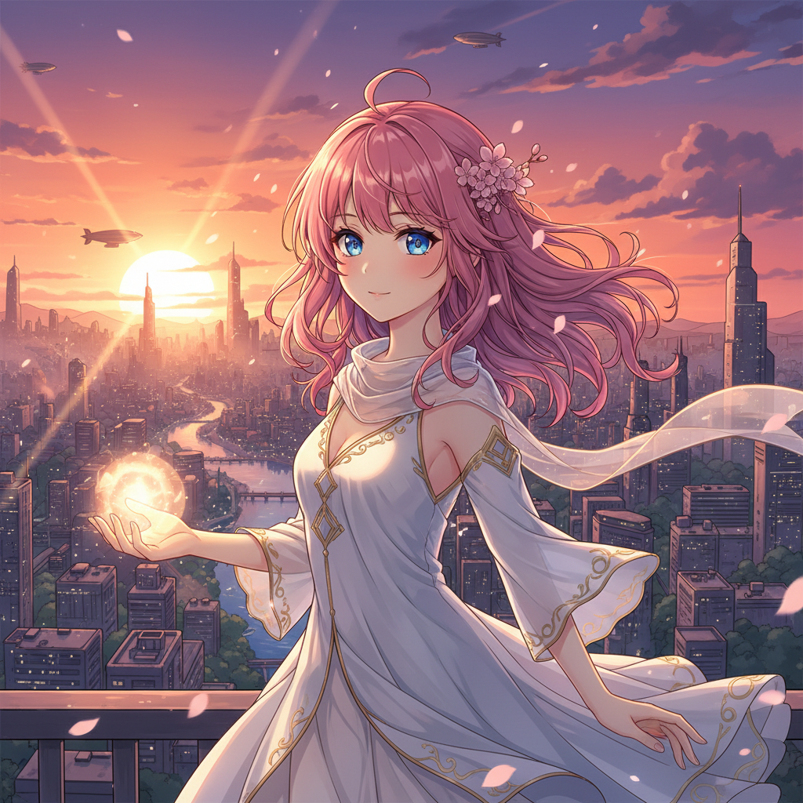

# Anime Art 动画艺术（日本）

> **时期：** 1960年代–至今  
> **关键词：** 赛璐珞美学、有限动画、大眼睛、光影渲染、世界观构建

## 概述

Anime（アニメ）是日本动画的独特视觉风格，从手冢治虫的有限动画技法（用更少的帧数讲故事）发展而来。它形成了一套独特的美学体系——精致的背景美术与简化的角色设计并存、静止画面与爆发性运动交替、光影和色彩营造情绪氛围——用有限的资源创造无限的想象世界。

## 风格特征

- **大眼睛**：夸大的眼睛作为情感窗口
- **有限动画**：关键帧之间的省略与暗示
- **背景美术**：精致写实的场景与简化角色的对比
- **光影渲染**：逆光、黄昏光、霓虹光的情绪营造
- **机械设定**：精密的机甲和载具设计

## 代表人物与作品

- 宫崎骏《千与千寻》《风之谷》
- 庵野秀明《新世纪福音战士》
- 新海诚《你的名字》
- 今敏《千年女优》《红辣椒》

## 概念图

