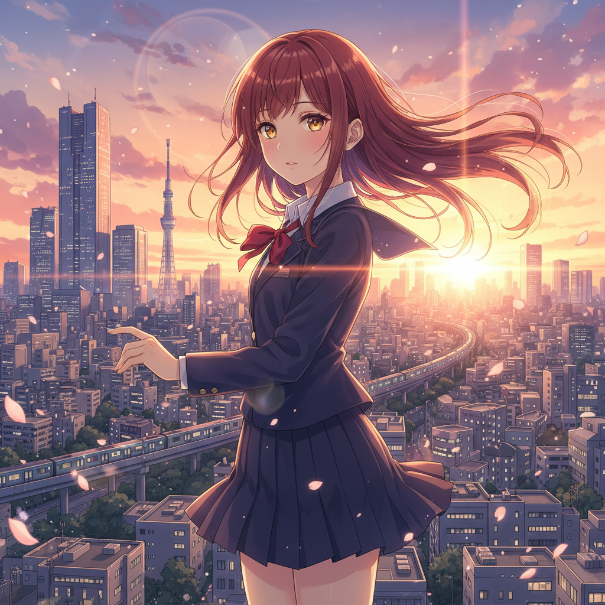

# Anime 动画美学



> **"赛璐珞的光影、无限的想象——日本动画创造了一个平行于现实的视觉宇宙。"**

## 概述

| 维度 | 描述 |
|------|------|
| 时期 | 1960s–至今 |
| 别名 | Anime, Japanese Animation, アニメ, 日本动画 |
| 核心色彩 | 鲜艳+平涂、赛璐珞色彩、光影分明 |
| 关键元素 | 大眼睛、精细背景、有限动画、光效、情绪表达 |
| 代表人物 | 宫崎骏, 新海诚, 庵野秀明, 今敏, 大友克洋 |
| 关联风格 | Manga, Kawaii, Vaporwave, Lofi, Cyberpunk |

---

## 历史脉络

| 年份 | 事件 |
|------|------|
| 1963 | 《铁臂阿童木》——日本TV动画开始 |
| 1979 | 《机动战士高达》——机器人动画革命 |
| 1988 | 《阿基拉》——动画电影的里程碑 |
| 1995 | 《攻壳机动队》《EVA》——动画的哲学深度 |
| 2001 | 《千与千寻》奥斯卡——全球认可 |
| 2016 | 《你的名字》——新海诚现象 |
| 2020s | 动画产业全球化+AI辅助制作 |

### 核心哲学

动画美学的精神是**"有限的帧数、无限的表达"**：
- 有限动画 = 风格（"不是预算不够——是选择把资源放在关键帧"）
- 背景 = 世界观（"每一帧背景都是一幅画"）
- 光 = 情感（"新海诚的光线 = 青春的感觉"）
- 静止 = 力量（"不动的画面——反而最有冲击力"）
- 宫崎骏: "动画可以描绘任何世界——这是它的自由"

---

## 视觉语法

### 色彩系统

```
经典赛璐珞：
  平涂色彩 — 明确的明暗分界
  2-3层阴影 — 简洁的光影
  高光 — 头发、眼睛的光点
  背景 — 水彩/数字绘景

新海诚风格：
  蓝天 (#87CEEB) — 标志性天空
  金色光线 — 黄昏、逆光
  高饱和 — 比现实更美
  光斑 — lens flare

宫崎骏风格：
  自然绿 (#228B22) — 森林、草地
  天空蓝 — 飞行、自由
  暖色 — 食物、家庭
  水彩质感 — 手绘温度

质感：
  平涂 — 赛璐珞传统
  渐变 — 数字时代
  光效 — 粒子、光斑
  背景 — 精细绘景
```

### 标志性元素

| 类别 | 元素 |
|------|------|
| 人物 | 大眼睛、精细发丝、表情系统 |
| 背景 | 精细绘景、光影氛围、季节感 |
| 动态 | 关键帧、速度线、变形夸张 |
| 光效 | 逆光、lens flare、粒子、光斑 |
| 情绪 | 樱花飘落、雨、黄昏、星空 |
| 态度 | 美、情感、想象、精细、叙事 |

---

## 与千禧怀旧的关系

### 全球千禧一代的视觉记忆
- 90s/00s: 《EVA》《美少女战士》《龙珠Z》= 全球童年
- "Anime aesthetic" = 2020s最流行的视觉风格之一
- Lofi Hip-Hop 封面 = Anime aesthetic的代表
- 新海诚的光线 = "青春"的视觉定义

### 对当代视觉文化的影响
- Anime → Vaporwave → Lofi → 当代数字美学
- Anime 背景 → 壁纸 → 手机主题 → 生活方式
- "Anime不只是动画——是一种看世界的方式"
- AI生图中"anime style"是最热门的风格标签

---

## 中国语境

- 中国动画（国创）的发展
- 从日本动画影响到中国独立风格
- 中国动画产业（B站、优酷、腾讯）
- 中国动画电影的崛起（《哪吒》《大圣》）

---

## 设计应用

| 场景 | 应用方式 |
|------|----------|
| 游戏 | 角色+场景+UI+动画风格 |
| 品牌 | 二次元+年轻+IP+联名 |
| 壁纸 | 手机/桌面+氛围+美学 |
| 营销 | 动画广告+虚拟偶像+社交 |

---

## 相关风格

← [Manga 漫画](manga.md) | [Lofi 低保真](lofi.md) →

↑ [返回千禧怀旧目录](README.md) | [返回总目录](../README.md)
