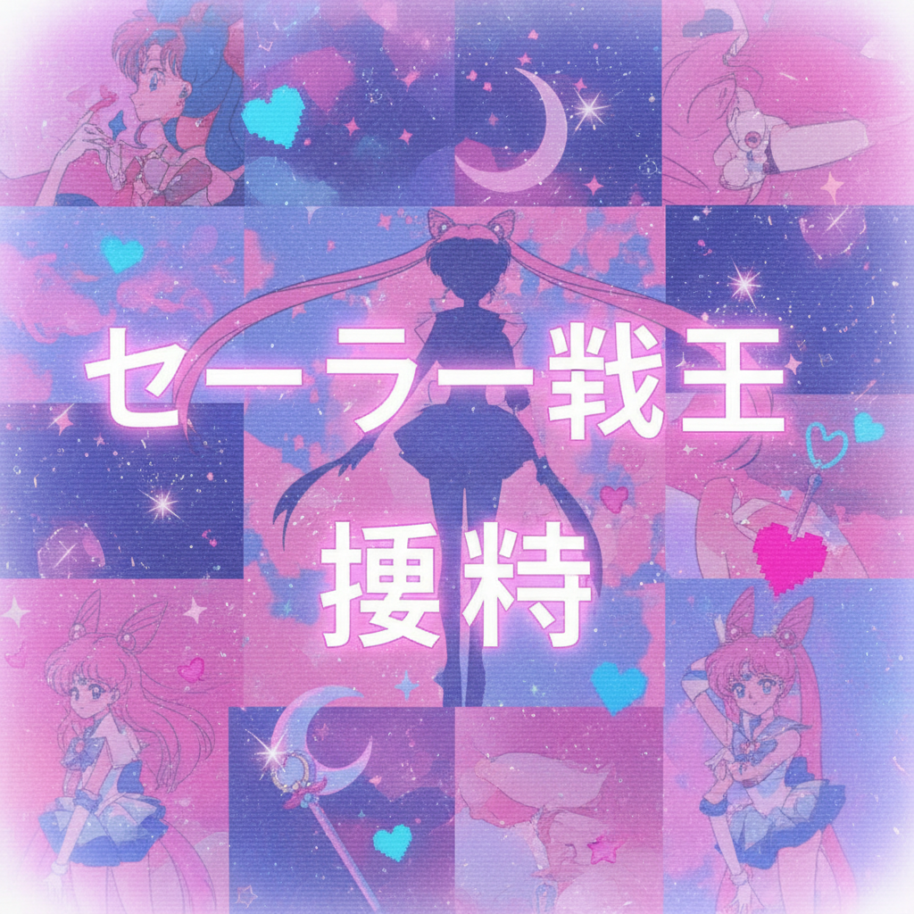

# Animecore 动漫核




> **"当二次元从屏幕溢出，渗透进现实世界的每一个像素。"**

## 概述

| 维度 | 描述 |
|------|------|
| 时期 | 2000s 原型 / 2018–至今 命名与回潮 |
| 别名 | Anime Aesthetic, Otaku Visual, Weeaboo Core |
| 核心色彩 | 高饱和动漫配色、粉蓝渐变、樱花粉 |
| 关键元素 | 动漫截图、日文文字、像素化、CRT屏幕效果 |
| 代表人物 | 初音未来、《美少女战士》、《新世纪福音战士》 |
| 关联风格 | Webcore, Kidcore, Harajuku Y2K, Vaporwave |

---

## 历史脉络

### 1990s：种子期——动漫的全球化传播

在 Animecore 成为一种自觉的美学之前，它的素材库已经在全球范围内积累了十年：

**日本国内**：
- 1995：《新世纪福音战士》播出，重新定义了动漫的视觉复杂度
- 1996：《美少女战士》完结，留下了魔法少女变身序列的视觉遗产
- 1998：《星际牛仔》播出，将爵士美学带入动漫
- 1999：《少女革命》完结，实验性视觉叙事的巅峰

**西方传播**：
- 1995：美国 Cartoon Network 开始播放日本动漫
- 1997：《精灵宝可梦》在美国播出，引发第一波"Pokémania"
- 1999：Toonami 频道开始系统性引进日本动漫
- 2000：Adult Swim 开播，将《星际牛仔》《犬夜叉》带给成年观众

### 2000s：西方的动漫入侵——Animecore 的原型

2000年代是日本动漫在全球（尤其是西方）大规模传播的黄金期：

**传播渠道**：
- **Toonami** 和 **Adult Swim**：将《龙珠Z》《星际牛仔》《犬夜叉》带入美国家庭
- **Napster/Limewire/BT**：让字幕组文化爆发，"fansub" 成为一种文化实践
- **DeviantArt**（2000年上线）：成为动漫同人创作的大本营
- **MySpace**：页面被动漫壁纸和 J-Pop 播放器装饰
- **YouTube**（2005年上线）：AMV（Anime Music Video）文化爆发

**视觉实践**：
这个时期，"weeb"（日本动漫迷）的视觉文化开始形成独特的美学语言：
- 低分辨率的动漫截图作为论坛签名档
- 日文装饰文字（即使不懂日语也要加）
- 像素化的角色头像
- 将动漫元素融入个人网页设计
- 用 Windows Movie Maker 制作 AMV

### 2010s：Tumblr 与 Vaporwave 的交汇

在 Tumblr 上，动漫截图被重新语境化，获得了全新的美学意义：

**Sad Anime Aesthetic**：
- 《新世纪福音战士》的忧郁画面被配上 sad boy 文字
- 碇真嗣成为"抑郁症代言人"
- "I'm so fucked up" 成为 meme
- 动漫截图+忧郁文字=一种新的情感表达方式

**Vaporwave × Anime**：
- 90年代动漫的色彩被融入 Vaporwave 拼贴
- 日文片假名作为纯粹的视觉装饰元素
- 《美少女战士》的变身画面被循环播放
- "Anime is real" 成为 Vaporwave 的视觉口号

**Lo-fi Hip Hop**：
- 2017年起，"lo-fi hip hop radio - beats to relax/study to" 直播频道
- 封面几乎都使用动漫女孩学习/看窗外的画面
- 来源：《心之谷》(1995) 的月岛雫学习画面
- 这个视觉选择将 Animecore 带入了更广泛的受众

### 2018–至今：Animecore 的自觉

随着 Aesthetics Wiki 等平台对互联网美学的系统化整理，Animecore 被正式命名为一种独立的视觉风格。它不再只是"喜欢动漫"，而是一种特定的视觉处理方式：

- 刻意使用低分辨率、VHS 效果
- 日文文字作为纯粹的视觉装饰（不一定有意义）
- 动漫截图的去语境化和再拼贴
- CRT 扫描线和像素化作为怀旧滤镜
- 特定色彩组合（粉蓝渐变、夕阳橙紫）

---

## 视觉语法

### 色彩系统

```
主色调（来自经典动漫的色彩记忆）：
  樱花粉 (#FFB7C5) — 《美少女战士》、魔法少女
  天空蓝 (#87CEEB) — 《天空之城》、日常系动漫
  薰衣草紫 (#E6E6FA) — 《EVA》初号机、神秘感
  夕阳橙 (#FF6347) — 《星际牛仔》、黄昏场景
  深夜蓝 (#191970) — 夜景、城市灯光

高饱和点缀：
  霓虹粉 (#FF1493) — 魔法少女变身
  电蓝 (#00BFFF) — 科幻动漫
  血红 (#DC143C) — EVA 系、暴力美学

背景处理：
  粉蓝渐变天空 — 最经典的 Animecore 背景
  深蓝/深紫渐变 — 夜景版本
  星空 — 宇宙系动漫
  纯白+光晕 — 梦境/回忆场景
```

### 视觉处理技法

| 技法 | 效果 | 来源 |
|------|------|------|
| VHS 效果 | 扫描线、色彩偏移、噪点 | 录像带时代的观看体验 |
| 像素化 | 刻意降低分辨率 | 旧屏幕/低带宽时代 |
| 日文叠加 | 片假名/平假名作为装饰层 | "异国情调"的视觉符号 |
| 渐变天空 | 粉蓝/粉紫渐变背景 | 动漫中的黄昏/黎明 |
| 星星/闪光 | 少女漫画式的光效 | 变身序列、情感高潮 |
| 截图裁切 | 从动漫中截取特定情绪画面 | 去语境化的情感投射 |
| CRT 曲面 | 模拟老式电视的弧形边缘 | 物理观看设备的怀旧 |
| 色彩溢出 | RGB 通道分离 | VHS 磁带老化效果 |

### 核心动漫来源（视觉素材库）

| 年代 | 代表作品 | 贡献的视觉元素 |
|------|----------|----------------|
| 1990s | 《美少女战士》 | 变身序列、星星月亮、粉色、少女力量 |
| 1990s | 《新世纪福音战士》 | 忧郁色调、科技界面、存在主义、橙色 |
| 1990s | 《星际牛仔》 | 爵士色彩、都市夜景、酷感、蓝色 |
| 1990s | 《少女革命》 | 玫瑰、剪影、实验构图 |
| 1990s | 《魔卡少女樱》 | 甜美色彩、魔法少女变身、粉色+绿色 |
| 1998 | 《玲音》 | 互联网视觉、故障效果、孤独 |
| 2000s | 《FLCL》 | 疯狂色彩、实验动画、摇滚能量 |
| 2000s | 《攻壳机动队 SAC》 | 赛博朋克界面、蓝绿色调 |
| 2004 | 《蒙面超人》 | 日常+超自然的色彩对比 |
| 2006 | 《凉宫春日》 | 校园日常的理想化色彩 |

---

## 与千禧怀旧的关系

Animecore 怀念的是一种特定的**观看动漫的方式**：

### 消失的观看仪式

- 在 CRT 电视上看 VHS/DVD——画面有扫描线和轻微抖动
- 在 56K 拨号网络上等待图片加载——每张图都是期待
- 在 DeviantArt 上发布自己的同人画——获得陌生人的评论
- 用动漫壁纸装饰 Windows XP 桌面——电脑是个人神殿
- 在 MySpace 上放动漫主题曲作为背景音乐——访客必须听
- 用 Windows Movie Maker 剪辑 AMV——Linkin Park + 火影忍者

### 低保真的魅力

这种怀旧不是对动漫本身的怀旧（动漫产业至今繁荣），而是对**那种低保真、高热情的消费方式**的怀旧。今天你可以在 4K 屏幕上流畅观看任何动漫，但你再也找不回：
- 在模糊的 RealPlayer 窗口里看字幕组翻译的兴奋感
- 等待 BT 下载完成的期待感
- 在论坛里和陌生人讨论剧情的社群感
- 收集实体 DVD 和海报的物质感

### 日文作为视觉符号

Animecore 中大量使用日文文字，但使用者往往不懂日语。这不是"文化挪用"的简单问题，而是一种特殊的符号学现象：日文在这里不是语言，而是**视觉纹理**——它代表的是"动漫世界"这个概念本身，而非任何具体含义。

---

## 中国语境

在中国，Animecore 的对应记忆极其丰富：

### 2000年代的动漫记忆

- **动漫城/音像店**：租碟文化，VCD/DVD 时代的动漫消费
- **百度贴吧**：动漫讨论区和签名档文化（火影吧、海贼吧）
- **QQ 空间**：动漫皮肤、背景音乐（通常是日语歌）
- **早期 B 站/AcFun**：弹幕文化的诞生地
- **《动漫周刊》《动感新势力》《动感新时代》**：纸质动漫杂志的视觉风格
- **淘宝"二次元"周边店铺**：从海报到抱枕的完整产业链
- **网吧文化**：在网吧看动漫、玩日系游戏

### 中国特色的 Animecore 元素

- **弹幕**：中国独有的观看方式，文字覆盖画面本身就是一种视觉美学
- **QQ 表情包**：将动漫截图转化为日常交流工具
- **"非主流"时期的动漫元素**：2008年前后，动漫头像+火星文签名
- **B站拜年祭**：将动漫美学与中国传统节日结合

---

## 子类型

### Sad Anime / Anime Sadboy

- 以《EVA》为核心视觉来源
- 忧郁色调、雨天场景、独处画面
- 配文通常是英文的存在主义短句
- 与 Vaporwave 的 "sad" 分支高度重合

### Magical Girl Core

- 以《美少女战士》《魔卡少女樱》为核心
- 粉色、星星、月亮、变身序列
- 更偏向 Kidcore 和 Coquette 的交叉
- 强调"少女力量"和"可爱即正义"

### Cyberpunk Anime

- 以《攻壳机动队》《Akira》为核心
- 蓝绿色调、城市夜景、科技界面
- 与 Vaporwave 和 Synthwave 有交集
- 更偏向"酷"而非"可爱"

### Lo-fi Anime

- 以吉卜力工作室作品为核心视觉
- 温暖色调、日常场景、学习/阅读画面
- 与 lo-fi hip hop 音乐文化紧密绑定
- 最"治愈"的 Animecore 子类型

---

## 设计应用

| 场景 | 应用方式 | 适用品类 |
|------|----------|----------|
| 社交媒体 | 动漫截图 + VHS滤镜 + 日文装饰文字 | 个人账号、音乐推广 |
| 音乐封面 | Lo-fi 风格动漫女孩 + 渐变天空 | Lo-fi、Chillhop、电子音乐 |
| 网页设计 | 像素化元素 + 星星装饰 + 粉蓝配色 | 独立音乐人、创意工作室 |
| 服装印花 | 动漫角色拼贴 + 日文标语 | 潮牌、街头服饰 |
| 视频编辑 | VHS 效果 + 动漫截图插入 + 日文字幕 | YouTube、TikTok 内容 |
| 房间装饰 | LED 灯带 + 动漫海报 + 手办展示 | "宅房间"美学 |

---

## 延伸阅读

- Aesthetics Wiki: [Animecore](https://aesthetics.fandom.com/wiki/Animecore)
- Lo-fi hip hop 视觉文化分析
- 東浩紀《動物化するポストモダン》（《动物化的后现代》）
- Patrick W. Galbraith《Otaku and the Struggle for Imagination in Japan》
- Ian Condry《The Soul of Anime》

---

## 相关风格

← [Webcore / Old Web](webcore.md) | [Harajuku Y2K 原宿千禧](harajuku-y2k.md) →

↑ [返回千禧怀旧目录](README.md) | [返回总目录](../README.md)
