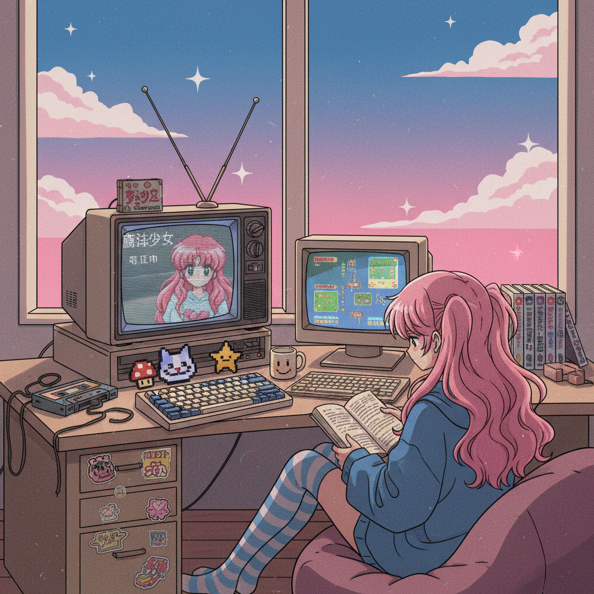

# Animecore 动漫核



> **"当二次元从屏幕溢出，渗透进现实世界的每一个像素。"**

## 概述

| 维度 | 描述 |
|------|------|
| 时期 | 2000s 原型 / 2018–至今 命名与回潮 |
| 别名 | Anime Aesthetic, Otaku Visual, Weeaboo Core |
| 核心色彩 | 高饱和动漫配色、粉蓝渐变、樱花粉 |
| 关键元素 | 动漫截图、日文文字、像素化、CRT屏幕效果 |
| 代表人物 | 初音未来、《美少女战士》、《新世纪福音战士》 |
| 关联风格 | Webcore, Kidcore, Harajuku Y2K, Vaporwave |

---

## 历史脉络

### 2000s：西方的动漫入侵

2000年代是日本动漫在全球（尤其是西方）大规模传播的黄金期：
- **Toonami** 和 **Adult Swim** 将《龙珠Z》《星际牛仔》《犬夜叉》带入美国家庭
- **Napster/Limewire** 让字幕组文化爆发
- **DeviantArt** 成为动漫同人创作的大本营
- **MySpace** 页面被动漫壁纸和 J-Pop 播放器装饰

这个时期，"weeb"（日本动漫迷）的视觉文化开始形成独特的美学语言：低分辨率的动漫截图、日文装饰文字、像素化的角色头像、以及将动漫元素融入个人网页设计的实践。

### 2010s：Tumblr 与 Vaporwave 的交汇

在 Tumblr 上，动漫截图被重新语境化：
- 《新世纪福音战士》的忧郁画面被配上 sad boy 文字
- 90年代动漫的色彩被融入 Vaporwave 拼贴
- "Anime sad edit" 成为一种独立的视觉类型
- Lo-fi hip hop 封面几乎都使用动漫女孩学习的画面

### 2018–至今：Animecore 的自觉

随着 Aesthetics Wiki 等平台对互联网美学的系统化整理，Animecore 被正式命名为一种独立的视觉风格。它不再只是"喜欢动漫"，而是一种特定的视觉处理方式：

- 刻意使用低分辨率、VHS 效果
- 日文文字作为纯粹的视觉装饰（不一定有意义）
- 动漫截图的去语境化和再拼贴
- CRT 扫描线和像素化作为怀旧滤镜

---

## 视觉语法

### 色彩系统

```
主色调：
  - 樱花粉 (#FFB7C5)
  - 天空蓝 (#87CEEB)
  - 薰衣草紫 (#E6E6FA)
  - 夕阳橙 (#FF6347)
高饱和点缀：
  - 霓虹粉 (#FF1493)
  - 电蓝 (#00BFFF)
背景：深蓝/深紫渐变、星空
```

### 视觉处理技法

| 技法 | 效果 |
|------|------|
| VHS 效果 | 扫描线、色彩偏移、噪点 |
| 像素化 | 刻意降低分辨率，模拟旧屏幕 |
| 日文叠加 | 片假名/平假名作为装饰层 |
| 渐变天空 | 粉蓝/粉紫渐变背景 |
| 星星/闪光 | 少女漫画式的光效 |
| 截图裁切 | 从动漫中截取特定情绪画面 |

### 核心动漫来源

| 年代 | 代表作品 | 贡献的视觉元素 |
|------|----------|----------------|
| 1990s | 《美少女战士》 | 变身序列、星星月亮、粉色 |
| 1990s | 《新世纪福音战士》 | 忧郁色调、科技界面、存在主义 |
| 1990s | 《星际牛仔》 | 爵士色彩、都市夜景、酷感 |
| 2000s | 《魔卡少女樱》 | 甜美色彩、魔法少女变身 |
| 2000s | 《FLCL》 | 疯狂色彩、实验动画 |

---

## 与千禧怀旧的关系

Animecore 怀念的是一种特定的**观看动漫的方式**：

- 在 CRT 电视上看 VHS/DVD
- 在 56K 拨号网络上等待图片加载
- 在 DeviantArt 上发布自己的同人画
- 用动漫壁纸装饰 Windows XP 桌面
- 在 MySpace 上放动漫主题曲作为背景音乐

这种怀旧不是对动漫本身的怀旧（动漫产业至今繁荣），而是对**那种低保真、高热情的消费方式**的怀旧。今天你可以在 4K 屏幕上流畅观看任何动漫，但你再也找不回在模糊的 RealPlayer 窗口里看字幕组翻译的那种兴奋感了。

---

## 中国语境

在中国，Animecore 的对应记忆包括：
- 2000年代的"动漫城"租碟文化
- 百度贴吧的动漫讨论区和签名档
- QQ 空间的动漫皮肤和背景音乐
- 早期 B 站（AcFun）的弹幕文化
- 《动漫周刊》《动感新势力》等杂志的视觉风格
- 淘宝上的"二次元"周边店铺美学

---

## 设计应用

| 场景 | 应用方式 |
|------|----------|
| 社交媒体 | 动漫截图 + VHS滤镜 + 日文装饰文字 |
| 音乐封面 | Lo-fi 风格动漫女孩 + 渐变天空 |
| 网页设计 | 像素化元素 + 星星装饰 + 粉蓝配色 |
| 服装印花 | 动漫角色拼贴 + 日文标语 |

---

## 延伸阅读

- Aesthetics Wiki: [Animecore](https://aesthetics.fandom.com/wiki/Animecore)
- Lo-fi hip hop 视觉文化分析
- 《Otaku: Japan's Database Animals》(東浩紀)

---

## 相关风格

← [Webcore / Old Web](webcore.md) | [Harajuku Y2K 原宿千禧](harajuku-y2k.md) →

↑ [返回千禧怀旧目录](README.md) | [返回总目录](../README.md)
