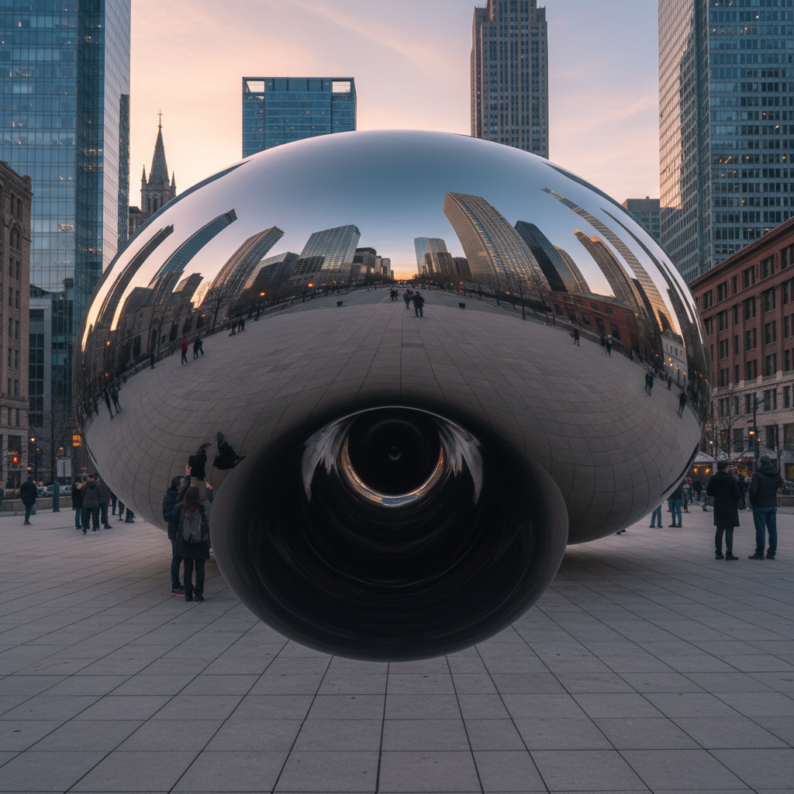

# Anish Kapoor 安尼施·卡普尔

> "I'm interested in the void, in the moment when form becomes formless." — Anish Kapoor

## 概述

安尼施·卡普尔（Anish Kapoor，1954–）是印度裔英国雕塑家，以探索虚空、凹面和极端色彩闻名。他的作品——从芝加哥的"云门"到深不可测的Vantablack黑洞——用曲面镜、色素粉末和工程技术创造出超越物质的感知体验，让观者在反射与深渊之间迷失。

## 核心特征

| 特征 | 描述 |
|------|------|
| 虚空与凹面 | 深不可测的黑色空洞 |
| 镜面反射 | 扭曲现实的不锈钢曲面 |
| 极端色彩 | Vantablack和纯色素粉末 |
| 巨大尺幅 | 城市尺度的公共雕塑 |
| 物质超越 | 让固体看起来非物质 |
| 东方哲学 | 印度教的虚空与创生 |

## 代表作品

| 作品 | 年代 | 意义 |
|------|------|------|
| *Cloud Gate (The Bean)* | 2004–06 | 芝加哥的标志性公共雕塑 |
| *Descent into Limbo* | 1992 | 看不见底的黑色深渊 |
| *Sky Mirror* | 2001– | 反射天空的巨型凹面镜 |
| *1000 Names* | 1979–80 | 色素粉末的早期装置 |

## AI生成概念图

## 与其他风格的关系

- **Minimalism** → 极简形式的感知扩展
- **Land Art** → 城市尺度的公共雕塑
- **Light and Space** → 加州光与空间运动的延伸
- **Indian Philosophy** → 东方虚空哲学的物质化
