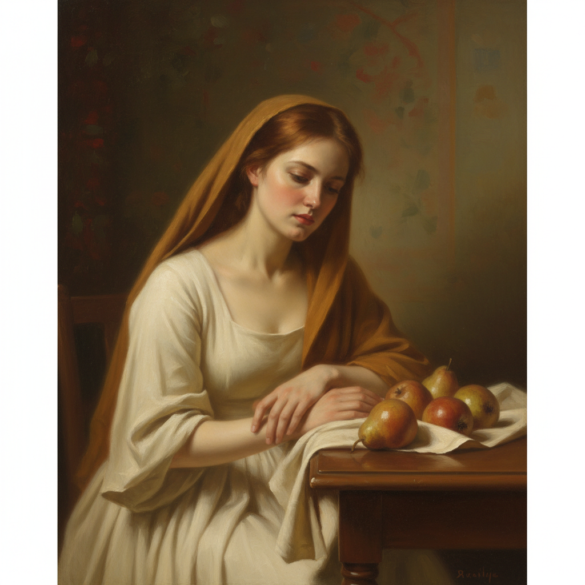

# Anna Weyant 安娜·韦扬特

> **时期：** 1995–至今  
> **关键词：** 新古典肖像、柔光写实、少女忧郁、当代荷兰风格

## 概述

Anna Weyant 是加拿大裔美国当代画家，以柔和光线下的女性肖像和静物画闻名。她的作品融合了17世纪荷兰静物画的精密与当代的忧郁气质，描绘年轻女性在私密空间中的沉思时刻，表面光滑如同古典大师的釉彩技法。

## 风格特征

- **柔光效果**：均匀柔和的光线包裹人物，如同阴天的自然光
- **古典技法**：多层罩染，表面光滑，色调温暖而内敛
- **少女形象**：年轻女性以沉思或略带不安的姿态出现
- **荷兰静物**：水果、花卉、织物等元素以17世纪vanitas传统呈现
- **暗示叙事**：画面暗示某种情绪或故事，但从不明确说明

## 代表作品

- *Summertime*（2022）
- *Falling Woman*（2020）
- *Still Life with Pears*（2021）
- *Girl in the Bathroom*（2021）

## 历史意义

Weyant 代表了Z世代画家对古典技法的重新拥抱，她的迅速市场成功（2022年成为高古轩最年轻签约艺术家）引发了关于艺术市场炒作与真实价值的广泛讨论。

## 概念图

