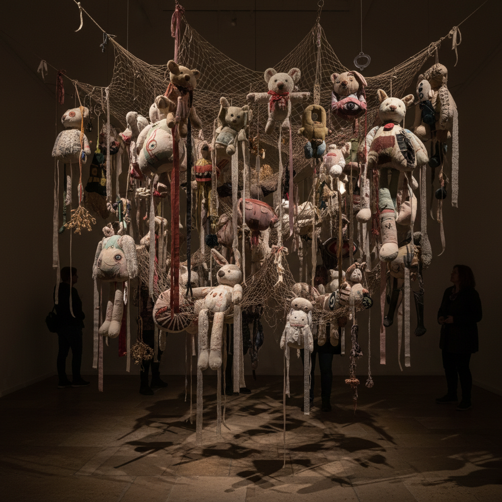

# Annette Messager 安妮特·梅萨热

> **时期：** 1943–至今  
> **关键词：** 软雕塑、毛绒玩具、女性日常、暗黑童话

## 概述

Annette Messager 是法国艺术家，以将女性日常物品（毛绒玩具、刺绣、照片、铅笔画）转化为既温柔又不安的装置而闻名。她的作品如同暗黑版的童话世界——毛绒动物被解剖、照片被针刺、身体碎片被网兜悬挂，在可爱与恐怖之间创造出独特的张力。

## 风格特征

- **软材料**：毛绒玩具、织物、网兜、绳索等柔软材料
- **身体碎片化**：身体被分解为局部——手、脚、眼睛
- **暗黑童话**：可爱的外表下隐藏不安和暴力
- **女性手工**：刺绣、缝纫、收集等传统女性活动被颠覆
- **悬挂与网罗**：物品被网兜包裹或用绳索悬挂

## 代表作品

- *Mes Vœux*（1989）
- *Pénétration*（1993–1994）
- *Casino*（2005，威尼斯双年展金狮奖）
- *Motion/Emotion*（2014）

## 概念图

