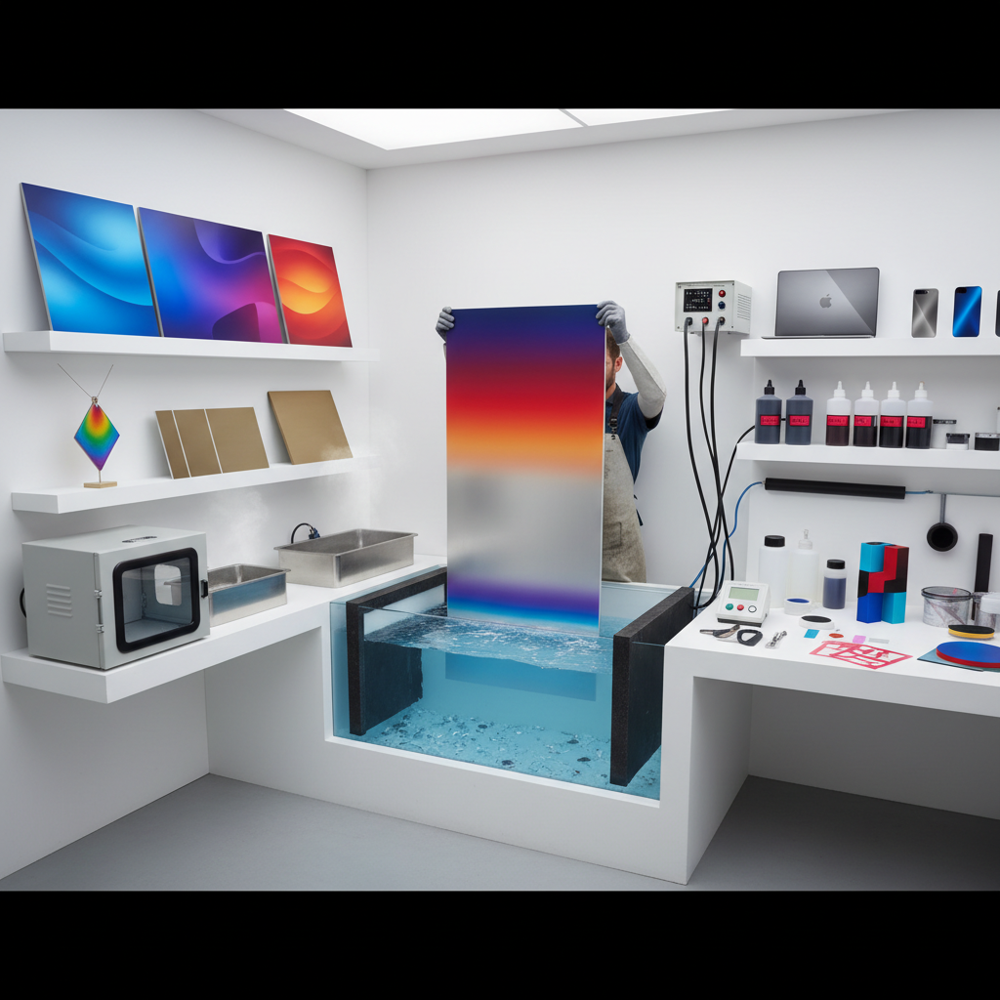

# Anodizing Art 阳极氧化艺术

> "Anodizing transforms aluminum from a dull industrial metal into a canvas of impossible colors — electric blues, deep purples, vivid golds, and sunset oranges locked permanently into the metal's own oxide layer. Unlike paint, these colors cannot peel or chip; they are the metal itself, transformed at the molecular level into a crystalline oxide that refracts light like a gemstone." — Unknown

## 概述

阳极氧化艺术（Anodizing Art）是利用电化学阳极氧化工艺在铝及其合金表面形成彩色氧化层的金属着色艺术——通过控制氧化层厚度和染色工艺，可以在金属表面创造出丰富的色彩和图案。阳极氧化不仅提供装饰效果，还增强金属的耐腐蚀性和耐磨性。

阳极氧化艺术的实践包括：1）单色阳极氧化——均匀的单一色彩；2）多色阳极氧化——通过遮蔽技术实现多色图案；3）钛阳极氧化——利用电压控制钛的干涉色；4）艺术阳极氧化——将阳极氧化作为艺术创作媒介；5）建筑阳极氧化——建筑外墙的彩色铝板；6）珠宝阳极氧化——首饰和配饰的彩色金属；7）渐变阳极氧化——色彩的渐变过渡效果。

## 核心特征

| 特征 | 描述 |
|------|------|
| 永久 | 色彩永不褪色剥落 |
| 鲜艳 | 极其鲜艳的色彩 |
| 精确 | 可精确控制色彩 |
| 耐久 | 极强的耐磨耐蚀性 |
| 金属 | 保留金属质感 |
| 科技 | 电化学工艺 |

## 视觉特征

- **色彩**：鲜艳饱和的金属色彩
- **光泽**：金属光泽与色彩的结合
- **均匀**：极其均匀的着色
- **透明**：半透明的氧化层
- **纹理**：可保留金属拉丝纹理
- **渐变**：可实现色彩渐变

## 代表作品

| 作品 | 艺术家/文化 | 年代 | 意义 |
|------|-------------|------|------|
| *Apple products* | Apple Inc. | 2000s至今 | 消费电子阳极氧化 |
| *Titanium jewelry* | 当代珠宝 | 1980s至今 | 钛金属彩色首饰 |
| *Architectural panels* | 建筑设计 | 1960s至今 | 建筑彩色铝板 |
| *Reactive Metals Studio* | 当代工艺 | 1980s至今 | 艺术阳极氧化先驱 |
| *Anodized aluminum art* | 当代艺术 | 当代 | 阳极氧化艺术创作 |

## 历史时间线

| 时期 | 事件 |
|------|------|
| 1923年 | 阳极氧化工艺发明 |
| 1930年代 | 建筑领域的应用 |
| 1960年代 | 彩色阳极氧化的发展 |
| 1980年代 | 艺术和珠宝领域的应用 |
| 当代 | 消费电子和艺术的广泛应用 |

## 中国语境

阳极氧化艺术在中国有广泛的工业和艺术应用。中国是全球最大的铝加工国——阳极氧化技术在中国的建筑、电子、汽车等行业广泛应用。中国的消费电子产品（如手机、笔记本电脑）大量使用阳极氧化铝外壳——这使得阳极氧化成为中国消费者最熟悉的金属表面处理工艺之一。中国的建筑幕墙行业大量使用彩色阳极氧化铝板——从商业建筑到公共设施。中国的一些当代艺术家和设计师开始将阳极氧化作为艺术创作媒介——利用其独特的色彩效果创作金属艺术品。中国的珠宝设计师也在探索钛阳极氧化的可能性——创造具有东方美学的彩色金属首饰。中国的一些创客空间和工作室提供阳极氧化体验课程——让普通人也能体验这种工业艺术。

## AI生成概念图

## 与其他风格的关系

- **Electroforming** → 电铸艺术
- **Metal Art** → 金属艺术
- **Industrial Design** → 工业设计
- **Jewelry Art** → 珠宝艺术
- **Color Theory** → 色彩理论
- **Surface Design** → 表面设计

---

*浮光艺志 | Chronicle of Artistry*
