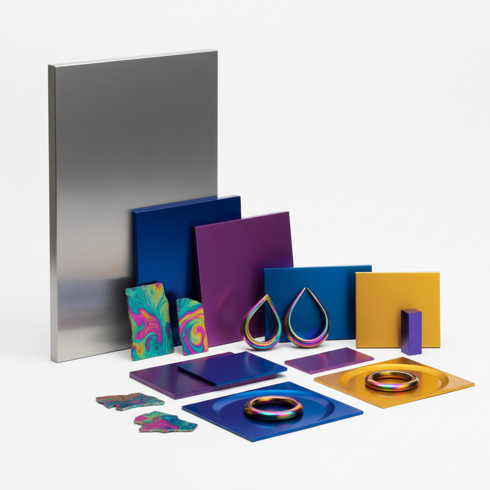

# Anodizing 阳极氧化

> "Anodizing is controlled corrosion — turning destruction into a rainbow of permanent color." — Unknown

## 概述

阳极氧化（Anodizing）是通过电化学过程在金属（主要是铝）表面生成一层致密的氧化膜的工艺。这层氧化膜不仅提供保护，还可以吸收染料，产生鲜艳持久的色彩。从苹果产品的太空灰到建筑幕墙的金色，从自行车零件的彩虹色到当代珠宝的电光蓝，阳极氧化将工业技术变成了色彩艺术。钛的阳极氧化更为神奇——通过控制电压改变氧化膜厚度，利用光的干涉原理产生不同颜色，无需任何染料。

阳极氧化的魅力在于：它是光学的魔法——色彩不来自颜料，而来自光与纳米级薄膜的互动。

## 核心特征

| 特征 | 描述 |
|------|------|
| 电化学 | 电化学氧化过程 |
| 氧化膜 | 致密的氧化保护层 |
| 色彩 | 鲜艳持久的色彩 |
| 耐久 | 极其耐磨耐腐蚀 |
| 金属感 | 保留金属质感 |
| 可控 | 精确控制色彩 |

## 视觉特征

- **金属感**：保留金属的质感和光泽
- **色彩**：鲜艳饱和的色彩
- **均匀**：均匀的表面着色
- **光泽**：从哑光到镜面
- **干涉色**：钛的光干涉彩虹色
- **现代**：现代工业美学

## 代表作品

| 作品 | 艺术家 | 年代 | 意义 |
|------|--------|------|------|
| *Apple products* | Apple Design | 2000s+ | 阳极氧化铝的标志 |
| *Titanium jewelry* | Various | 当代 | 钛阳极氧化珠宝 |
| *Architectural facades* | Various | 当代 | 建筑幕墙着色 |
| *Reactive Metals Studio* | Various | 1980s+ | 钛艺术先驱 |
| *Anodized art panels* | Various | 当代 | 阳极氧化艺术面板 |

## 历史时间线

| 时期 | 事件 |
|------|------|
| 1923 | 铝阳极氧化专利 |
| 1930s | 建筑中的早期应用 |
| 1960s | 航空航天的广泛应用 |
| 1980s | 钛阳极氧化艺术的兴起 |
| 2000s | 消费电子产品的标志性应用 |
| 当代 | 阳极氧化作为艺术媒介 |

## 中国语境

中国是全球最大的铝阳极氧化加工基地之一，广东、浙江等地有大量阳极氧化工厂。中国的消费电子产品（如小米、华为）广泛使用阳极氧化工艺。当代中国的工业设计师和珠宝设计师也在探索阳极氧化的艺术可能性，特别是钛阳极氧化在首饰设计中的应用。中国的建筑幕墙行业也大量使用阳极氧化铝板。

## AI生成概念图

## 与其他风格的关系

- **Industrial Design** → 工业设计的表面处理
- **Jewelry** → 钛阳极氧化珠宝
- **Architecture** → 建筑表面着色
- **Patina** → 另一种金属表面变化
- **Color Theory** → 光干涉色彩原理
- **Minimalism** → 极简主义设计美学

---

*浮光艺志 | Chronicle of Artistry*
