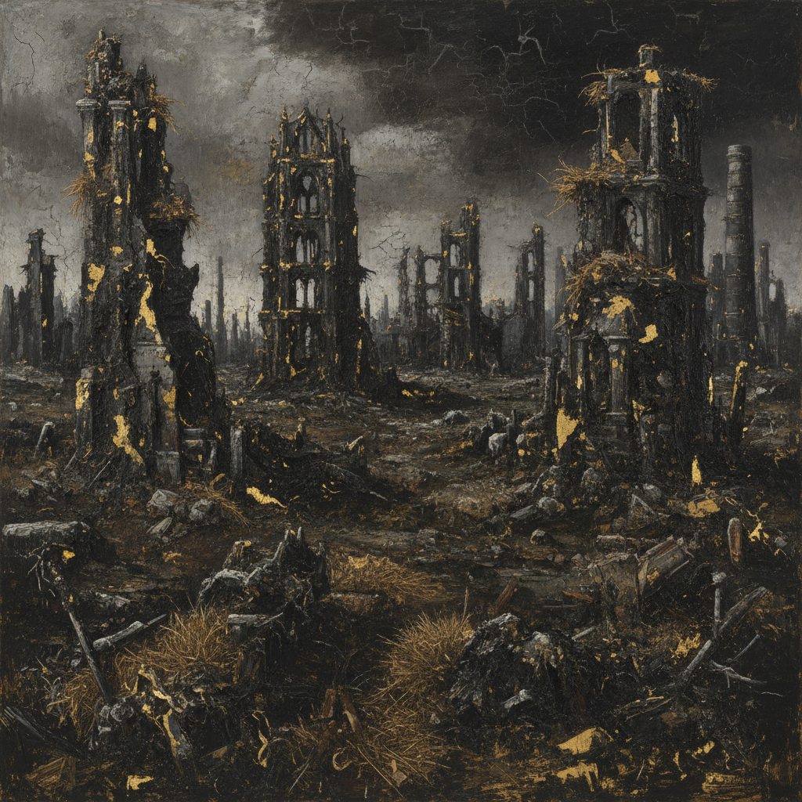

# Anselm Kiefer 安塞尔姆·基弗

> **流派**: 新表现主义 · 当代艺术  
> **时期**: 1945–至今 德国  
> **关键词**: 废墟美学、铅与灰烬、德国历史、物质厚度

## 概述

安塞尔姆·基弗是战后德国最重要的艺术家之一。他直面德国历史的黑暗——纳粹、大屠杀、北欧神话——用铅、灰烬、稻草和焦土创造出废墟般的巨型绘画。他的作品既是哀悼也是质问，既是毁灭也是重生。

## 视觉特征

- **物质厚度**: 画面堆积铅片、灰烬、稻草、泥土等真实材料
- **巨大尺幅**: 作品常达数米高，具有建筑般的压迫感
- **焦土色调**: 黑色、灰色、褐色为主，偶有金色闪光
- **废墟意象**: 焚毁的建筑、荒芜的田野、坍塌的书架
- **文字铭刻**: 画面中常刻写诗句、人名或历史引用

## 代表作品

- 《你金色的头发，玛格丽特》(1981)
- 《纽伦堡》(1982)
- 《星空坠落》系列 (1990s)
- 《秘密的德国生活》(2001)

## 历史影响

基弗证明了艺术可以承担历史的重量——它不必回避创伤，而是可以通过直面来实现某种转化。他影响了后来所有处理集体记忆和历史创伤的当代艺术实践。

## 相关风格

- [Neo-Expressionism 新表现主义](neo-expressionism.md)
- [Georg Baselitz 格奥尔格·巴塞利茨](georg-baselitz.md)
- [Joseph Beuys 约瑟夫·博伊斯](joseph-beuys.md)
