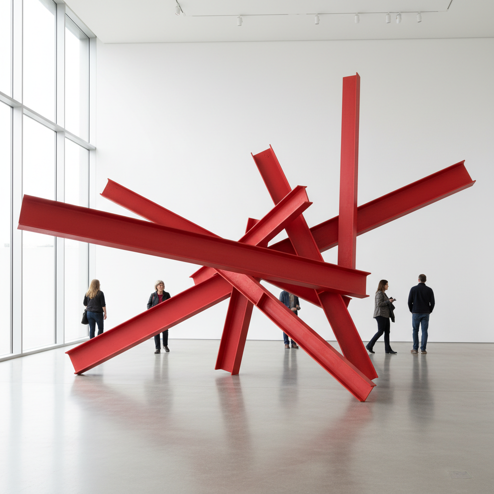

# Anthony Caro 安东尼·卡罗

> **时期：** 1924–2013  
> **关键词：** 焊接钢雕塑、去底座、色彩雕塑、英国现代主义

## 概述

Anthony Caro 是英国雕塑家，被认为是亨利·摩尔之后最重要的英国雕塑家。他在1960年代的革命性突破是将雕塑从底座上解放——直接放置在地面上的焊接钢板和工字钢，涂以鲜艳的工业色彩（红、黄、蓝），创造出既抽象又具有姿态感的水平展开形态。

## 风格特征

- **去底座**：雕塑直接放置在地面，与观者共享同一空间
- **焊接钢材**：工字钢、钢板、钢管等工业材料的焊接组合
- **鲜艳色彩**：早期作品涂以明亮的单色，赋予钢铁轻盈感
- **水平展开**：作品倾向于水平方向延伸，而非垂直耸立
- **姿态性**：抽象形态具有身体姿态般的表现力和动感

## 代表作品

- *Early One Morning*（1962）
- *Midday*（1960）
- *Prairie*（1967）
- *Table Pieces*系列（1966–1977）

## 历史意义

Caro 的去底座革命彻底改变了雕塑与空间和观者的关系，他证明了抽象雕塑可以具有绘画般的色彩和姿态表现力。作为教师，他在St Martin's School培养了整整一代英国雕塑家（"新一代"雕塑）。

## 概念图

