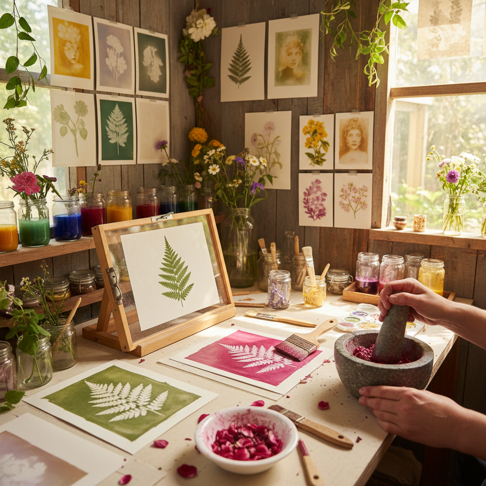

# Anthotype 花汁摄影

> "Anthotype is the slowest photography — plant juices painted onto paper, then exposed to sunlight for days or weeks until the image emerges through the fading of the emulsion, a process so gentle and patient that the sun itself becomes the developer, bleaching away everything except what is hidden in shadow." — Unknown

## 概述

花汁摄影（Anthotype）是一种使用植物汁液（花瓣、浆果、叶子等的提取液）作为光敏乳剂的古老摄影技法。植物色素对光线敏感——暴露在阳光下会逐渐褪色。艺术家将植物汁液涂在纸张上，放置物体或透明负片遮挡部分区域，然后长时间暴露在阳光下（通常需要数天到数周）。受光区域的植物色素褪色，被遮挡区域保留原色，形成图像。

花汁摄影由John Herschel爵士在1842年首次描述。这种技法的独特之处在于：它完全使用天然植物材料，不需要任何化学药品；但其缺点是图像不能"定影"——如果继续暴露在光线下，整个图像最终会完全褪色。因此花汁摄影作品需要在暗处保存。当代艺术家将花汁摄影视为一种关于"时间"和"消逝"的诗意媒介。

## 核心特征

| 特征 | 描述 |
|------|------|
| 植物汁 | 使用植物汁液 |
| 褪色 | 利用光线褪色 |
| 缓慢 | 极其缓慢的过程 |
| 天然 | 完全天然材料 |
| 短暂 | 图像不能永久保存 |
| 诗意 | 关于时间的诗意 |

## 视觉特征

- **柔和**：极其柔和的色调
- **植物色**：植物汁液的自然色彩
- **朦胧**：朦胧的图像质感
- **褪色**：褪色的美感
- **有机**：有机的材料质感
- **诗意**：诗意的视觉效果

## 代表作品

| 作品 | 艺术家 | 年代 | 意义 |
|------|--------|------|------|
| *Anthotype experiments* | John Herschel | 1842 | 技法的发明 |
| *Contemporary anthotypes* | Various | 当代 | 当代花汁摄影 |
| *Botanical anthotypes* | Various | 当代 | 植物主题花汁摄影 |
| *Anthotype portraits* | Various | 当代 | 花汁摄影肖像 |
| *Anthotype installations* | Various | 当代 | 花汁摄影装置 |

## 历史时间线

| 时期 | 事件 |
|------|------|
| 1842年 | John Herschel描述anthotype过程 |
| 19世纪 | 早期实验和记录 |
| 20世纪 | 技法的边缘化 |
| 2000年代 | 替代摄影运动中的复兴 |
| 当代 | 花汁摄影的艺术化发展 |

## 中国语境

花汁摄影在中国尚属非常小众的实验性技法，但随着中国替代摄影（alternative photography）社区的发展，这种技法开始受到关注。中国丰富的植物资源为花汁摄影提供了独特的材料——中国传统的植物染料（靛蓝、茜草、黄檗等）都可以用于花汁摄影实验。中国的一些实验摄影艺术家和自然教育机构开始探索花汁摄影。花汁摄影与中国传统的"天人合一"哲学有天然的契合。

## AI生成概念图

## 与其他风格的关系

- **Sun Printing** → 日光印刷
- **Cyanotype** → 氰版印刷
- **Lumen Printing** → 光敏印刷
- **Natural Dyeing** → 天然染色
- **Alternative Photography** → 替代摄影
- **Eco Art** → 生态艺术

---

*浮光艺志 | Chronicle of Artistry*
