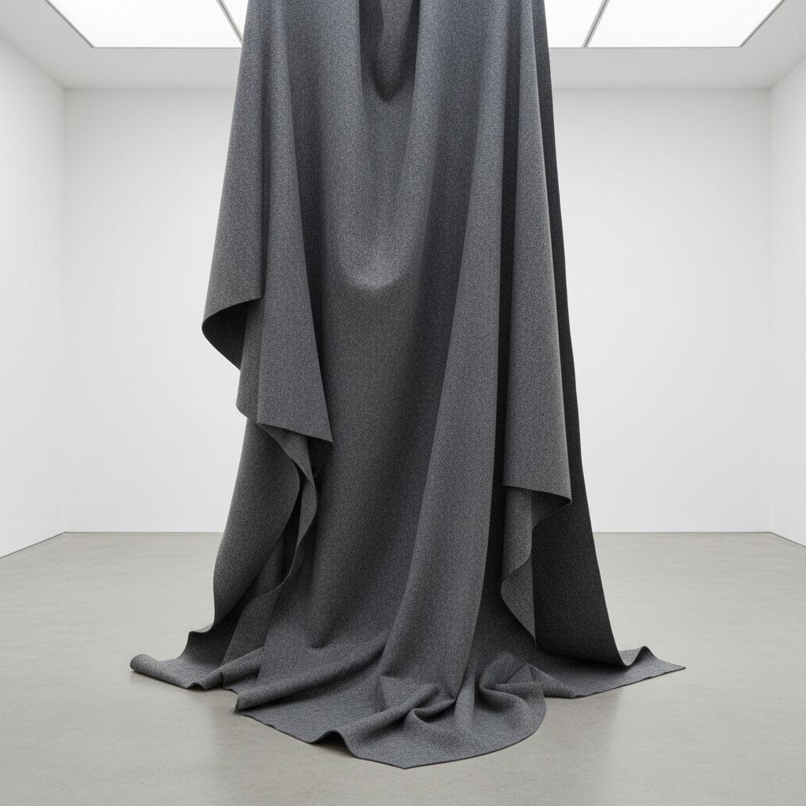

# Anti-Form 反形式

> **时期：** 1968年–1970年代  
> **关键词：** 罗伯特·莫里斯、重力、软材料、过程优先、反几何

## 概述

Anti-Form（反形式）由罗伯特·莫里斯1968年在《艺术论坛》发表的同名文章命名，主张让材料的物理属性——重力、柔软、流动——决定作品的最终形态，而非艺术家预设的几何形式。毛毡悬挂后自然下垂的褶皱、乳胶泼洒后凝固的形状——过程取代了构图，偶然取代了控制。

## 风格特征

- **重力决定**：材料在重力作用下自然成形
- **软材料**：毛毡、乳胶、绳索、布料
- **过程优先**：创作过程比最终形态重要
- **反几何**：拒绝预设的规则形状
- **临时性**：作品可以被重新配置

## 代表人物与作品

- 罗伯特·莫里斯 毛毡悬挂
- 伊娃·海瑟 乳胶与绳索
- 理查德·塞拉 泼铅
- 巴里·勒瓦 面粉撒落

## 概念图

