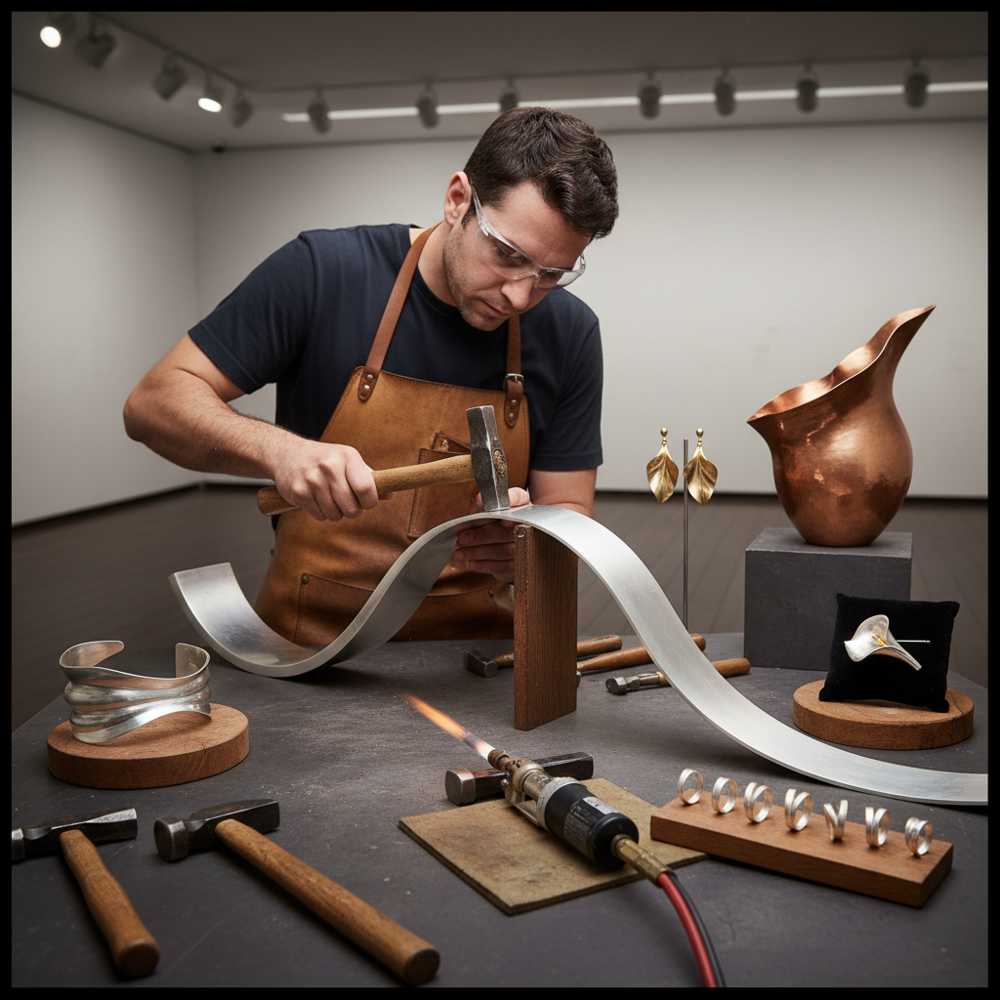

# Anticlastic Raising 反曲起形

> "Anticlastic raising defies the natural tendency of metal to dome — instead it saddles, curves in two opposing directions at once, creating forms as elegant and inevitable as a Pringles chip or a lily petal caught in wind." — Unknown

## 概述

反曲起形（Anticlastic Raising）是一种金属成型技法——与传统的起形（synclastic raising，使金属向同一方向弯曲形成碗状）相反，反曲起形使金属在两个垂直方向上向相反方向弯曲，形成马鞍形（saddle shape）。想象一个马鞍或薯片的形状——沿一个轴向上弯曲，沿垂直轴向下弯曲——这就是反曲面。

反曲起形由美国金属艺术家Heikki Seppä在1970年代系统化和推广。这种技法能创造出极其优雅的流动形态——类似于花瓣、波浪或丝带在空间中的扭转。反曲起形在当代金属首饰和雕塑中被广泛使用——它能产生轻盈、动态、有机的形态，这些形态用传统的起形方法很难实现。

## 核心特征

| 特征 | 描述 |
|------|------|
| 马鞍形 | 马鞍形曲面 |
| 双向 | 两个方向相反弯曲 |
| 优雅 | 优雅的流动形态 |
| 轻盈 | 轻盈的视觉感 |
| 当代 | 当代金属艺术技法 |
| 有机 | 有机的自然形态 |

## 视觉特征

- **马鞍**：马鞍形的曲面
- **流动**：流动的线条
- **扭转**：空间中的扭转
- **轻盈**：轻盈飘逸
- **动态**：动态的形态
- **优雅**：优雅的曲线

## 代表作品

| 作品 | 艺术家 | 年代 | 意义 |
|------|--------|------|------|
| *Heikki Seppä sculptures* | Seppä | 1970s起 | 反曲起形的先驱 |
| *Anticlastic bracelets* | Various | 当代 | 反曲手镯 |
| *Anticlastic earrings* | Various | 当代 | 反曲耳环 |
| *Anticlastic vessels* | Various | 当代 | 反曲器皿 |
| *Michael Good jewelry* | Michael Good | 当代 | 反曲首饰大师 |

## 历史时间线

| 时期 | 事件 |
|------|------|
| 传统 | 金属加工中偶然出现的反曲形态 |
| 1970s | Heikki Seppä系统化反曲起形 |
| 1980s | 反曲起形在金属工艺教育中的推广 |
| 1990s | Michael Good等艺术家的商业成功 |
| 2000s | 全球金属艺术家的广泛采用 |
| 当代 | 反曲起形的持续创新 |

## 中国语境

反曲起形在中国的金属工艺教育和当代首饰设计领域正在获得关注。中国的一些珠宝设计学校和金属工艺课程引入了反曲起形技法。中国的独立首饰设计师使用反曲起形创作具有流动感的金属首饰——这种优雅的形态在中国市场有吸引力。反曲起形的"简单材料、复杂形态"特点使其适合工作室环境。中国的金属工艺社区中有关于反曲起形的学习和实践分享。

## AI生成概念图

## 与其他风格的关系

- **Raising** → 起形
- **Fold Forming** → 折叠成型
- **Silversmithing** → 银器制作
- **Metal Sculpture** → 金属雕塑
- **Jewelry Making** → 首饰制作
- **Organic Design** → 有机设计

---

*浮光艺志 | Chronicle of Artistry*
