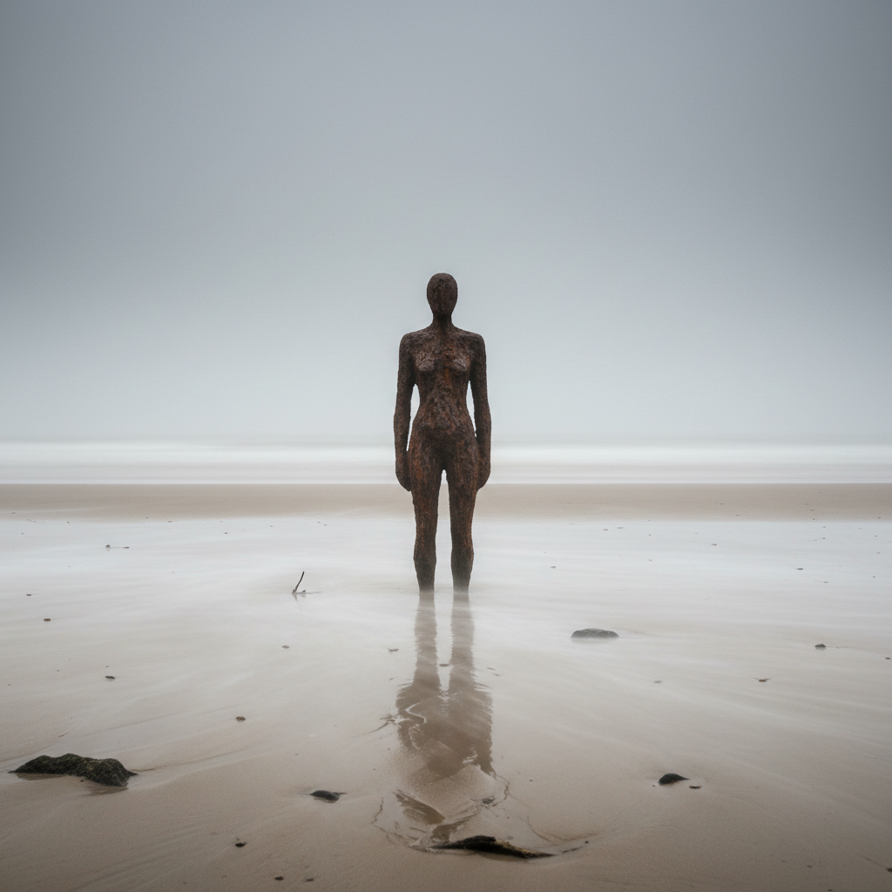

# Antony Gormley 安东尼·葛姆雷

> **流派**: 当代雕塑 · 公共艺术  
> **时期**: 1950–至今 英国  
> **关键词**: 人体铸模、北方天使、场域雕塑、身体与空间

## 概述

安东尼·葛姆雷是当代最重要的英国雕塑家之一。他以自己的身体为模具铸造铁人雕塑，将它们放置在海滩、屋顶、山顶和城市街道上，探索人体与空间、个体与集体的关系。他的《北方天使》(Angel of the North)是英国最著名的公共雕塑之一。

## 视觉特征

- **人体铸模**: 以自己身体为模具的铸铁人形
- **静默站立**: 人物通常以直立姿态面向远方
- **锈蚀表面**: 耐候钢的棕红色锈蚀质感
- **场域分布**: 多个相同人形分散在广阔空间中
- **几何变体**: 后期作品将人体分解为方块或线条

## 代表作品

- 《北方天使》(Angel of the North, 1998) — 翼展54米
- 《另一个地方》(Another Place, 1997) — 100个铁人面向大海
- 《量子云》(Quantum Cloud, 1999)
- 《亚洲田野》(Asian Field, 2003) — 20万个泥人

## 历史影响

葛姆雷将雕塑从美术馆解放到公共空间，证明了当代雕塑可以与普通人的日常生活产生直接对话。他的人体铸模方法既是对古典雕塑传统的致敬，也是对个体存在的当代追问。

## 相关风格

- [Public Art 公共艺术](public-art.md)
- [Richard Serra 理查德·塞拉](richard-serra.md)
- [Henry Moore 亨利·摩尔](henry-moore.md)
