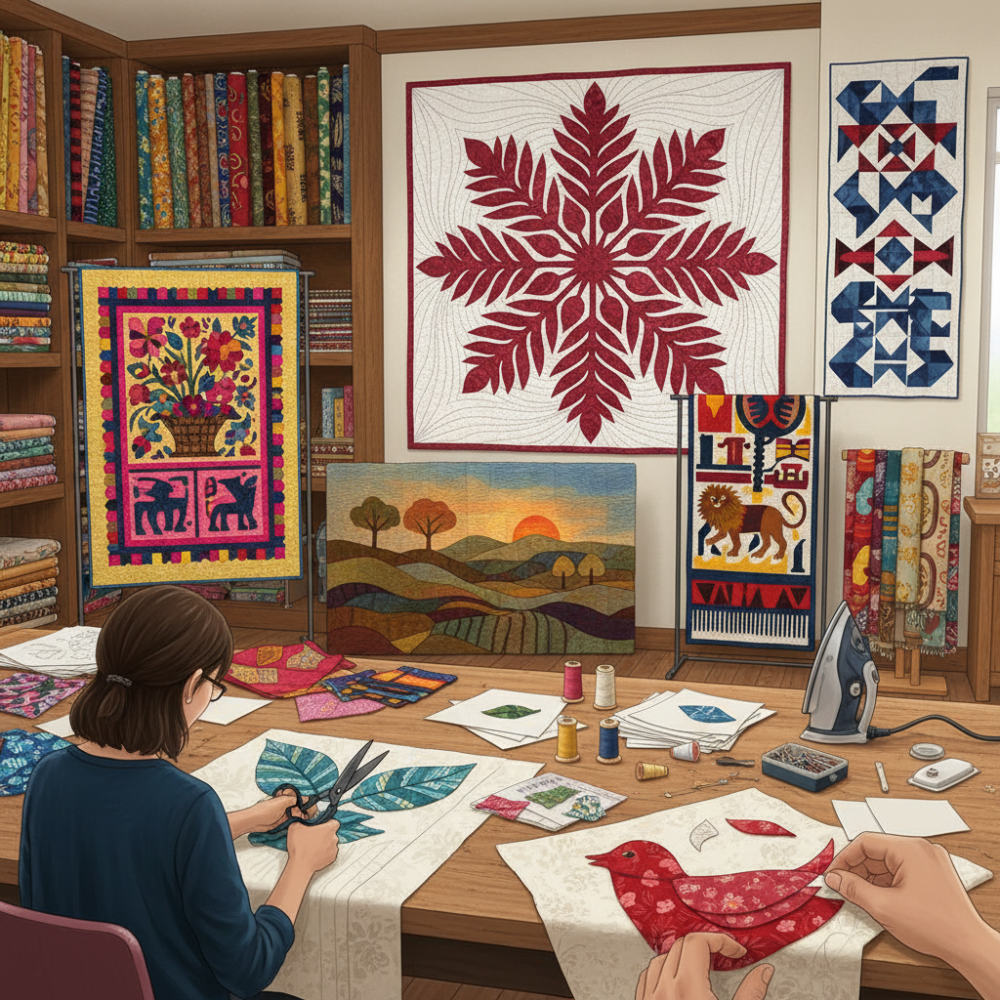

# Applique Art 贴布绣

> "Appliqué is collage in cloth — shapes cut from one fabric and stitched onto another, building up layers of color and pattern like a painter adding pigment to canvas, creating images through the juxtaposition of textiles rather than the accumulation of stitches, where the fabric itself becomes the medium of expression." — Unknown

## 概述

贴布绣（Appliqué Art）是一种将一块织物的形状剪下并缝合或粘贴到另一块织物（底布）上的装饰技法。"Appliqué"来自法语"appliquer"（应用/贴上）。贴布绣是最古老和最普遍的纺织装饰技法之一——几乎每个文化都有自己的贴布传统。

贴布绣的基本类型包括：正面贴布（standard appliqué——将形状贴在底布正面）、反面贴布（reverse appliqué——从上层织物剪出形状露出下层）、多层贴布（layered appliqué）、折边贴布（turned-edge appliqué）、毛边贴布（raw-edge appliqué）等。贴布绣在全球各文化中有丰富的传统：夏威夷贴布被（Hawaiian quilts）、巴拿马莫拉（Mola）、印度贴布（Ralli quilts）、日本贴布（Japanese appliqué）、非洲贴布等。

## 核心特征

| 特征 | 描述 |
|------|------|
| 剪贴 | 剪切和贴合织物 |
| 层叠 | 织物的层叠效果 |
| 色彩 | 织物本身的色彩 |
| 图案 | 清晰的图案轮廓 |
| 普遍 | 全球性的传统 |
| 多样 | 多种技法变体 |

## 视觉特征

- **层次**：织物层叠的层次感
- **色彩**：织物的丰富色彩
- **轮廓**：清晰的形状轮廓
- **对比**：不同织物的对比
- **图案**：大胆的图案设计
- **质感**：不同织物的质感

## 代表作品

| 作品 | 艺术家 | 年代 | 意义 |
|------|--------|------|------|
| *Hawaiian quilts* | 夏威夷工匠 | 19世纪起 | 夏威夷贴布被 |
| *Kuna Mola* | 库纳族 | 传统 | 巴拿马莫拉 |
| *Baltimore Album quilts* | 美国工匠 | 19世纪 | 巴尔的摩贴布被 |
| *African appliqué* | 非洲工匠 | 传统 | 非洲贴布 |
| *Contemporary appliqué art* | Various | 当代 | 当代贴布艺术 |

## 历史时间线

| 时期 | 事件 |
|------|------|
| 古代 | 古埃及等文明的贴布 |
| 中世纪 | 欧洲的纹章贴布 |
| 18-19世纪 | 美国贴布被的发展 |
| 20世纪 | 贴布艺术的多样化 |
| 当代 | 贴布的艺术化创新 |

## 中国语境

贴布绣在中国有丰富的传统——中国的"贴绣"或"堆绣"是传统的装饰技法。藏族的堆绣（用于唐卡和寺庙装饰）是国家级非物质文化遗产。苗族、彝族等少数民族的服饰中大量使用贴布技法。中国的传统戏曲服装中也有贴布装饰。当代中国的拼布（patchwork）社区中，贴布绣是核心技法之一。中国的儿童服装和家居装饰中广泛使用贴布。

## AI生成概念图

## 与其他风格的关系

- **Reverse Applique** → 反面贴布
- **Patchwork** → 拼布
- **Quilting** → 绗缝
- **Collage** → 拼贴
- **Textile Art** → 纺织艺术
- **Folk Art** → 民间艺术

---

*浮光艺志 | Chronicle of Artistry*
