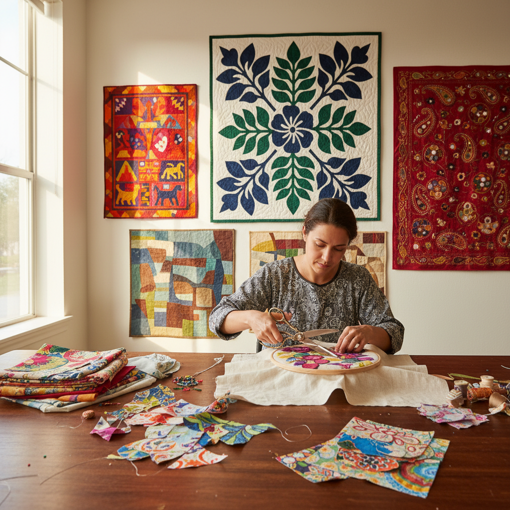

# Appliqué 贴布绣

> "Appliqué is collage in cloth — fabric upon fabric, each piece cut and stitched to build images that no single textile could achieve alone." — Unknown

## 概述

贴布绣（Appliqué）是将剪裁好的织物片缝缀或粘贴到另一块底布上，形成装饰性图案的纺织工艺。"Appliqué"源自法语"appliquer"（贴上）。这种技法比刺绣更快速地覆盖大面积色块——用一片红色布料就能创造出一朵花的花瓣，而刺绣则需要无数针脚来填满同样的面积。贴布绣广泛存在于世界各地的纺织传统中——从夏威夷的大型花卉被子到印度的镜片贴布、从巴拿马库纳族的mola到非洲的旗帜贴布、从中世纪欧洲的纹章到当代的艺术拼布。

贴布绣的哲学在于：拼合的力量——将不同的布料片段组合在一起，创造出比任何单一材料更丰富的视觉效果。

## 核心特征

| 特征 | 描述 |
|------|------|
| 贴布 | 布料贴于底布上 |
| 剪裁 | 精确剪裁布片 |
| 缝缀 | 手缝或机缝固定 |
| 色块 | 大面积色块效果 |
| 层叠 | 多层布料叠加 |
| 装饰 | 高度装饰性 |

## 视觉特征

- **色块**：大胆的色块组合
- **轮廓**：清晰的形状轮廓
- **层次**：布料层叠的层次
- **质感**：不同布料的质感对比
- **图案**：鲜明的图案设计
- **立体**：微微凸起的立体感

## 代表作品

| 作品 | 艺术家 | 年代 | 意义 |
|------|--------|------|------|
| *Hawaiian quilts* | 匿名 | 19世纪+ | 夏威夷贴布被 |
| *Kuna molas* | 库纳族 | 传统 | 巴拿马反向贴布 |
| *Indian mirror work* | 匿名 | 传统 | 印度镜片贴布 |
| *Medieval heraldic appliqué* | Various | 中世纪 | 纹章贴布 |
| *Contemporary art quilts* | Various | 当代 | 当代艺术拼布 |

## 历史时间线

| 时期 | 事件 |
|------|------|
| 古代 | 古埃及的贴布装饰 |
| 中世纪 | 欧洲纹章和教堂贴布 |
| 传统 | 各文化的贴布传统 |
| 19世纪 | 夏威夷贴布被的发展 |
| 20世纪 | 现代贴布艺术 |
| 当代 | 当代贴布艺术的繁荣 |

## 中国语境

贴布绣在中国有悠久的传统——中国民间的"贴绣"或"堆绣"是重要的民间工艺。藏族的堆绣（用彩色绸缎剪贴佛像和图案）是国家级非物质文化遗产。中国各地的民间贴布绣包括：苗族的贴布绣、陕西的布贴画、山东的布老虎等。中国的贴布绣常与刺绣结合——先贴布定形，再用刺绣加以修饰。当代中国的纤维艺术家也在探索贴布绣的当代表达，将传统技法与现代设计理念结合。

## AI生成概念图

## 与其他风格的关系

- **Quilting** → 拼布
- **Embroidery** → 刺绣
- **Collage** → 拼贴
- **Textile Art** → 纺织艺术
- **Patchwork** → 拼接布
- **Folk Art** → 民间艺术

---

*浮光艺志 | Chronicle of Artistry*
