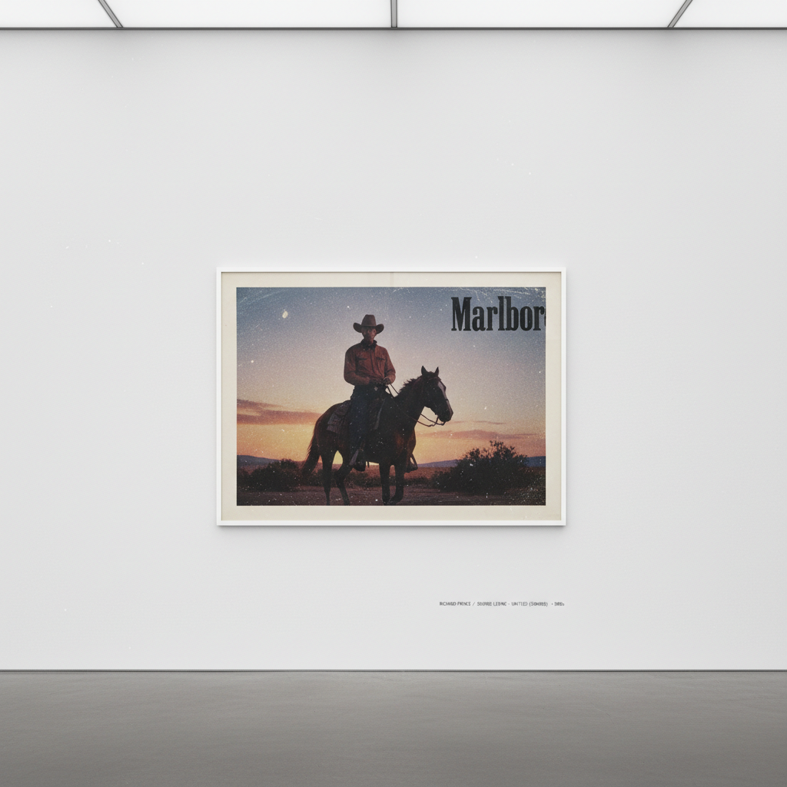

# Appropriation Art 挪用艺术

> "I'm not stealing anything. I'm just borrowing it." — Richard Prince

## 概述

挪用艺术（Appropriation Art）是1970年代末至1980年代兴起的艺术实践，艺术家直接使用（挪用）已有的图像、物品或文本作为自己作品的材料——不是"受影响"或"致敬"，而是字面意义上的复制、重新拍摄或重新展示。

挪用艺术挑战了原创性、作者身份和版权的传统观念，追问：在一个被图像淹没的世界里，"原创"还有意义吗？谁拥有图像？复制本身能否成为创造？

## 核心特征

| 特征 | 描述 |
|------|------|
| 直接挪用 | 使用已有图像/物品而非从零创作 |
| 质疑原创 | 挑战"原创性"的神话 |
| 语境转换 | 通过改变语境赋予旧图像新意义 |
| 制度批评 | 质疑艺术体制、版权和所有权 |
| 图像政治 | 揭示图像如何建构性别、种族、阶级 |
| 后现代 | 深受鲍德里亚"仿真"理论影响 |

## 视觉特征

- **来源**：广告、杂志、电影剧照、经典艺术
- **手法**：重新拍摄、裁切、放大、并置
- **质感**：照片的照片——刻意保留复制痕迹
- **构图**：与原作几乎相同或微妙改变
- **文字**：有时加入文字改变图像含义
- **呈现**：画廊白墙上的"现成图像"

## 代表作品

| 作品 | 艺术家 | 年代 | 意义 |
|------|--------|------|------|
| *Untitled Film Stills* | Cindy Sherman | 1977-80 | 重演电影中的女性形象 |
| *After Walker Evans* | Sherrie Levine | 1981 | 直接重新拍摄Evans的照片 |
| *Untitled (Cowboy)* | Richard Prince | 1989 | 重新拍摄万宝路广告 |
| *Untitled (Your gaze hits the side of my face)* | Barbara Kruger | 1981 | 图像+文字的权力批评 |
| *Erased de Kooning Drawing* | Robert Rauschenberg | 1953 | 擦除即创造（先驱） |
| *Fountain (After Marcel Duchamp)* | Sherrie Levine | 1991 | 挪用挪用——元挪用 |

## 历史时间线

| 时期 | 事件 |
|------|------|
| 1917 | Duchamp的现成品——挪用的思想先驱 |
| 1977 | Sherman开始Untitled Film Stills |
| 1979 | "Pictures"展览（Douglas Crimp策划）——Pictures Generation命名 |
| 1981 | Levine重新拍摄Walker Evans——挪用艺术的极端宣言 |
| 1980s | Kruger、Prince、Holzer——挪用成为主流策略 |
| 1990s | 法律争议——Prince被起诉侵犯版权 |
| 2000s-至今 | 互联网时代的meme文化使挪用成为日常 |

## 子类型

| 子类型 | 特征 |
|--------|------|
| 照片挪用 | Levine、Prince——重新拍摄已有照片 |
| 身份表演 | Sherman——通过扮演挪用文化形象 |
| 文字/图像 | Kruger、Holzer——文字改变图像含义 |
| 物品挪用 | Koons、Steinbach——商品的再语境化 |
| 数字挪用 | 互联网时代的meme、混剪、采样 |

## 中国语境

挪用在中国当代艺术中极为普遍。政治波普（王广义的"大批判"系列）直接挪用文革宣传画和西方商标；岳敏君挪用自己的笑脸形象；艾未未挪用古代陶罐。在更广泛的文化层面，中国的"山寨"文化本身就是一种大规模的民间挪用实践——虽然动机不同，但都涉及原创性和所有权的问题。

## 争议与遗产

- **争议**：挪用与抄袭/盗窃的边界在哪里？
- **法律战**：Richard Prince多次被起诉侵犯版权
- **性别政治**：Sherman和Kruger的挪用揭示了图像对女性的规训
- **遗产**：为互联网时代的remix文化、meme文化奠定了合法性
- **当代回响**：AI训练数据争议、NFT中的版权问题

## AI生成概念图

## 与其他风格的关系

- **Dadaism** → 达达的现成品是挪用的思想源头
- **Pop Art** → 波普艺术挪用大众文化图像
- **Conceptual Art** → 概念艺术的"观念优先"为挪用提供理论支持
- **Postmodernism** → 后现代主义的"作者之死"是挪用的哲学基础
- **Post-Internet** → 后网络艺术在数字时代延续挪用实践
- **Remix Culture** → 混音文化是挪用的大众化和民主化

---

*浮光艺志 | Chronicle of Artistry*
