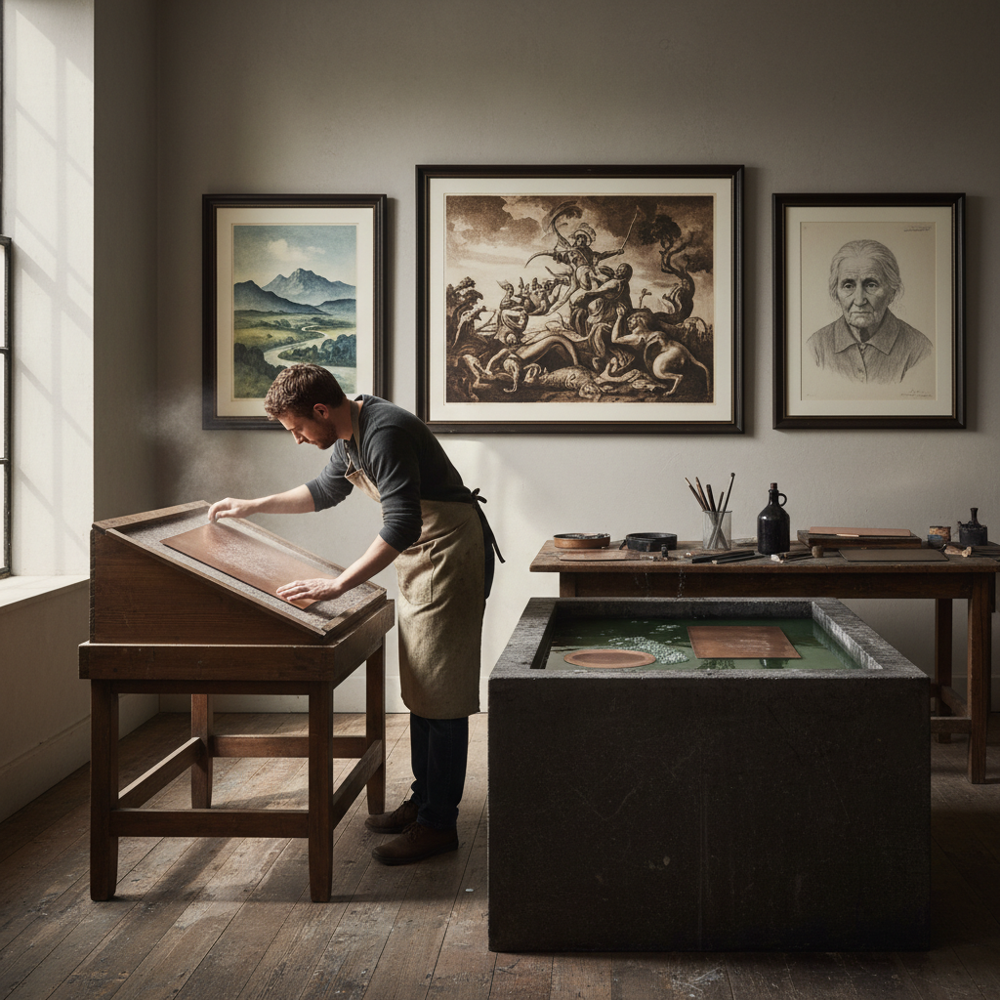

# Aquatint 飞尘腐蚀

> "Aquatint gives etching the power of wash — where line alone once ruled, now tone floods the plate like watercolor on copper." — Unknown

## 概述

飞尘腐蚀（Aquatint）是一种凹版版画技法，用于在铜版或锌版上创造大面积的色调和渐变效果。传统蚀刻（etching）只能产生线条，而飞尘腐蚀可以产生类似水彩画般的面积色调。其原理是：将细小的松香粉（rosin）均匀撒在版面上并加热使其粘附，形成无数微小的抗酸点。当版面浸入酸液时，酸只能腐蚀松香点之间的微小空隙，形成密集的细小凹坑——这些凹坑在印刷时能保持油墨，产生均匀的色调。通过控制腐蚀时间和逐步遮挡，可以创造出从浅灰到深黑的丰富层次。

飞尘腐蚀的哲学在于：用点构成面——无数微小的点汇聚成连续的色调，如同沙粒汇成沙丘。

## 核心特征

| 特征 | 描述 |
|------|------|
| 凹版 | 凹版印刷技法 |
| 色调 | 产生面积色调 |
| 松香 | 松香粉作为抗酸剂 |
| 腐蚀 | 酸液腐蚀 |
| 层次 | 丰富的灰度层次 |
| 渐变 | 可以产生渐变 |

## 视觉特征

- **色调**：均匀的面积色调
- **渐变**：柔和的灰度渐变
- **颗粒**：细微的颗粒质感
- **水彩感**：类似水彩的效果
- **层次**：多层次的明暗
- **氛围**：氛围感强烈

## 代表作品

| 作品 | 艺术家 | 年代 | 意义 |
|------|--------|------|------|
| *Los Caprichos* | Francisco Goya | 1799 | 飞尘腐蚀的巅峰 |
| *Los Desastres de la Guerra* | Goya | 1810-20 | 战争版画 |
| *Mary Cassatt color prints* | Mary Cassatt | 1890s | 彩色飞尘腐蚀 |
| *David Hockney etchings* | David Hockney | 1960s+ | 当代飞尘腐蚀 |
| *Contemporary aquatints* | Various | 当代 | 当代飞尘艺术 |

## 历史时间线

| 时期 | 事件 |
|------|------|
| 1650s | 早期实验 |
| 1768 | Jean-Baptiste Le Prince完善技法 |
| 1790s | Goya将飞尘腐蚀推向巅峰 |
| 19世纪 | 广泛用于书籍插图 |
| 20世纪 | 现代艺术家的创新使用 |
| 当代 | 当代飞尘腐蚀的多样化 |

## 中国语境

飞尘腐蚀在中国版画教育中是铜版画课程的重要组成部分。中国的版画系学生在学习蚀刻的同时也会学习飞尘腐蚀技法。中国当代版画家将飞尘腐蚀与中国水墨画的"墨分五色"理念结合——飞尘腐蚀产生的灰度层次与水墨的浓淡变化有异曲同工之妙。一些中国版画家如苏新平等在铜版画（包括飞尘腐蚀）领域有重要成就。

## AI生成概念图

## 与其他风格的关系

- **Etching** → 蚀刻版画
- **Mezzotint** → 美柔汀
- **Intaglio** → 凹版印刷
- **Engraving** → 雕版
- **Printmaking** → 版画总称
- **Watercolor** → 水彩画（效果类似）

---

*浮光艺志 | Chronicle of Artistry*
