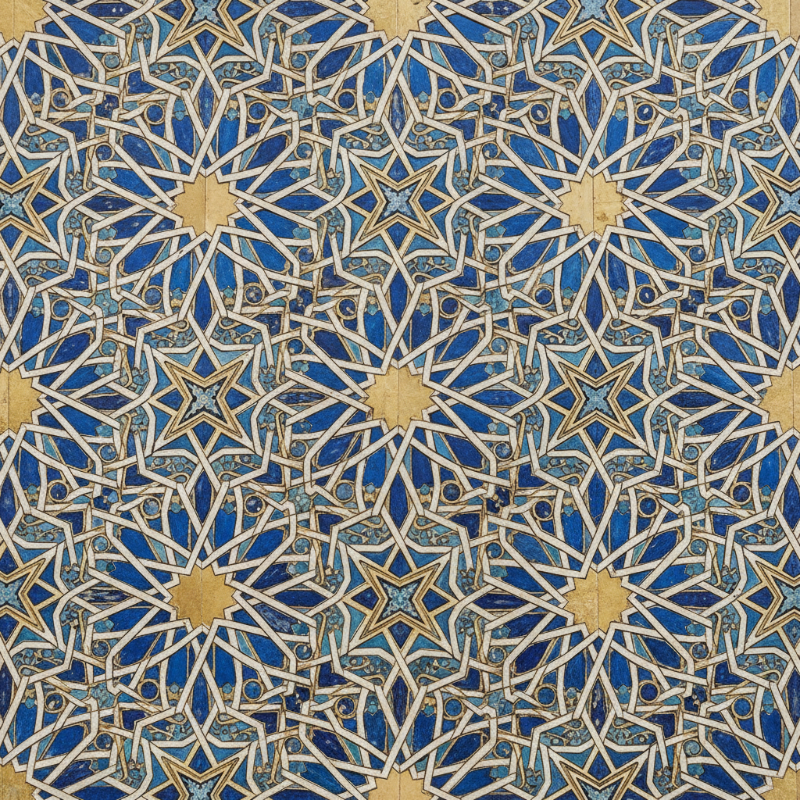

# Arabesque Art 阿拉伯式花纹

> **时期：** 7世纪–至今  
> **关键词：** 几何图案、无限重复、伊斯兰艺术、禁止偶像、数学之美

## 概述

Arabesque（阿拉伯式花纹）是伊斯兰艺术中最具代表性的装饰形式——通过几何图案、植物纹样和书法的无限重复与交织，创造出暗示无限和神圣秩序的视觉体验。由于伊斯兰传统中对偶像崇拜的禁忌，抽象图案成为表达神圣之美的主要途径，数学精确性本身就是对造物主智慧的赞美。

## 风格特征

- **无限重复**：图案可以向任何方向无限延伸
- **几何精确**：基于圆形分割的数学构图
- **植物抽象**：高度程式化的藤蔓和花叶
- **对称变换**：旋转、镜像、平移的组合
- **恐惧空白**：每一寸表面都被图案覆盖

## 代表人物与作品

- 阿尔罕布拉宫 纳斯里德装饰
- 伊斯法罕星期五清真寺 瓷砖
- 托普卡帕宫 伊兹尼克瓷砖
- 当代：Monir Farmanfarmaian 镜面马赛克

## 概念图

