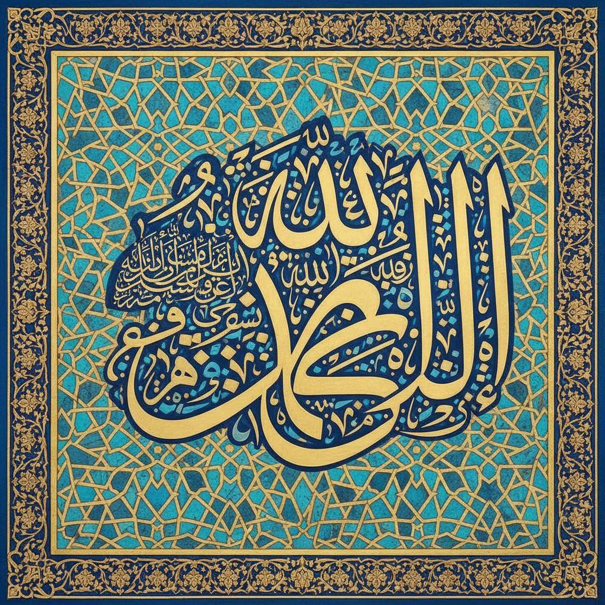

# Arabic Calligraphy 阿拉伯书法

> **时期：** 7世纪–至今  
> **关键词：** 几何韵律、宗教装饰、连笔流动、建筑铭文、抽象美学

## 概述

Arabic Calligraphy（阿拉伯书法）是伊斯兰文明最崇高的艺术形式，因伊斯兰教对偶像崇拜的禁止而将文字提升为最高视觉表达。从库法体的建筑庄严到纳斯赫体的优雅流畅，阿拉伯书法发展出数十种书体，将文字变为纯粹的视觉音乐——每个字母都是一段旋律，每行文字都是一首诗。

## 风格特征

- **连笔流动**：字母之间的连续书写
- **几何基础**：基于圆和直线的比例系统
- **装饰功能**：建筑、织物、器物上的铭文装饰
- **多种书体**：库法、纳斯赫、苏鲁斯、迪瓦尼等
- **对称构图**：镜像对称的装饰性排列

## 代表人物与作品

- 伊本·穆格莱（阿拉伯书法比例体系创始人）
- 哈桑·马萨迪（当代阿拉伯书法大师）
- 清真寺建筑铭文（蓝色清真寺等）
- eL Seed（当代阿拉伯街头书法）

## 概念图

