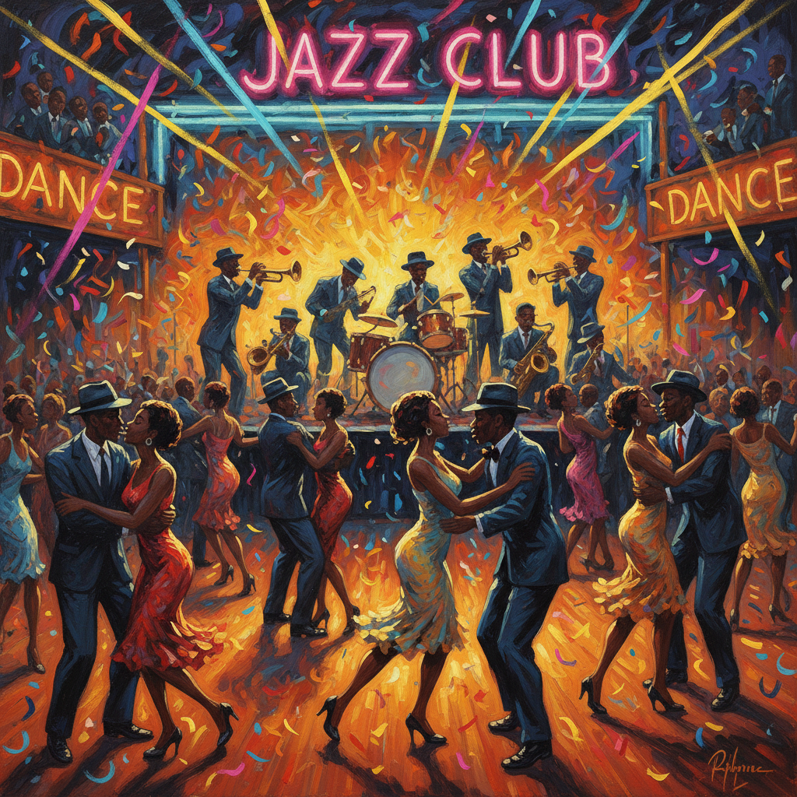

# Archibald Motley 阿奇博尔德·莫特利

> **时期：** 1891–1981  
> **关键词：** 爵士时代夜生活、芝加哥黑人社区、色彩节奏、都市活力

## 概述

Archibald Motley 是芝加哥画家，以描绘1920-30年代非裔美国人夜生活的活力和复杂性而闻名。他的画面充满爵士乐的节奏感——舞厅、酒吧、街头派对中的人物在霓虹灯光下旋转，色彩如同即兴演奏般自由奔放。他是最早系统性描绘黑人中产阶级生活的画家之一。

## 风格特征

- **爵士节奏构图**：人物的姿态和色彩排列具有音乐般的节奏感
- **霓虹色彩**：夜景中的人工光源创造出独特的色彩氛围
- **肤色光谱**：精确描绘非裔美国人从浅到深的完整肤色范围
- **群像叙事**：画面中包含大量人物，每个人都有独立的故事
- **都市能量**：捕捉城市夜生活的动感、喧嚣和欢乐

## 代表作品

- *Nightlife*（1943）
- *Blues*（1929）
- *Saturday Night*（1935）
- *The Liar*（1936）

## 历史意义

Motley 打破了当时对非裔美国人的两种刻板视觉表现——要么是田园牧歌式的南方农民，要么是贫困的城市底层。他展示了黑人社区的欢乐、优雅和文化丰富性，为后来的黑人都市绘画奠定了基础。

## 概念图

