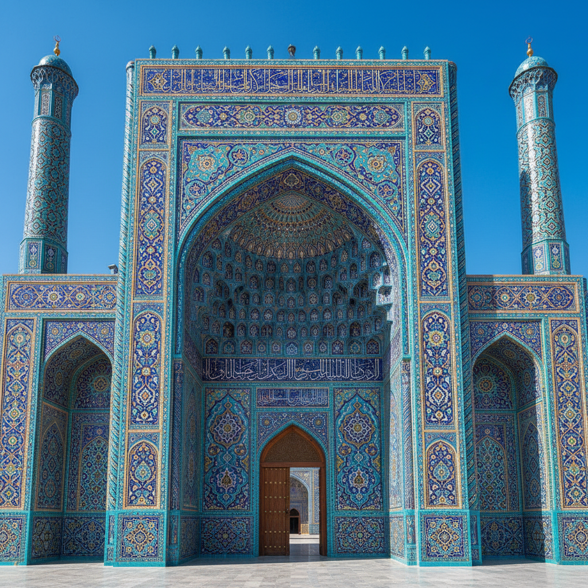

# Architectural Ceramics Art 建筑陶瓷艺术

> "Architectural ceramics is clay scaled to the size of buildings — tiles that armor roofs against centuries of rain, bricks that bear the weight of cathedrals, terracotta panels that wrap facades in ornament fireproof and fadeproof, each piece fired to outlast the mortar that holds it, ceramics serving not the hand but the horizon, decoration measured not in centimeters but in stories." — Unknown

## 概述

建筑陶瓷艺术（Architectural Ceramics Art）是一种将陶瓷材料应用于建筑装饰和结构的艺术形式。从古代的琉璃瓦到现代的陶瓷幕墙，从伊斯兰清真寺的彩色瓷砖到欧洲新艺术运动的陶瓷立面，建筑陶瓷将陶瓷的耐久性、色彩稳定性和可塑性发挥到建筑尺度。建筑陶瓷不仅是装饰，更是建筑的保护层——它抵御风雨、隔热防火，同时赋予建筑独特的视觉身份。

建筑陶瓷艺术的核心要素包括：1）建筑尺度——从单块瓷砖到整面墙壁；2）耐久性——抵御数百年的风雨侵蚀；3）色彩稳定——釉色不褪色不变质；4）防火防水——天然的防护性能；5）模块化——可重复的模块化设计；6）结构整合——与建筑结构的整合；7）公共性——面向公众的艺术表达。

## 核心特征

| 特征 | 描述 |
|------|------|
| 建筑尺度 | 从瓷砖到整面墙壁 |
| 极耐久 | 抵御数百年风雨 |
| 色彩永固 | 釉色永不褪色 |
| 防火防水 | 天然防护性能 |
| 模块化 | 可重复的模块设计 |
| 公共艺术 | 面向公众的表达 |

## 视觉特征

- **大尺度图案**：建筑尺度的装饰图案
- **色彩鲜艳**：经久不褪的鲜艳色彩
- **几何重复**：模块化的几何重复
- **浮雕装饰**：立体的浮雕效果
- **釉面光泽**：反射光线的釉面
- **与建筑融合**：与建筑形态的有机结合

## 代表作品

| 作品 | 艺术家/文化 | 年代 | 意义 |
|------|-------------|------|------|
| *伊斯法罕清真寺* | 伊朗 | 17世纪 | 伊斯兰建筑陶瓷巅峰 |
| *中国琉璃九龙壁* | 中国 | 明代 | 中国琉璃建筑经典 |
| *高迪建筑陶瓷* | Antoni Gaudi | 20世纪初 | 现代建筑陶瓷先驱 |
| *里斯本瓷砖* | 葡萄牙 | 16世纪起 | 欧洲建筑瓷砖传统 |
| *当代陶瓷幕墙* | 各建筑师 | 当代 | 建筑陶瓷的当代应用 |

## 历史时间线

| 时期 | 事件 |
|------|------|
| 前3000年 | 美索不达米亚的釉面砖 |
| 唐宋 | 中国琉璃瓦的发展 |
| 15-17世纪 | 伊斯兰建筑陶瓷的辉煌 |
| 19世纪 | 欧洲建筑陶瓷的工业化 |
| 当代 | 高科技建筑陶瓷的发展 |

## 中国语境

中国的建筑陶瓷传统极为丰富——琉璃瓦是中国传统建筑最具标志性的元素之一。从紫禁城的黄色琉璃瓦到天坛的蓝色琉璃瓦，从九龙壁的彩色琉璃到各地寺庙的琉璃装饰，中国的琉璃建筑陶瓷代表了东方建筑装饰的最高成就。中国当代建筑中，陶瓷材料正在以新的方式回归——从陶瓷幕墙到陶瓷遮阳板，从陶瓷地砖到陶瓷艺术墙。中国的佛山是世界上最大的建筑陶瓷生产基地，其产品覆盖全球市场。中国建筑师和陶艺家正在探索将传统琉璃美学与当代建筑技术结合的新可能。

## AI生成概念图

## 与其他风格的关系

- **Tile Art** → 瓷砖艺术
- **Islamic Ceramics** → 伊斯兰陶瓷
- **Glazed Brick** → 琉璃砖
- **Terracotta** → 赤陶
- **Public Art** → 公共艺术
- **Mosaic** → 马赛克

---

*浮光艺志 | Chronicle of Artistry*
