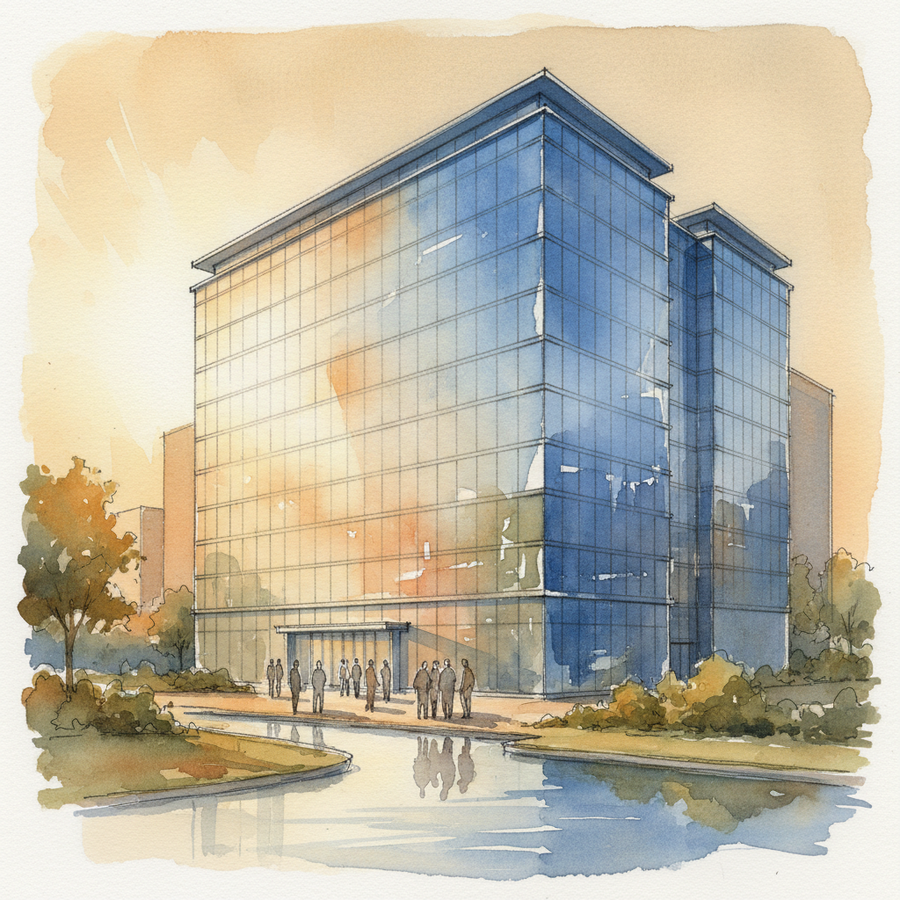

# Architectural Illustration 建筑插画

> **时期：** 文艺复兴–至今  
> **关键词：** 透视渲染、建筑表现、水彩渲染、数字可视化、空间叙事

## 概述

Architectural Illustration（建筑插画）是将建筑设计转化为可视化图像的艺术，从文艺复兴时期的透视图到当代的数字渲染。它不仅是技术图纸，更是一种空间叙事——通过光影、材质、人物点景和环境氛围，让尚未建成的建筑在纸面上"活"起来，传达建筑师的设计意图和空间体验。

## 风格特征

- **透视精确**：严格的建筑透视和比例
- **材质表现**：玻璃、混凝土、木材等质感
- **光影氛围**：时间和天气的情绪营造
- **人物点景**：比例人物赋予空间尺度感
- **环境融合**：建筑与景观的整体呈现

## 代表人物与作品

- 休·费里斯《未来的大都会》
- 扎哈·哈迪德（解构主义建筑画）
- 勒·柯布西耶（现代主义建筑素描）
- Alex Hogrefe（当代建筑可视化）

## 概念图

