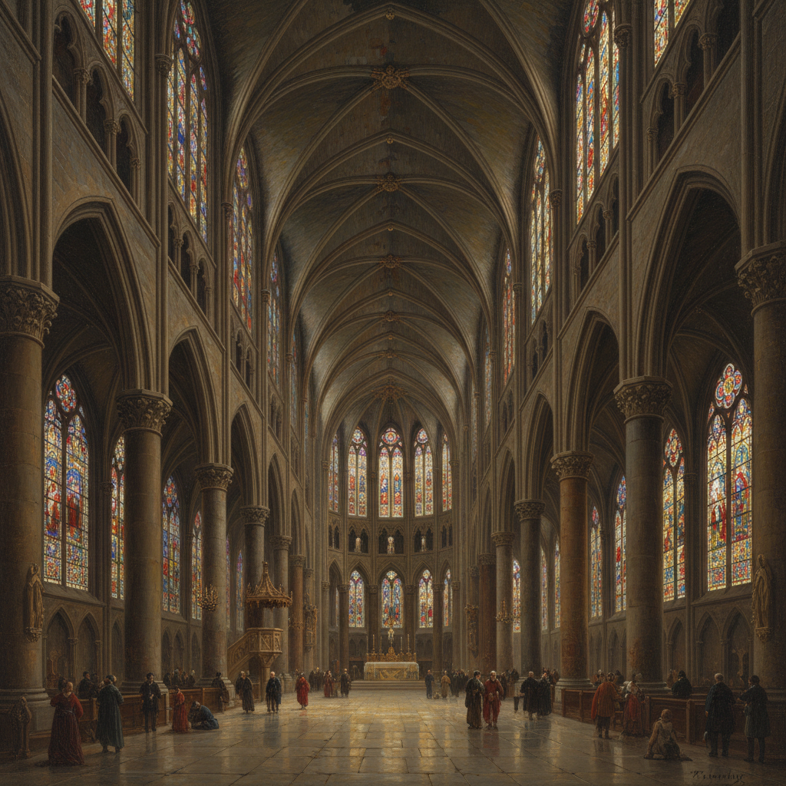

# Architectural Painting 建筑画

> **时期：** 15世纪–至今  
> **关键词：** 建筑内外、透视法展示、教堂内景、废墟、城市记录

## 概述

Architectural Painting（建筑画）以建筑物的内部或外部为主要题材，是透视法最直接的应用场域。从萨恩雷丹的荷兰教堂白色内景到皮拉内西的罗马废墟版画，建筑画既是对空间的精确记录，也是对人类建造能力的赞美——石头和光线在画布上重新组合，创造出比现实更完美的建筑。

## 风格特征

- **精确透视**：严格的几何透视构图
- **光线空间**：光线如何塑造建筑内部
- **细节忠实**：柱式、拱券、装饰的精确记录
- **尺度感**：通过人物比例暗示建筑宏伟
- **氛围营造**：时间和天气对建筑的影响

## 代表人物与作品

- 彼得·萨恩雷丹 荷兰教堂内景
- 乔瓦尼·巴蒂斯塔·皮拉内西《罗马古迹》
- 卡纳莱托 威尼斯建筑
- 当代：Thierry Despont 建筑水彩

## 概念图

