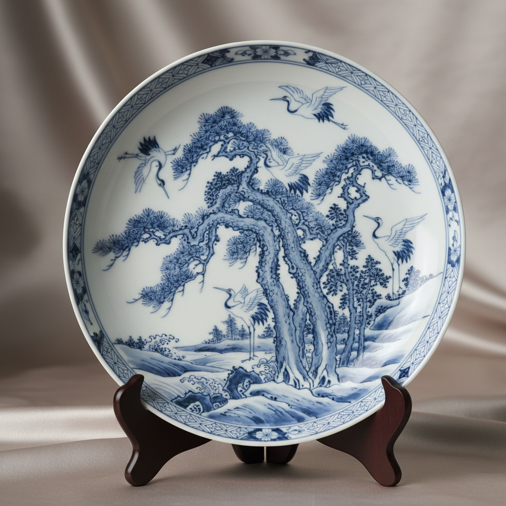

# Arita Art 有田烧艺术

> "The flame transforms earth into treasure." — Japanese pottery proverb

## 概述

有田烧艺术（Arita Art）是日本佐贺县有田町为中心的瓷器艺术传统，始于17世纪初。有田烧是日本最早的瓷器——1616年朝鲜陶工李参平在有田泉山发现了瓷石矿，开启了日本瓷器制造的历史。有田烧以其精美的彩绘装饰、多样的风格和卓越的品质著称——它不仅是日本瓷器的代名词，更是17-18世纪欧洲"中国风"热潮中的重要角色。

有田烧包含多个子风格：初期伊万里（染付青花）、柿右卫门样式（乳白地彩绘）、�的锅岛样式（藩窑精品）和金襴手（金彩华丽装饰）。17世纪中叶，由于中国明清交替导致景德镇出口中断，有田烧通过荷兰东印度公司大量出口欧洲——被欧洲人称为"伊万里瓷器"。有田烧对欧洲瓷器（梅森、塞夫尔等）的发展产生了深远影响。

有田烧艺术的核心要素包括：1）染付——蓝色釉下彩（青花）；2）色绘——多彩釉上彩装饰；3）柿右卫门——乳白地的精致彩绘；4）锅岛——藩窑的极致精品；5）金襴手——金彩的华丽装饰；6）欧洲出口——对欧洲瓷器的影响；7）传承创新——400年的持续传承。

## 核心特征

| 特征 | 描述 |
|------|------|
| 染付 | 蓝色釉下彩青花 |
| 色绘 | 多彩釉上彩装饰 |
| 柿右卫门 | 乳白地精致彩绘 |
| 锅岛 | 藩窑极致精品 |
| 金襴手 | 金彩华丽装饰 |
| 欧洲出口 | 对欧洲瓷器影响 |

## 视觉特征

- **青花纹样**：蓝色山水花鸟纹
- **乳白釉**：柿右卫门的温润乳白
- **赤绘**：红色为主的彩绘装饰
- **金彩**：金色的华丽点缀
- **留白**：大面积的留白构图
- **自然题材**：花鸟、山水、松竹梅

## 代表作品

| 作品 | 年代 | 意义 |
|------|------|------|
| *染付山水文大皿* | 17世纪 | 初期伊万里 |
| *色绘花鸟文壶* (柿右卫门) | 17世纪后半 | 柿右卫门样式 |
| *色锅岛色绘牡丹文皿* | 17-18世纪 | 锅岛样式 |
| *金襴手花鸟文壶* | 18世纪 | 出口欧洲精品 |
| *染付唐草文花瓶* | 江户时代 | 青花经典 |
| *现代有田烧* | 当代 | 传统与创新 |

## 历史时间线

| 时期 | 事件 |
|------|------|
| 1616年 | 李参平发现瓷石，开始制瓷 |
| 1640年代 | 柿右卫门样式确立 |
| 1650年代 | 开始大量出口欧洲 |
| 1670年代 | 锅岛藩窑确立 |
| 18世纪 | 金襴手样式鼎盛 |
| 1867年 | 巴黎世博会展出 |
| 2016年 | 有田烧400周年 |

## 中国语境

有田烧与中国瓷器有着密不可分的关系。有田烧的诞生直接源于朝鲜陶工带来的中国制瓷技术——其早期产品明显模仿中国景德镇青花瓷的风格。17世纪中叶明清交替期间，有田烧填补了中国瓷器出口的空白——这一历史事件深刻改变了世界瓷器贸易的格局。有田烧在吸收中国瓷器传统的基础上发展出了独特的日本美学——柿右卫门的留白构图和色彩运用展现了日本独特的审美意识。有田烧与中国瓷器的关系是东亚文化交流的重要案例——它展示了技术和美学如何在不同文化之间传播、转化和创新。当代有田烧与景德镇之间的交流也在继续——两地的陶艺家互相学习，推动着东亚瓷器艺术的当代发展。

## 概念图

## 与其他风格的关系

- **Chinese Blue-and-White** → 中国青花瓷（技术来源）
- **Imari** → 伊万里（出口名称）
- **Kakiemon** → 柿右卫门（子风格）
- **Nabeshima** → 锅岛（子风格）
- **Meissen** → 梅森（受影响的欧洲瓷器）
- **Korean Ceramics** → 朝鲜陶瓷（技术传承）

---

*浮光艺志 | Chronicle of Artistry*
