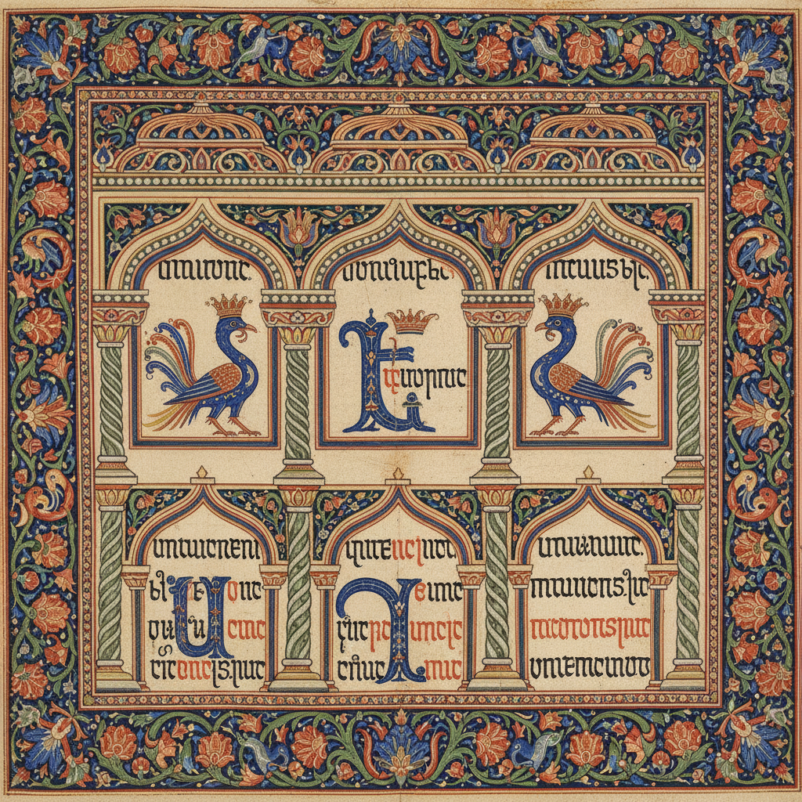

# Armenian Manuscript Illumination 亚美尼亚手抄本彩饰

> **"在世界的十字路口，用金色和靛蓝守护文字的神圣。"**

## 概述

亚美尼亚手抄本彩饰（Հայկական մանրանկարչություն / Armenian Manuscript Illumination）是世界基督教艺术中最独特的手抄本传统之一，起源于公元5世纪亚美尼亚字母发明之后。亚美尼亚是世界上第一个将基督教定为国教的国家（301年），其手抄本艺术融合了东方装饰性、拜占庭神圣感和独特的亚美尼亚民族美学。马特纳达兰（Matenadaran）手抄本博物馆保存着超过17,000部中世纪手抄本，是人类文明的珍贵遗产。

## 时间线

| 时期 | 特征 |
|------|------|
| 5–7世纪 | 早期手抄本，简朴装饰 |
| 9–11世纪 | 黄金时代开始，色彩丰富 |
| 12–13世纪 | 奇里乞亚（小亚美尼亚）画派巅峰 |
| 13–14世纪 | Toros Roslin 大师时期 |
| 15–17世纪 | 伊斯法罕和君士坦丁堡的亚美尼亚社区 |
| 当代 | 传统技法的学术研究和艺术复兴 |

## 核心特征

- **鸟形字母**：用鸟的身体构成亚美尼亚字母
- **花卉边框**：精美的植物纹样装饰页面边缘
- **Canon Tables**：福音书对照表的建筑式拱门装饰
- **全页插图**：圣经场景的叙事性描绘
- **金色底色**：大量使用金箔和金粉
- **独特色彩**：深蓝、朱红、翠绿、金色的鲜艳组合

## 代表画派与大师

| 画派/大师 | 时期 | 特征 |
|-----------|------|------|
| 奇里乞亚画派 | 12–14世纪 | 最精致华丽，西方影响 |
| Toros Roslin | 13世纪 | 亚美尼亚手抄本艺术的巅峰 |
| 大亚美尼亚画派 | 13–14世纪 | 更本土化，东方影响 |
| 伊斯法罕画派 | 17世纪 | 波斯影响下的亚美尼亚风格 |

## 视觉特征

- 鸟形和动物形的装饰字母（Zoomorphic Initials）
- 精美的建筑式拱门框架
- 鲜艳饱和的矿物颜料
- 金箔的大量使用
- 植物蔓藤的精细描绘
- 人物的程式化但富有表情的面容
- 几何与有机纹样的精妙结合

## 与其他风格的关系

| 风格 | 关系 |
|------|------|
| 拜占庭手抄本 | 共享东方基督教传统，互相影响 |
| 凯尔特手抄本 | 共享动物形字母和交织纹 |
| 波斯细密画 | 地理邻近，互相影响 |
| 埃塞俄比亚手抄本 | 共享东方基督教彩饰传统 |
| 格鲁吉亚手抄本 | 高加索地区的姊妹传统 |

## 概念图

---

*浮光艺志 | Chronicle of Artistry*
