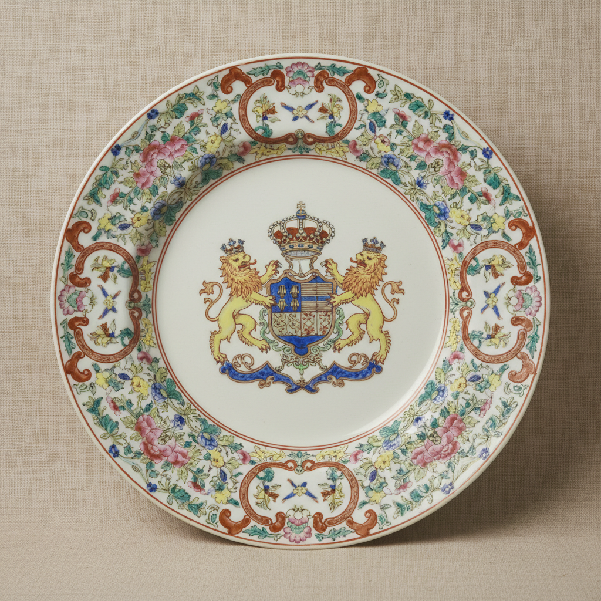

# Armorial Porcelain Art 纹章瓷艺术

> "Armorial porcelain is identity fired into clay — European coats of arms painted by Chinese hands onto Jingdezhen porcelain, a collaboration across oceans where Western heraldry meets Eastern craftsmanship, each piece a diplomatic letter written in glaze, commissioned by noble families who sent their crests halfway around the world to be immortalized on the finest ceramic surface known to man." — Unknown

## 概述

纹章瓷艺术（Armorial Porcelain Art）是17-19世纪中国景德镇为欧洲贵族和富商定制的一种外销瓷器，以绘有欧洲家族纹章（coat of arms）为特征。纹章瓷是中西文化交流的独特产物——欧洲客户将自己的家族纹章图样寄到中国，由景德镇工匠精确地绘制在瓷器上。纹章瓷代表了外销瓷中最高级别的定制服务——每一件都是独一无二的私人订制品。

纹章瓷艺术的核心要素包括：1）纹章图案——欧洲家族的纹章标志；2）定制生产——按客户要求定制；3）中西合璧——中国工艺与西方图案；4）身份象征——家族身份和地位的象征；5）精细绘制——精确复制纹章细节；6）彩绘技法——粉彩或五彩绘制；7）贸易网络——全球贸易网络的产物。

## 核心特征

| 特征 | 描述 |
|------|------|
| 纹章图案 | 欧洲家族纹章标志 |
| 定制生产 | 按客户要求定制 |
| 中西合璧 | 中国工艺西方图案 |
| 身份象征 | 家族身份地位象征 |
| 精细绘制 | 精确复制纹章细节 |
| 贸易网络 | 全球贸易网络产物 |

## 视觉特征

- **纹章居中**：纹章图案居于中心
- **盾形标志**：典型的盾形纹章
- **彩色丰富**：多色彩绘制纹章
- **金色装饰**：金彩的使用
- **边饰精美**：中式或西式边饰
- **器形多样**：餐具、茶具、装饰品

## 代表作品

| 作品 | 艺术家/文化 | 年代 | 意义 |
|------|-------------|------|------|
| *葡萄牙王室纹章瓷* | 景德镇 | 16世纪 | 最早的纹章瓷 |
| *荷兰东印度公司瓷* | 景德镇 | 17世纪 | VOC标志瓷器 |
| *英国贵族纹章瓷* | 景德镇 | 18世纪 | 英国定制瓷器 |
| *瑞典纹章瓷* | 景德镇 | 18世纪 | 北欧定制瓷器 |
| *美国纹章瓷* | 景德镇 | 18-19世纪 | 美国早期定制 |

## 历史时间线

| 时期 | 事件 |
|------|------|
| 16世纪 | 最早的纹章瓷出现 |
| 17世纪 | 荷兰东印度公司大量订制 |
| 18世纪 | 纹章瓷的黄金时代 |
| 19世纪初 | 纹章瓷生产的衰落 |
| 当代 | 纹章瓷成为收藏热点 |

## 中国语境

纹章瓷是中国外销瓷中最具个性化特征的品类。景德镇的工匠们虽然不了解欧洲纹章学的含义，但他们以精湛的技艺忠实地复制了这些复杂的图案——有时甚至比欧洲本地的画师画得更加精细。纹章瓷的生产流程体现了18世纪全球贸易的复杂性——从欧洲客户下单到成品运回，通常需要一到两年的时间。广州十三行在纹章瓷贸易中扮演了重要的中介角色——欧洲商人在广州下单，由广州商人转交景德镇生产。纹章瓷的价格远高于普通外销瓷——它们是真正的奢侈品，只有贵族和富商才能负担。今天，纹章瓷是国际拍卖市场上的热门收藏品——一件精美的18世纪纹章瓷可以拍出数十万美元的高价。

## AI生成概念图

## 与其他风格的关系

- **Kraak Porcelain** → 克拉克瓷
- **Export Porcelain** → 外销瓷
- **Canton Ware** → 广彩
- **Famille Rose** → 粉彩
- **Heraldry** → 纹章学
- **Maritime Trade** → 海上贸易

---

*浮光艺志 | Chronicle of Artistry*
